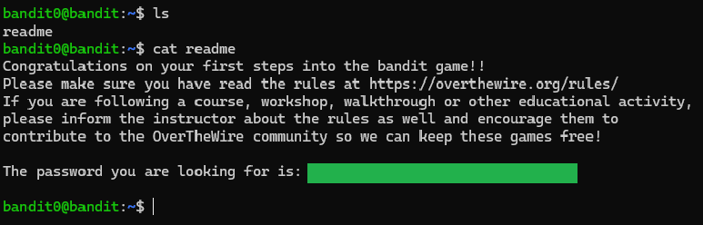
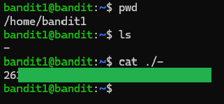
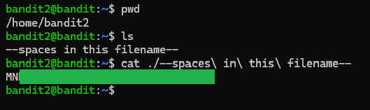
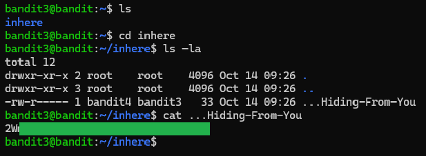
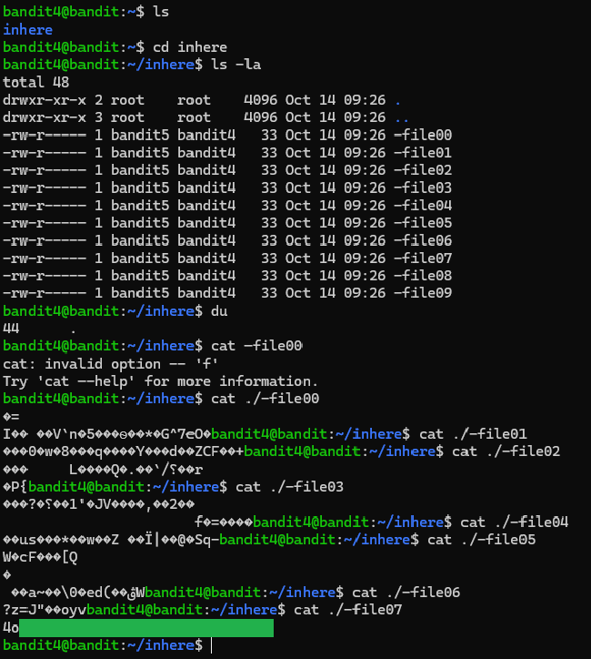

# OverTheWire: Bandit

Linux wargame focused on learning the command line through security challenges.


---

## Level 0 → 1

### Objective
Connect to the Bandit server via SSH on port 2220 and read the password stored in a file called `readme` in the home directory.

### Key concept
Basic Linux navigation and viewing files.

### Commands used
```bash
ls
cat readme
```

### Result


---

## Level 1 → 2

### Objective
Read the password from a file named `-` in the home directory.

### Key concept
A filename starting with `-` will be treated as a command option. Using `./` tells the system we are looking for a file.

### Commands used
```bash
ls
cat ./-
```

### Result
  

---

## Level 2 → 3

### Objective
Read the password from a file named `--spaces in this filename--` in the home directory.

### Key concept
A filename with spaces needs to be quoted or escaped.

### Commands used
```bash
ls
cat ./--spaces\ in\ this\ filename--
```

### Result
  

---

## Level 3 → 4

### Objective
Read the password from a hidden file in the inhere directory.

### Key concept
Listing hidden files and directories which start with `.` by using flag `-a`.

### Commands used
```bash
ls -a
cd inhere
cat ...Hiding-From-You
```

### Result
  

---

## Level 4 → 5

### Objective
Read the password from the only human-readable file in the inhere directory.

### Key concept
Listing type of files using the `file` command. The `./*` displays the file type of all files within the directory. 

### Commands used
```bash
ls -la
file ./*
cat ./-file07
```

### Result
  

---


