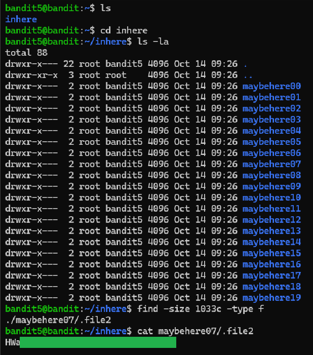

# Level 5 → 6

## Objective
Read the password from a file in the inhere directory which has the following properties: human-readable, 1033 bytes in size, not executable.

## Key concept
 Utilising the `find` command with flags such as `-size` and `-type` to locate a specific file with listed attributes.

## Commands used
```bash
cd inhere
find -size 1033c -type f
cat /
```

## Result
  

## Reflections
Locate file with specific permissions `! -executable`