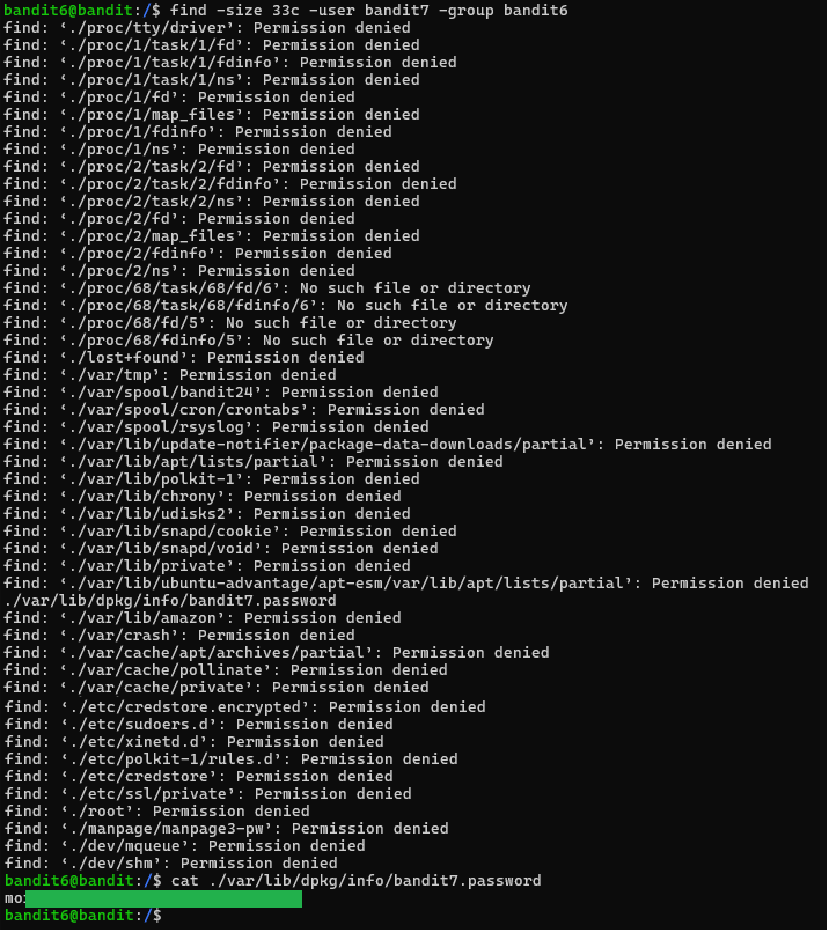

# Level 6 → 7

## Objective
Read the password from a file somewhere on the server with the following properties: owned by user bandit7, owned by group bandit6, 33 bytes in size.

## Key concept
 Utilising the `find` command with flags such as `-size`, `-user`, and `-group` to locate a specific file with listed permissions and size.

## Commands used
```bash
find -size 33c -user bandit7 -group bandit6
cat /
```

## Result
  

## Reflections
Suppress permission errors with `2>/dev/null`