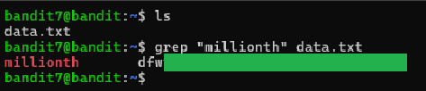

# Level 7 → 8

## Objective
Read the password from the file data.txt next to the word `millionth`. 

## Key concept
 Utilising the `grep` command to search and output a specific word from a file.

## Commands used
```bash
grep "millionth" data.txt
```

## Result
  
  