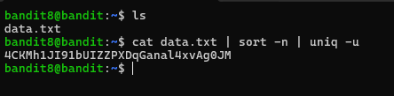

# Level 8 → 9

## Objective
Read the password from the file data.txt and is the only line of text that occurs only once.

## Key concept
 Utilising `sort` and `uniq` to detect unique lines in the file.

## Commands used
```bash
cat data.txt | sort -n | uniq -u
```

## Result
  
