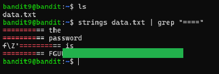

# Level 9 → 10

## Objective
Read the password from the file data.txt in one of the few human-readable strings, preceded by several ‘=’ characters.

## Key concept
 Utilising `strings` to output readable text from a data file, then filter the results with `grep`.

## Commands used
```bash
strings data.txt | grep "===="
```

## Result
  
