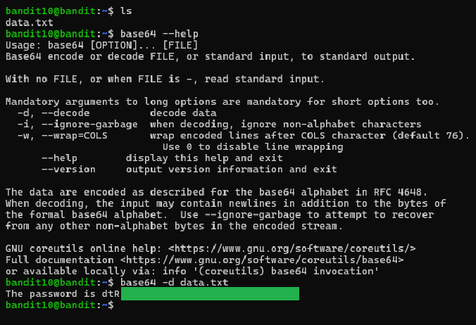

# Level 10 → 11

## Objective
Read the password from the file data.txt, which contains base64 encoded data.

## Key concept
 Utilising `base64` command to decode data.

## Commands used
```bash
base64 -d data.txt
```

## Result
  
