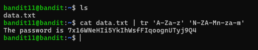

# Level 11 → 12

## Objective
Read the password from the file data.txt, where all lowercase (a-z) and uppercase (A-Z) letters have been rotated by 13 positions.

## Key concept
 Utilising the `tr` command to append the data by 13 positions in the alphabet. Commonly known as `ROT13`.

## Commands used
```bash
cat data.txt | tr 'A-Za-z' 'N-ZA-Mn-za-m'
```

## Result
  
