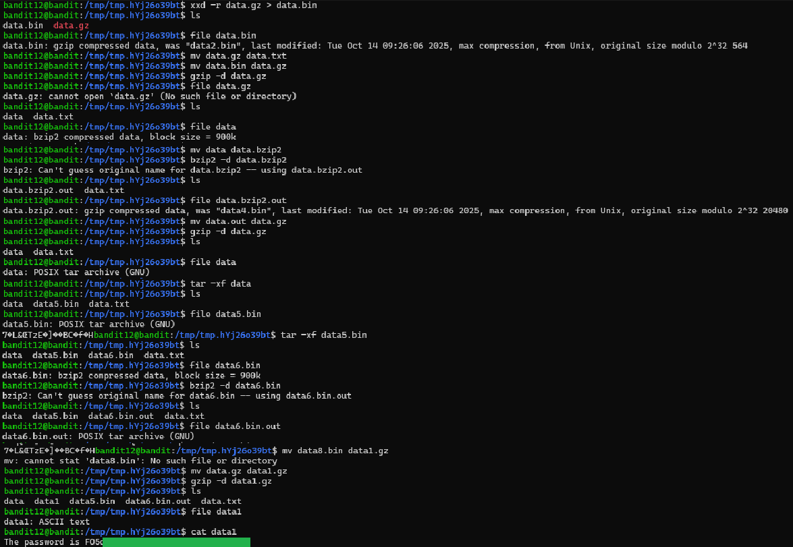

# Level 12 → 13

## Objective
Read the password from the file data.txt, which is a hexdump of a file that has been repeatedly compressed.

## Key concept
 Utilising the `xxd` command to reverse a hexdump to binary. Utilising both `gzip` and `bzip2` to decompress file based on `file` output.

## Commands used
```bash
mktemp -d
cp data.txt tmp/tmp.hYj26o39bt
mv data.txt data.gz
xxd -r data.gz > data.bin #reverts the hexdump

file * #repeated checks after each change in file

#repeated decompressions commands below
gzip -d / bzip2 -d / tar -xf

cat data1
```

## Result
  
