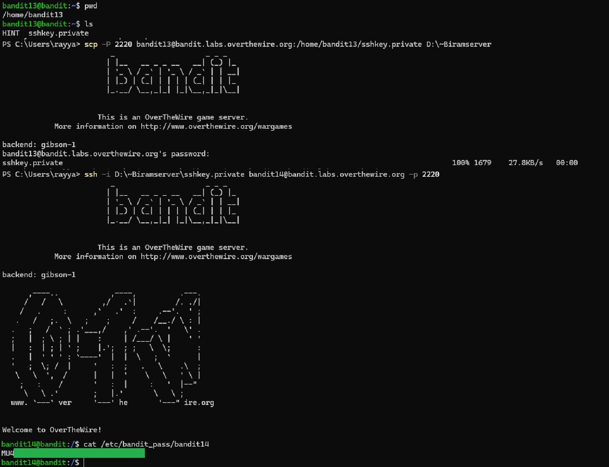

# Level 13 → 14

## Objective
Read the password from the file stored in /etc/bandit_pass/bandit14, which can only be read by user bandit14. For this level, you don’t get the next password, but you get a private SSH key that can be used to log into the next level.

## Key concept
 Utilising the `scp` command to copy files between hosts on a network. Utilising `ssh` with flag `-i` to select a file from which the private key is read for public key authentication.

## Commands used
```bash
pwd
ls
scp -P 2220 bandit13@bandit.labs.overthewire.org:/home/bandit13/sshkey.private D:\~Biramserver
ssh -i D:\~Biramserver\sshprivate.key bandit14@bandit.labs.overthewire.org -p 2220
cat /etc/bandit_pass/bandit14
```

## Result
  
