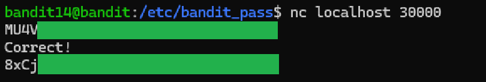

# Level 14 → 15

## Objective
The password for the next level to be retrieved by submitting the password of the current level to port 30000 on localhost.

## Key concept
 Utilising the `cat` command to read the file, `|` used to pass the command onto the `nc` command which opens ports to listen.

## Commands used
```bash
cat /etc/bandit_pass/bandit14 | nc localhost 30000
```

## Result
  
