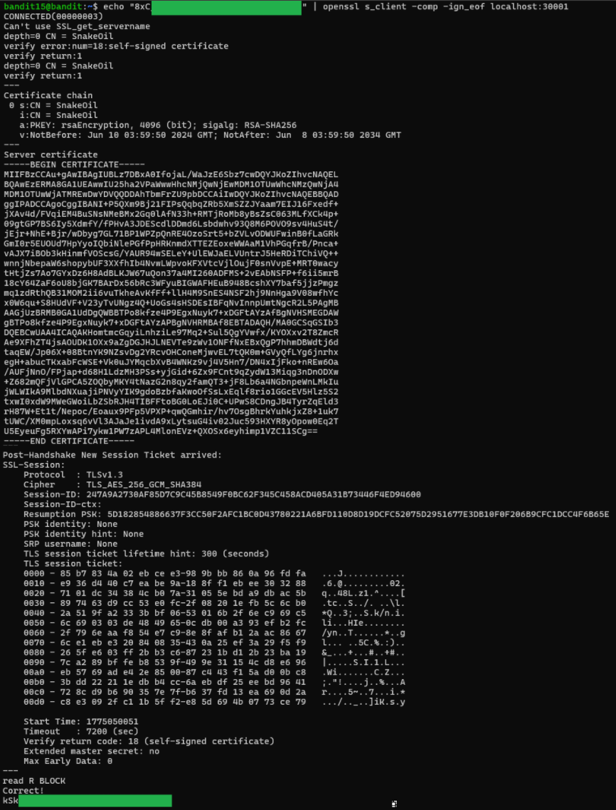

# Level 15 → 16

## Objective
The password for the next level can be retrieved by submitting the password of the current level to port 30001 on localhost using SSL/TLS encryption.

## Key concept
 Utilising the `openssl s_client` command to implement a generic SSL/TLS encrypted connection. `|` normally calls EOF, closing connection, so the `-ign_eof` flag is used to keep the connection open.

## Commands used
```bash
echo "bandit14password" | openssl s_client -comp -ign_eof localhost:30001
```

## Result
  

## Reflections
`-comp` flag not needed - Enabled support for SSL/TLS compression not required.