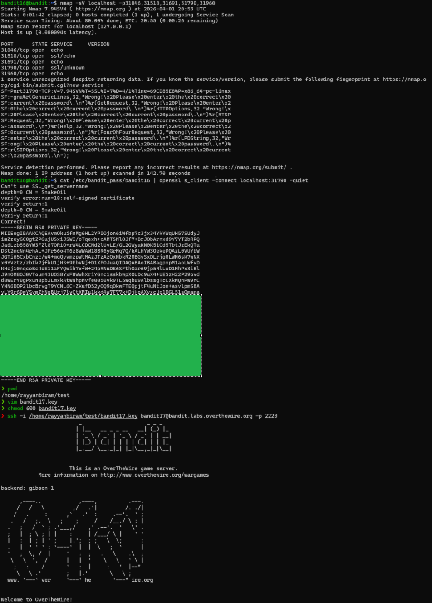

# Level 16 → 17

## Objective
Find the correct SSL service port in a range and use it to obtain an SSH private key for the next level.

## Key concept
 Utilising the `nmap` command to locate specific ports which communicate via SSL/TLS. Using the `openssl s_client` command to use communicate via SSL/TLS and retrieve credentials. 

## Commands used
```bash
nmap -sV localhost -p31000-32000
cat /etc/bandit_pass/bandit16 | openssl s_client -connect localhost:31790 -quiet
vim bandit17.key
chmod 600 bandit17.key
ssh -i /home/rayyanbiram/test/bandit17.key bandit17@bandit.labs.overthewire.org -p 2220
```

## Result
  