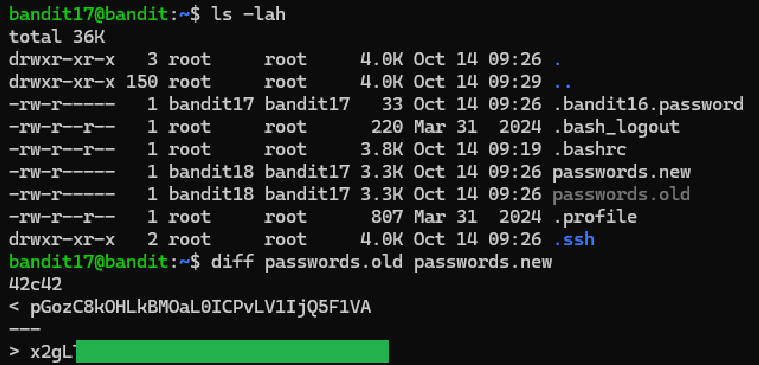

# Level 17 → 18

## Objective
The password for the next level is in passwords.new and is the only line that has been changed between passwords.old and passwords.new

## Key concept
 Utilising `diff` to find the difference between lines in a file

## Commands used
```bash
ls -lah
diff passwords.old passwords.new
```

## Result
  
