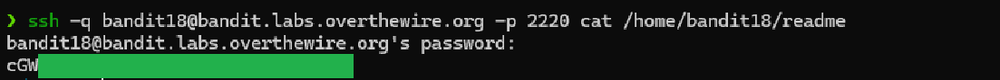

# Level 18 → 19

## Objective
The password for the next level is stored in a file readme in the homedirectory. Unfortunately, someone has modified .bashrc to log you out when you log in with SSH.

## Key concept
 Utilising the `ssh` command without starting an interactive shell.

## Commands used
```bash
ssh -q bandit18@bandit.labs.overthewire.org -p 2220 cat /home/bandit18/readme
```

## Result
  
