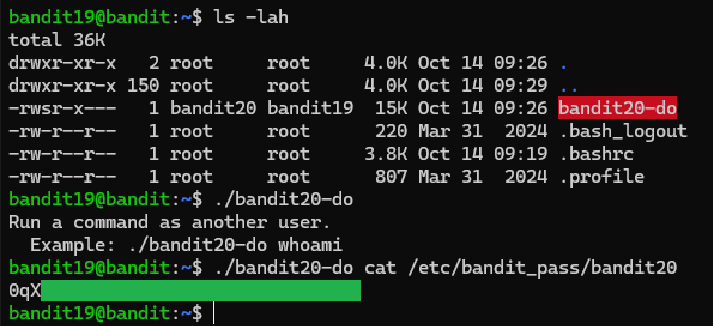

# Level 19 → 20

## Objective
To gain access to the next level, you should use the setuid binary in the homedirectory. Execute it without arguments to find out how to use it. The password for this level can be found in the usual place (/etc/bandit_pass), after you have used the setuid binary.

## Key concept
 Utilising `ls -lah` to specify file permissions. Executing the `setuid binary` to retrieve the password.

## Commands used
```bash
ls -lah
./bandit20-do cat /etc/bandit_pass/bandit20
```

## Result
  
