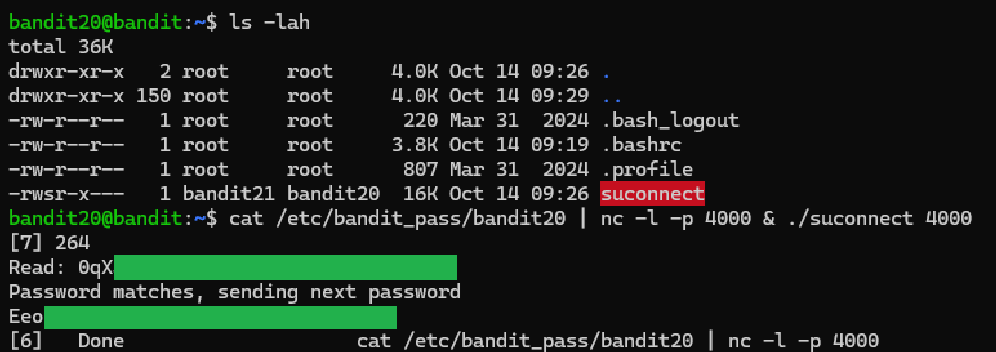

# Level 20 → 21

## Objective
There is a setuid binary in the homedirectory that does the following: it makes a connection to localhost on the port you specify as a commandline argument. It then reads a line of text from the connection and compares it to the password in the previous level (bandit20). If the password is correct, it will transmit the password for the next level (bandit21).

## Key concept
 Utilising `cat` and `nc -l -p 4000` to open a listening port with file contents. Using `&` to run multiple commands at once.

## Commands used
```bash
cat /etc/bandit_pass/bandit20 | nc -l -p 4000 & ./suconnect 4000
```

## Result
  
