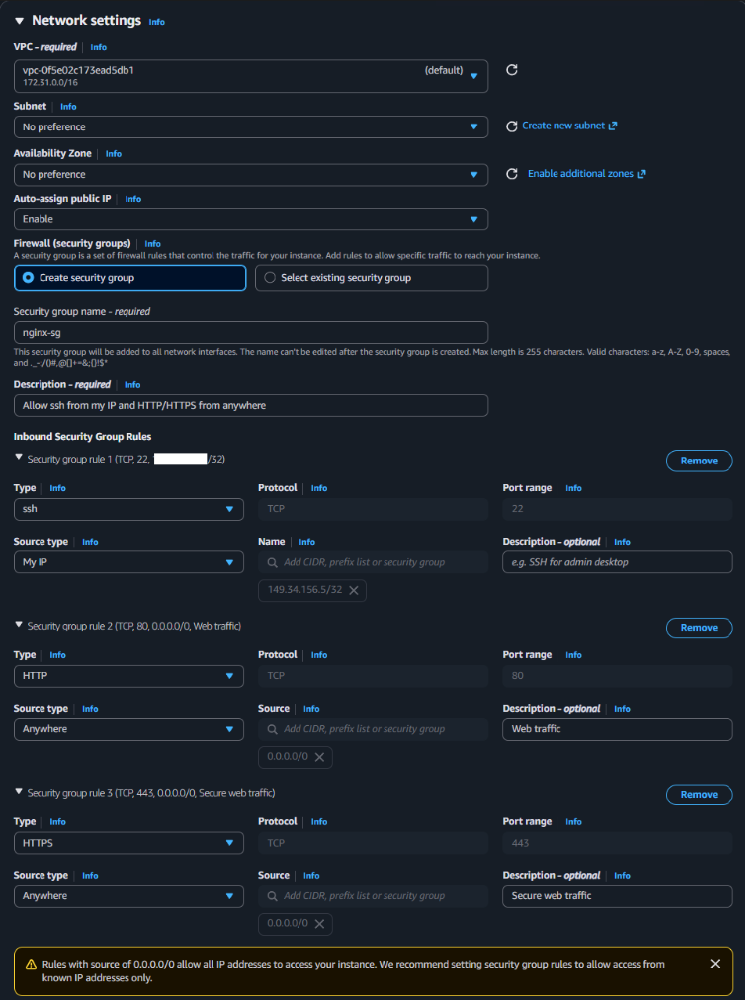

# AWS Networking Project: Domain + EC2 + nginx
 
A core networking module project that brings together IP addressing, DNS, ports, security groups, and basic web hosting on AWS.
 
## What I Built
 
An end-to-end web hosting setup serving an nginx landing page over a custom subdomain.
 
**Stack:**
- AWS EC2 - Amazon Linux 2023, `t3.micro`, region `eu-west-2` (London)
- nginx web server
- Cloudflare DNS managing `biram.uk`
- Custom subdomain: `nginx.biram.uk`
**Architecture:**
 
```
Browser
   │  (DNS lookup)
   ▼
Cloudflare DNS  ──►  A record: nginx.biram.uk → 13.42.27.129
   │  (HTTP request on port 80)
   ▼
EC2 Public IP (13.42.27.129)
   │  (security group permits inbound 80 from 0.0.0.0/0)
   ▼
nginx
   │
   ▼
HTML landing page
```
 
## Screenshots — quick reference
 
Jump straight to any step. Full walk-through with images is in the next section.
 
| # | Step | Screenshot |
|---|------|-----------|
| 1 | EC2 instance launch wizard (Amazon Linux 2023, t3.micro) | [View](screenshots/launch%20an%20instance%20-%20aws%20linux.png) |
| 2 | Custom security group: SSH from my IP only, HTTP/HTTPS from anywhere | [View](screenshots/nginx-sg.png) |
| 3 | Instance up and running | [View](screenshots/instance%20running.png) |
| 4 | Connecting via SSH client | [View](screenshots/connect%20via%20ssh%20client.png) |
| 5 | Terminal session inside the EC2 instance | [View](screenshots/terminal%20connection%20to%20ec2.png) |
| 6 | nginx serving over raw public IPv4 | [View](screenshots/web%20page%20ip%20connection.png) |
| 7 | A record in Cloudflare pointing `nginx.biram.uk` → EC2 IP | [View](screenshots/nginx%20a%20record.png) |
| 8 | `dig` confirming DNS resolution | [View](screenshots/terminal%20ns%20dig.png) |
| 9 | nginx loading over `nginx.biram.uk` | [View](screenshots/web%20page%20dns%20connection.png) |
 
## Build Walkthrough
 
The project end-to-end, in the order it actually happened.
 
### 1. Launching the EC2 instance
 
Picked Amazon Linux 2023 on a `t3.micro`. Generated a new RSA key pair and downloaded the `.pem` file. The file is the private half of the SSH keypair and there is no way to re-download it later.
 

 
### 2. Creating the security group
 
Three inbound rules: SSH limited to my own IP (`/32`), HTTP and HTTPS open to `0.0.0.0/0`. The yellow warning at the bottom is AWS being cautious about public rules.
 

 
### 3. Instance running
 
After launch the instance moves to the `Running` state and is assigned its public IPv4. That IP is the address every later step needs.
 

 
### 4. Connecting to the instance
 
AWS exposes an in-browser SSH option (EC2 Instance Connect) alongside the standard `ssh -i key.pem` flow. Either works.
 

 
Once connected, the shell drops into a fresh Amazon Linux 2023 environment as `ec2-user`.
 

 
### 5. Installing nginx and testing on the raw IP
 
Ran `sudo dnf install nginx -y`, then enabled and started the service via `systemctl`. Visiting `http://<EC2-IP>` directly in the browser confirmed nginx was serving. Testing the server *before* adding DNS isolates problems to one layer at a time.
 

 
### 6. Pointing the domain at the instance
 
Created an A record in Cloudflare: `nginx.biram.uk` → EC2 public IPv4. Proxy disabled (grey cloud) so the lookup resolves directly to the EC2 IP, not Cloudflare's edge.
 

 
Verified the resolution from the local terminal with `nslookup` and `dig` - the answer comes back as the EC2 IP, confirming the record is live.
 

 
### 7. Loading the page over the domain
 
The final result - `http://nginx.biram.uk` serving the nginx page through the full chain: DNS lookup → security group → port 80 → nginx → HTML.
 

 
## Commands Used
 
All commands used during the build, in one place.
 
```bash
# ─── On the EC2 instance (Amazon Linux 2023) ────────────────
 
# Refresh package metadata
sudo dnf update -y
 
# Install nginx
sudo dnf install nginx -y
 
# Enable nginx to start automatically on boot
sudo systemctl enable nginx
 
# Start nginx now
sudo systemctl start nginx
 
# Verify it's running (look for "active (running)" in green)
sudo systemctl status nginx
 
# Customise the default landing page
sudo nano /usr/share/nginx/html/index.html
 
 
# ─── On my local machine (DNS verification) ─────────────────
 
# Quick lookup - returns just the IP
dig nginx.biram.uk +short
 
# Full DNS lookup output (resolver, TTL, record type)
nslookup nginx.biram.uk
 
 
# ─── SSH connection (alternative to EC2 Instance Connect) ───
 
# Lock down key file permissions (required by ssh)
chmod 400 /home/rayyanbiram/coderco/networking/"biram-key.pem"
 
# Connect to the instance
ssh -i /home/rayyanbiram/coderco/networking/"biram-key.pem" ec2-user@ec2-13-42-27-129.eu-west-2.compute.amazonaws.com
```
 
## What I Learnt
 
### EC2 fundamentals
- An EC2 instance is a virtual server rented by the hour. It lives inside a **VPC** (virtual private cloud), sits in a **subnet** within an **Availability Zone**, and gets both a public and a private IPv4.
- The free-tier `t3.micro` is plenty for a basic web server.
- **AMIs** are pre-built OS images. Amazon Linux 2023 uses `dnf` as its package manager (newer than `yum`, though `yum` still works as a symlink).
- A **key pair** is just an SSH public/private keypair. The `.pem` file is the private half - keep it safe, `chmod 400`, and don't commit it.
### Security groups = stateful firewall
- Security groups control which inbound and outbound traffic reaches the instance.
- Inbound rules are **deny-by-default**; you explicitly allow what you want.
- Each rule needs a protocol (TCP/UDP), port range, and source CIDR.
- Restrict SSH (port 22) to your own IP only. HTTP (80) and HTTPS (443) must be open to `0.0.0.0/0` for a public website.
- The AWS warning about `0.0.0.0/0` is informational - for web ports it's expected and required.
### DNS
- DNS turns human-readable names into IP addresses.
- An **A record** maps a hostname directly to an IPv4 address.
- Cloudflare DNS propagation is near-instant - their own network resolves new records within seconds; downstream resolvers depend on the TTL.
- The Cloudflare **orange cloud** proxies traffic through Cloudflare's edge (caching, DDoS protection). **Grey cloud** is DNS-only - the record resolves directly to your origin IP. For this exercise I used grey cloud so the lookup returned the actual EC2 IP.
### Ports & protocols
| Port | Service |
|------|---------|
| 22 | SSH (encrypted remote shell) |
| 80 | HTTP (unencrypted web) |
| 443 | HTTPS (encrypted web) |
 
- nginx listens on port 80 by default after install.
- A TCP connection is identified by the 4-tuple `(source IP, source port, destination IP, destination port)`.
### nginx & systemd
- `systemctl enable` makes a service start on boot; `systemctl start` runs it now; both are needed.
- nginx's default web root on Amazon Linux 2023 is `/usr/share/nginx/html/`.
- Editing `index.html` is reflected instantly on the next page refresh — no nginx restart needed for content changes.
## Challenges & How I Solved Them
 
### 1. Cloudflare proxy hiding the EC2 IP
The first time I added the A record, `dig nginx.biram.uk` returned Cloudflare's anycast IPs (`104.x.x.x`) instead of `13.42.27.129`. The page still loaded, but the DNS demonstration was muddled - it didn't actually prove the record was pointing at EC2.
 
**Solution:** switched the Cloudflare proxy from orange cloud to grey cloud (DNS-only). On the next `dig` the result was `13.42.27.129` directly.
 
### 2. AWS security group warning
The launch wizard threw a yellow warning about rules with source `0.0.0.0/0`. Initially confusing, and I thought to myself "was the security group misconfigured?"
 
**Solution:** thought through what each rule is for. SSH from `0.0.0.0/0` would have been a problem, so I changed it to `My IP`. For HTTP and HTTPS, `0.0.0.0/0` is necessary - a public web server must accept connections from anywhere. The warning is generic; it's right to surface it, but not all `0.0.0.0/0` rules are wrong.
 
### 3. Personal IP exposed in screenshots
The security group screenshot showed my home IPv4 in the SSH source field. Publicly attributing "this IP has SSH access to an EC2 instance" is a small but unnecessary breadcrumb for anyone scanning the repo.
 
**Solution:** redacted the personal IP before committing. EC2 public IPs are ephemeral (released when the instance terminates) so I left those visible - they have no value to anyone after cleanup.
 
## Cleanup
 
After the project was verified end-to-end:
- Terminated the EC2 instance from the AWS console
- Removed the `nginx` A record from Cloudflare DNS
- Set up a billing alert at £1 to catch any forgotten resources
`t3.micro` is free-tier for 750 hours/month for the first 12 months, but the instance was terminated to avoid drift.
 
## Files
 
- [`README.md`](README.md) — this file
- [`screenshots/`](screenshots/) — step-by-step screenshots referenced above