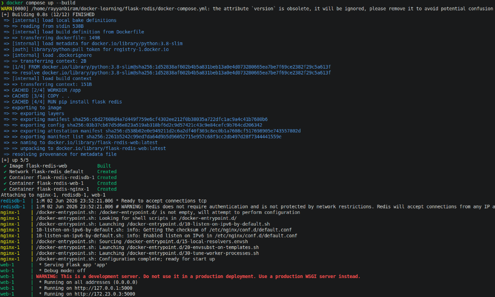
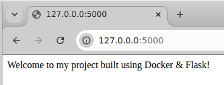
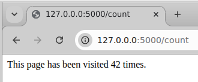
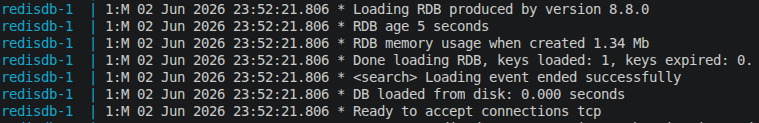
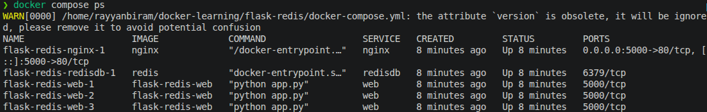
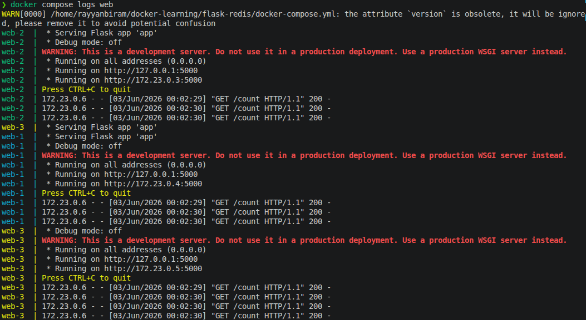
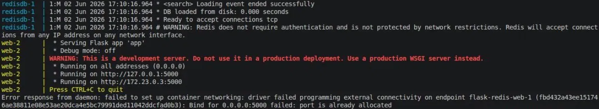

# Docker Containers Project: Flask + Redis + nginx
 
A core containers module project that brings together multi-container orchestration, service networking, persistent storage, environment-based config, and load balancing with Docker Compose.
 
## What I Built

A multi-container web application: a Flask app that tracks page visits in Redis, fronted by an nginx load balancer, all orchestrated with Docker Compose. The Flask service can be scaled to multiple instances, with nginx spreading traffic across them.
 
**Stack:**
- Flask - Python web app with two routes (`/` and `/count`)
- Redis - in-memory key-value store holding the visit counter
- Docker + Docker Compose - containerise the app and orchestrate the multi-container setup
- nginx - reverse proxy and load balancer across the scaled Flask instances

**Architecture:**
 
```
Browser
   │  (HTTP request → http://localhost:5000)
   ▼
nginx                    (load balancer; listens on :80, published as :5000)
   │  (round-robins across replicas via Docker's internal DNS)
   ├──►  Flask  web-1  ┐
   ├──►  Flask  web-2  ┤   (each Flask instance listens on :5000)
   └──►  Flask  web-3  ┘
                       │  (INCR "visits")
                       ▼
                    Redis  (:6379)
                       │  (RDB snapshot on write / shutdown)
                       ▼
               redis-data volume   (count survives restarts)
```
 
## Screenshots — quick reference
 
Jump straight to any step. Full walk-through with images is in the next section.
 
| # | Step | Screenshot |
|---|------|-----------|
| 1 | Welcome page served at `localhost:5000` (the `/` route) | [View](screenshots/welcome-page.png) |
| 2 | Visit counter incrementing at `/count` | [View](screenshots/visit-counter.png) |
| 3 | `docker compose up --build` - all services starting | [View](screenshots/compose-up.png) |
| 4 | Redis loading its persisted data after a restart | [View](screenshots/redis-persistence.png) |
| 5 | Three Flask instances running under one nginx (`docker compose ps`) | [View](screenshots/scaled-instances.png) |
| 6 | nginx round-robining requests across `web-1` / `web-2` / `web-3` | [View](screenshots/load-balancing.png) |
| 7 | The port-allocation error before nginx was added (the gotcha) | [View](screenshots/port-conflict.png) |
 
## Build Walkthrough
 
The project end-to-end, in the order it actually happened.
 
### 1. The Flask application
 
Two routes: `/` returns a welcome message, and `/count` increments a counter stored in Redis and returns the new total. The Redis connection details are read from environment variables (with sensible defaults) rather than hard-coded.
 
```python
from flask import Flask
import redis
import os
 
app = Flask(__name__)
 
cache = redis.Redis(
    host=os.getenv("REDIS_HOST", "redisdb"),
    port=int(os.getenv("REDIS_PORT", "6379"))
)
 
@app.route('/')
def welcome():
    return 'Welcome to my project built using Docker & Flask!'
 
@app.route('/count')
def increment():
    visits = cache.incr('visits')
    return f'This page has been visited {visits} times.'
 
if __name__ == '__main__':
    app.run(host='0.0.0.0', port=5000)
```
 
The key detail is `cache.incr('visits')` - Redis's `INCR` is atomic, so it increments the key and returns the new value in a single operation. No read-modify-write, no race condition.
 
### 2. Containerising with the Dockerfile
 
A single-stage image built on `python:3.8-slim`. It copies the app in, installs the two Python libraries, documents the port, and sets the start command.
 
```dockerfile
FROM python:3.8-slim
WORKDIR /app
COPY . .
RUN pip install flask redis
EXPOSE 5000
CMD ["python", "app.py"]
```
 
This started as a multi-stage build (carried over from an earlier MySQL version of the app), but the Redis client is pure Python with nothing to compile, so a single stage is smaller and simpler here. More on that in [Challenges](#challenges--how-i-solved-them).
 
### 3. Orchestrating with Docker Compose
 
Three services on one private network: `web` (Flask), `redisdb` (Redis), and `nginx` (load balancer). Compose gives each service a DNS name equal to its service name, which is why the Flask app reaches Redis at host `redisdb`.
 
```yaml
volumes:
  redis-data:
 
services:
  web:
    build: .
    depends_on:
      - redisdb
    environment:
      REDIS_HOST: redisdb
      REDIS_PORT: 6379
 
  redisdb:
    image: redis
    volumes:
      - redis-data:/data
 
  nginx:
    image: nginx
    ports:
      - "5000:80"
    depends_on:
      - web
    volumes:
      - ./nginx.conf:/etc/nginx/nginx.conf:ro
```
 
Note that `web` has **no** published port. Only nginx owns the host port (`5000:80`). That is deliberate, and it is what makes `web` safe to scale.
 
### 4. Running it
 
```bash
docker compose up --build
```
 
All three services start on the shared network.
 

 
Then visit the app in the browser. `http://localhost:5000` shows the welcome page:
 

 
And `http://localhost:5000/count` increments the counter on every refresh:
 

 
### 5. Bonus - Persistent storage for Redis
 
By default the counter lives only inside the Redis container, so it resets to zero whenever the container is destroyed. Mounting a named volume at Redis's data directory (`/data`) keeps the data outside the container's lifecycle. Redis writes an RDB snapshot there on shutdown and at save points, so the count survives `docker compose down` → `up`.
 
The volume is declared once at the top level and mounted into the `redisdb` service (see the Compose file above). On the next start, Redis loads its saved data straight off disk:
 

 
### 6. Bonus - Environment variables
 
Instead of hard-coding the Redis host and port in `app.py`, they are read from the environment with `os.getenv("REDIS_HOST", "redisdb")` and `int(os.getenv("REDIS_PORT", "6379"))`, and supplied by the `environment:` block under the `web` service in Compose. The same image now runs in any setup just by changing what is passed in. No code edit, no rebuild. The defaults mean it still runs even if nothing is set.
 
### 7. Bonus - Scaling the app + load balancing with nginx
 
nginx sits in front as a reverse proxy. Its config defines an `upstream` pool pointing at the `web` service, and forwards every request to it:
 
```nginx
events {
    multi_accept on;
    accept_mutex on;
}
 
http {
    upstream dockerproject {
        server web:5000;
    }
 
    server {
        listen 80;
 
        location / {
            proxy_pass http://dockerproject;
        }
    }
}
```
 
Run with the `--scale` flag to start multiple Flask instances:
 
```bash
docker compose up --build --scale web=3
```
 
All three come up cleanly. No port conflict, because nginx owns the host port and the Flask containers are reachable internally by name:
 

 
When nginx resolves the name `web`, Docker's internal DNS returns one IP per replica, and nginx round-robins across them. Watching the logs while refreshing `/count` shows requests landing on `web-1`, `web-2`, and `web-3` in rotation:
 

 
## Commands Used
 
All commands used during the build, in one place.
 
```bash
# ─── Build and run the whole stack ──────────────────────────
 
# Build the images and start all services (web, redisdb, nginx)
docker compose up --build
 
# Run detached (in the background)
docker compose up --build -d
 
 
# ─── Test it ────────────────────────────────────────────────
 
# Welcome message
curl http://localhost:5000
 
# Increment + show the visit counter
curl http://localhost:5000/count
 
 
# ─── Scale the Flask service + load balance ─────────────────
 
# Run 3 Flask instances behind nginx
docker compose up --build --scale web=3
 
# Check how many containers are running and their state
docker compose ps
 
# Watch which instance handles each request (load balancing)
docker compose logs web
 
 
# ─── Persistence check ──────────────────────────────────────
 
# Stop and remove containers (the named volume is kept)
docker compose down
 
# Bring it back up — the visit count resumes where it left off
docker compose up
 
 
# ─── Teardown ───────────────────────────────────────────────
 
# Stop and remove containers + network (keeps the volume)
docker compose down
 
# Also remove the named volume (wipes the saved count)
docker compose down -v
```
 
## What I Learnt
 
### Docker images & the Dockerfile
- An **image** is a read-only template; a **container** is a running instance of it.
- Each Dockerfile instruction is a cached layer, so instruction order affects rebuild speed.
- **Multi-stage builds** only pay off when there is a build step whose tooling you do not want in the final image e.g. compiling a C extension. The MySQL version needed `gcc` and dev headers to compile `mysqlclient`; the Redis client is pure Python, so a single stage is smaller and simpler.
- `python:3.8-slim` is a lightweight base, `EXPOSE` documents the port, and `CMD` sets the default start command.
### Docker Compose & service networking
- Compose puts all services on a shared private network and gives each a DNS name equal to its **service name**. That is why Flask reaches Redis at host `redisdb`.
- `depends_on` controls **start order**, not **readiness**. A container can be "started" before the service inside it is actually ready to accept connections.
- `build: .` lets Compose build the Dockerfile directly. Named volumes are declared once at the top level and mounted per-service.
### Redis as a key-value store
- The counter is stored under a single key (`visits`).
- `INCR` is **atomic**. It increments and returns the new value in one operation, with no read-modify-write race.
- **Persistence:** Redis writes an RDB snapshot to `/data` on shutdown and at save points; mounting a named volume there keeps the data across restarts. Append-only mode (AOF) writes on every change for stronger guarantees.
### Environment variables
- Moving config (Redis host/port) out of the code and into the environment means one image runs in any setup, unchanged.
- Environment variables are **always strings**. The port must be wrapped in `int()` before Redis accepts it.
- `os.getenv("KEY", default)` provides a fallback so the app still runs if a variable is unset.
### nginx as a load balancer
- nginx is a **reverse proxy**: it owns the published port and forwards requests to the backend instances.
- An `upstream` block defines the pool; `proxy_pass` sends traffic to it.
- Resolving the service name `web` returns one IP per replica, and nginx **round-robins** across them.
- The catch: nginx resolves the upstream **once at startup**, so changing the replica count means restarting nginx.
**Ports in this project:**
 
| Port | Container | Purpose |
|------|-----------|---------|
| `5000 → 80` | nginx | published host port maps to nginx's listen port |
| `5000` | web (Flask) | Flask server - internal to the network only |
| `6379` | redisdb (Redis) | Redis - internal to the network only |
 
## Challenges & How I Solved Them
 
### 1. Scaling broke with a "port is already allocated" error
The first attempt to run three Flask instances (`docker compose up --scale web=3`) failed. With `ports: "5000:5000"` on the `web` service, every replica tried to bind host port 5000 and only one process can own a host port.
 

 
**Solution:** removed the fixed host-port mapping from `web` and added an nginx service to own port 5000 instead. nginx becomes the single entry point and round-robins requests across all the (now port-free, freely scalable) Flask containers.
 
### 2. A leftover multi-stage Dockerfile from the MySQL version
This project started out using MySQL, whose Python driver (`mysqlclient`) has to be compiled so the Dockerfile used a multi-stage build to install `gcc` and dev headers in a build stage and copy only the result into a clean final image.
 
**Solution:** the Redis client is pure Python with nothing to compile, so the build stage was doing no useful work. I collapsed it to a single stage, a smaller, simpler image, once I understood that multi-stage only earns its place when build-time and run-time needs genuinely differ.
 
### 3. `depends_on` doesn't wait for Redis to be ready
`depends_on` guarantees Redis *starts* before Flask, but not that it is *ready to accept connections*. On a cold start, the Flask container can come up a moment before Redis is listening.
 
**Solution:** for this app the gap is tiny and a refresh resolves it, but the proper fix is a readiness check, a healthcheck on Redis, or retry-on-connect logic in the app. Worth knowing the difference between "started" and "ready."
 
## Cleanup
 
After verifying the project end-to-end:
- `docker compose down` - stops and removes the containers and the network (the named volume is preserved, so the count is kept)
- `docker compose down -v` - also removes the `redis-data` volume, wiping the saved count for a clean slate
- `docker image rm flask-redis-web` - removes the built image if no longer needed
## Files
 
- [`README.md`](README.md) — this file
- [`app.py`](app.py) — the Flask application (two routes, Redis-backed counter)
- [`Dockerfile`](Dockerfile) — image definition for the Flask service
- [`docker-compose.yml`](docker-compose.yml) — multi-container orchestration (web, redisdb, nginx)
- [`nginx.conf`](nginx.conf) — reverse proxy / load balancer config
- [`screenshots/`](screenshots/) — step-by-step screenshots referenced above