# AWS VPC & Networking: A Custom Cloud Network From Scratch


A foundational AWS networking project: a custom VPC built entirely from scratch - public and private subnets, internet and NAT gateways, route tables, segmented security groups, a bastion host, and CloudWatch monitoring across both instances. This is the bedrock that every other AWS project sits on: routing, segmentation, and least-privilege access.

## What I Built

A complete, segmented network in the **eu-west-2 (London)** region. A custom `10.0.0.0/16` VPC is split into one public and one private subnet. The public subnet reaches the internet directly through an **Internet Gateway**; the private subnet reaches *out* - but stays unreachable from *outside* - through a **NAT Gateway**. A public EC2 instance doubles as a **bastion host**, the single SSH entry point into the private instance, and the **CloudWatch agent** ships memory and disk metrics from both instances.

**Stack:**
- **Amazon VPC** – the isolated `10.0.0.0/16` network, carved into a public and a private `/24` subnet
- **Internet Gateway** – bidirectional internet access for the public subnet
- **NAT Gateway + Elastic IP** – outbound-only internet for the private subnet
- **Route Tables** – the routing that actually *makes* a subnet public or private
- **Amazon EC2** – a public/bastion instance and a private instance (both `t3.micro`, Amazon Linux 2023)
- **Security Groups** – least-privilege, instance-level firewalls (SSH/HTTP from my IP; private SSH from the bastion only)
- **IAM role** – grants the instances permission to push metrics to CloudWatch
- **Amazon CloudWatch + CloudWatch agent** – detailed monitoring plus custom memory/disk metrics

**Architecture:**

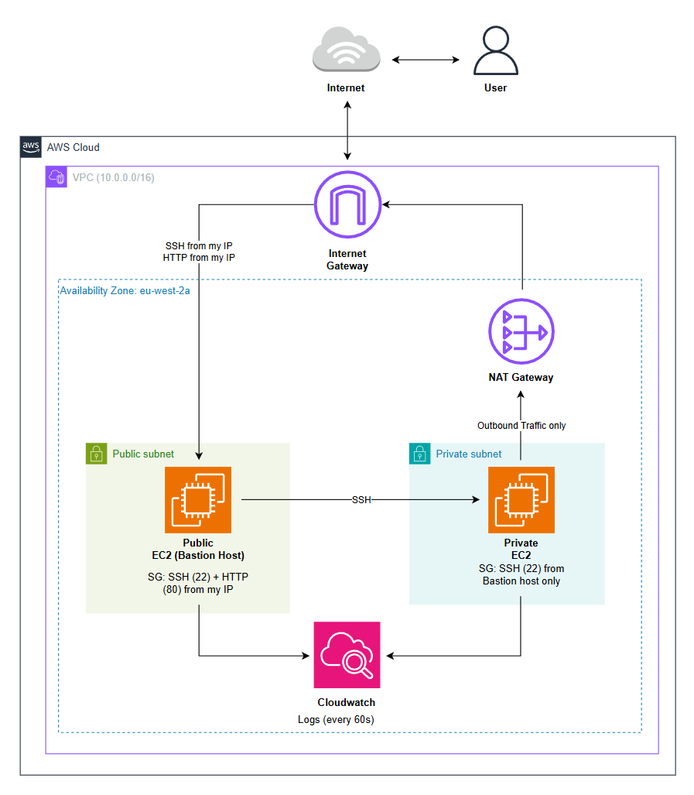

How traffic actually flows:
- **Me → IGW → public subnet.** SSH and HTTP into the bastion, locked to my home IP only.
- **Bastion → private subnet.** SSH from the bastion to the private instance over its *private* IP - the only way in, since the private box has no public IP.
- **Private instance → NAT → IGW → internet.** Strictly outbound (package installs, pushing metrics). Nothing on the internet can *initiate* a connection back to it.
- **Both instances → CloudWatch.** The agent ships `mem_used_percent` / `disk_used_percent` every 60 seconds.

### Resources created

| Resource | Name | ID / Value |
|----------|------|-----------|
| VPC | `Assignment-VPC` | `vpc-0a5cb0c5ea61a2ea2` - `10.0.0.0/16` |
| Public subnet | `Public-Assignment-Subnet` | `subnet-0f95428500817432b` - `10.0.0.0/24` |
| Private subnet | `Private-Assignment-Subnet` | `subnet-05a8e40675db5a04d` - `10.0.1.0/24` |
| Internet Gateway | `Assignment-IGW` | `igw-0a3c73ea6aec6d862` |
| NAT Gateway | `Assignment-NAT` | `nat-0b496bd49610e85a0` - EIP `18.130.127.4` |
| Public route table | `Public-Assignment-RT` | `rtb-0587a3cb57b7483a4` |
| Private route table | `Private-Assignment-RT` | `rtb-0b7f2f62ffe41e9ba` |
| Public EC2 (bastion) | `Assignment-Public-EC2` | `i-02a132b42d0505330` - `13.40.45.94` |
| Private EC2 | `Assignment-Private-EC2` | `i-077437bc65148537f` |
| Public SG | `Assignment-Public-SG` | `sg-0dd2a3ea22946b392` |
| Private SG | `Assignment-Private-SG` | `sg-00c4ce316bcfda54a` |
| IAM role | `Assignment-EC2-Cloudwatch` | `CloudWatchAgentServerPolicy` + `AmazonSSMManagedInstanceCore` |

## Screenshots - quick reference

Jump straight to any step. The full walk-through with images is in the next section.

| # | Step | Screenshot |
|---|------|-----------|
| 1 | The VPC (`10.0.0.0/16`) | [View](screenshots/vpc.png) · [CIDR](screenshots/cidr-block.png) |
| 2 | Public + private subnets | [View](screenshots/subnets.png) |
| 3 | Internet Gateway attached | [View](screenshots/igw.png) |
| 4 | NAT Gateway + Elastic IP | [View](screenshots/natgw.png) |
| 5 | Route tables (public → IGW, private → NAT) | [View](screenshots/route-tables.png) |
| 6 | Security groups (the segmentation) | [View](screenshots/sg.png) |
| 7 | Both EC2 instances running | [View](screenshots/ec2-instances.png) |
| 8 | SSH into the bastion | [View](screenshots/ssh-public-ec2.png) |
| 9 | Apache running on the bastion | [View](screenshots/apache.png) |
| 10 | HTTP from the browser | [View](screenshots/http.png) · [curl](screenshots/curl.png) |
| 11 | Bastion → private SSH hop | [View](screenshots/ssh-bastion-host.png) |
| 12 | Private subnet reaching the internet via NAT | [View](screenshots/nat-internet-test.png) |
| 13 | IAM role for the CloudWatch agent | [View](screenshots/ec2iamcw.png) |
| 14 | Memory/disk metrics from both instances | [View](screenshots/cw-metrics.png) |

## Build Walkthrough

The project end-to-end, in the order it actually happened.

### 1. Create the VPC

A custom VPC with the CIDR block `10.0.0.0/16` - roughly 65,000 private addresses to carve up. DNS resolution and DNS hostnames are both enabled, which is what lets instances in the public subnet receive a public DNS name.

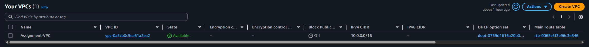
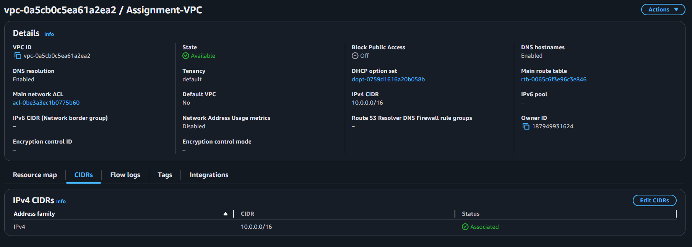

The VPC is just an empty, isolated network at this point - no routing, no internet, nothing can reach it yet.

### 2. Carve out the subnets

Two subnets, both in `eu-west-2a`:

- **Public** – `Public-Assignment-Subnet`, `10.0.0.0/24`
- **Private** – `Private-Assignment-Subnet`, `10.0.1.0/24`

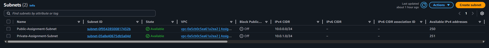

Each `/24` gives 256 addresses, of which 251 are usable - **AWS reserves 5 per subnet** (network, VPC router, DNS, future use, broadcast). The key thing here: at this stage *neither subnet is actually "public" or "private" yet*. A subnet has no inherent type - what makes it one or the other is the route table it's later associated with (step 5).

### 3. Create and attach the Internet Gateway

`Assignment-IGW`, created and attached to the VPC.

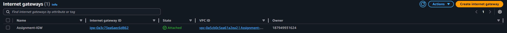

The IGW is the doorway between the VPC and the public internet. It's **bidirectional** - it allows inbound connections to instances that have a public IP, and outbound connections from them. On its own it does nothing; it only matters once a route table points traffic at it.

### 4. Create the NAT Gateway and Elastic IP

`Assignment-NAT`, placed **in the public subnet**, with an Elastic IP (`18.130.127.4`) attached. Its own ENI sits at `10.0.0.22` - inside the public subnet's range, as expected.

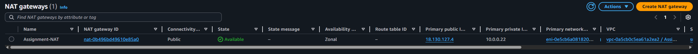

A NAT Gateway lets instances in the *private* subnet make **outbound** connections to the internet (OS updates, package installs, pushing metrics) while remaining completely **unreachable from the outside** - the internet can never initiate a connection back through it. It *must* live in the public subnet because its own return traffic needs the public subnet's route to the IGW to actually reach the internet.

### 5. Route tables - the step that makes subnets public or private

This is where the segmentation becomes real. Two custom route tables, each explicitly associated with one subnet:

- **`Public-Assignment-RT`** → associated with the public subnet. Routes: `0.0.0.0/0` → **Internet Gateway**, plus the implicit `10.0.0.0/16` → `local`.
- **`Private-Assignment-RT`** → associated with the private subnet. Routes: `0.0.0.0/0` → **NAT Gateway**, plus `10.0.0.0/16` → `local`.

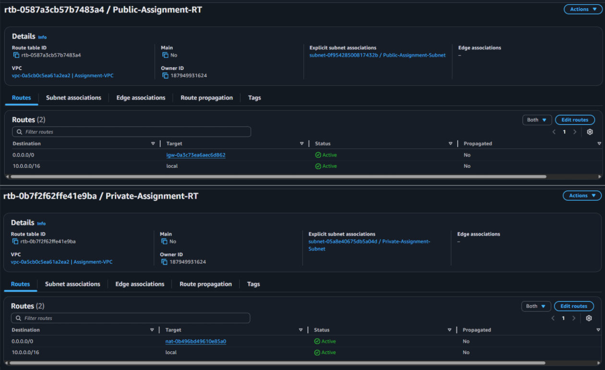

The `local` route (always present) is what lets the two subnets talk to each other internally. The `0.0.0.0/0` default route is the differentiator: send it to the IGW and the subnet is *public*; send it to the NAT and the subnet is *private*. Same hardware, different door.

### 6. Security groups

Two security groups enforcing least-privilege access at the instance level:

- **`Assignment-Public-SG`** (bastion) – inbound **SSH (22)** and **HTTP (80)**, both **from my IP only**.
- **`Assignment-Private-SG`** – inbound **SSH (22) from the bastion's security group** (`sg-0dd2a3ea22946b392`), nothing else.

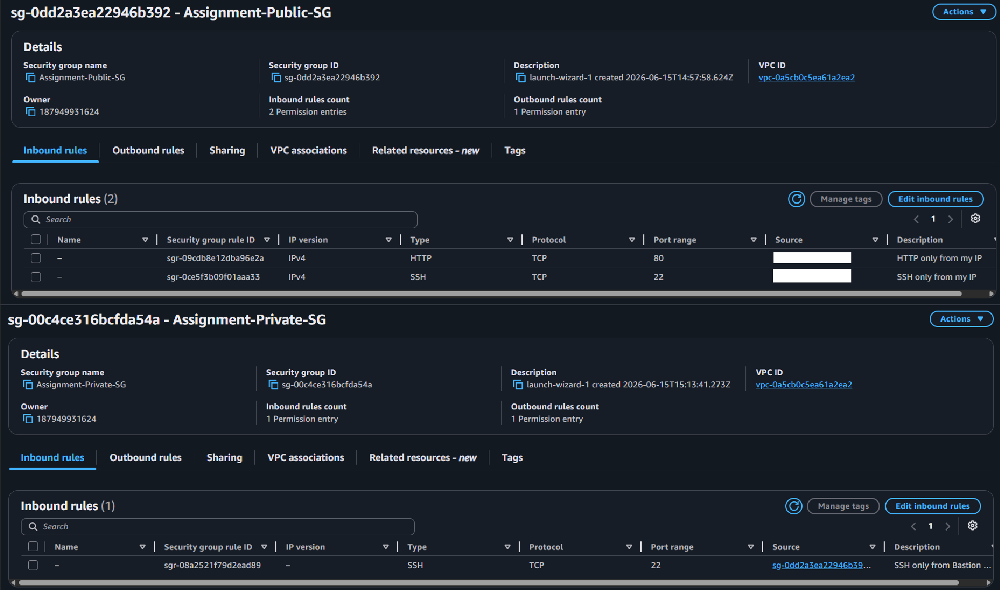

The important detail is the private SG's source: it references the **bastion's SG**, not an IP address. That means "allow SSH from anything wearing the bastion security group" - it keeps working even if the bastion's IP changes, and it's the textbook bastion → private pattern. Security groups are also **stateful**, so the return traffic for any allowed connection is automatically permitted; you only ever define the inbound side.

### 7. Launch the EC2 instances

Two `t3.micro` instances on Amazon Linux 2023, both in `eu-west-2a`:

- **`Assignment-Public-EC2`** – public IP `13.40.45.94`, `Assignment-Public-SG`. This is also the bastion host.
- **`Assignment-Private-EC2`** – **no public IP**, `Assignment-Private-SG`.

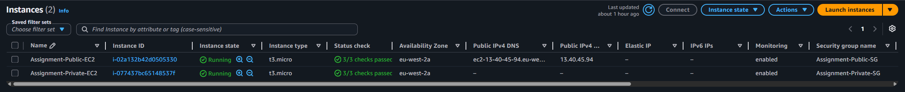

Note the **Monitoring → enabled** column on both (detailed CloudWatch monitoring, 1-minute granularity) and that only the public instance has a Public IPv4 address - exactly the public/private split the assignment asks for.

### 8. SSH into the bastion

Connecting from my machine straight to the public instance's public DNS name.

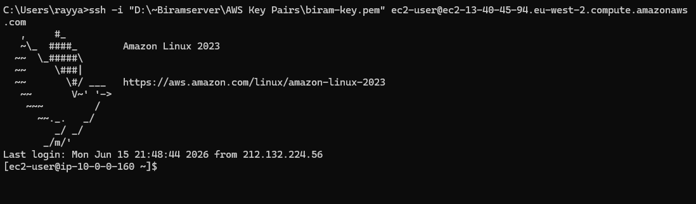

### 9. Stand up a web server on the bastion

A fresh EC2 instance serves nothing on port 80, so Apache is installed and started, and a simple test page is dropped in:

```bash
sudo dnf install -y httpd
sudo systemctl enable --now httpd
echo "My Assignment 1 works" | sudo tee /var/www/html/index.html
```

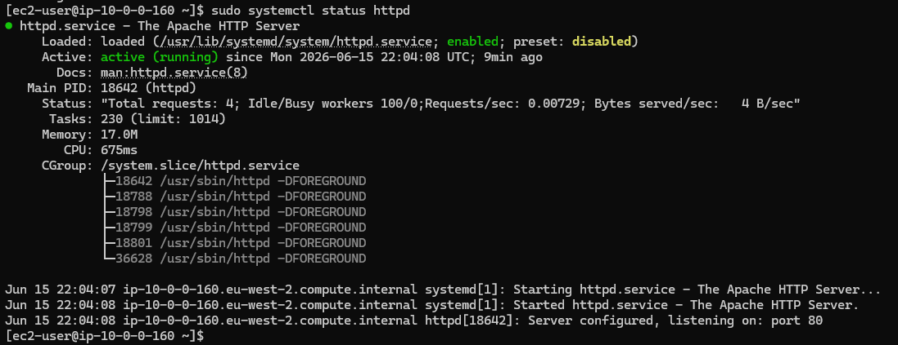

A local `curl` confirms the server answers on the box itself before involving the network or security group:

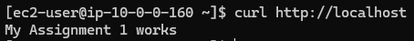

### 10. Hit it over HTTP from the browser

Browsing to the public IP `http://13.40.45.94` returns the page - proof the IGW route, the public IP, and the `HTTP from my IP` security-group rule all line up.

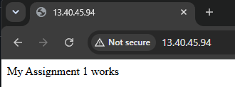

### 11. Hop from the bastion to the private instance

From inside the bastion, SSH to the private instance over its **private** IP (`10.0.1.239`). This is the *only* way to reach the private box, and it works because the private SG allows SSH from the bastion's SG.

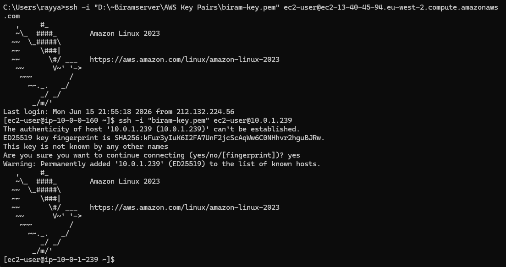

> The private key was copied onto the bastion for the hop.

### 12. Prove the private subnet's outbound path

From the private instance - which has no public IP - pinging `8.8.8.8` succeeds. The only path those packets can take to the internet is out through the NAT Gateway, so this is direct proof the NAT egress works.

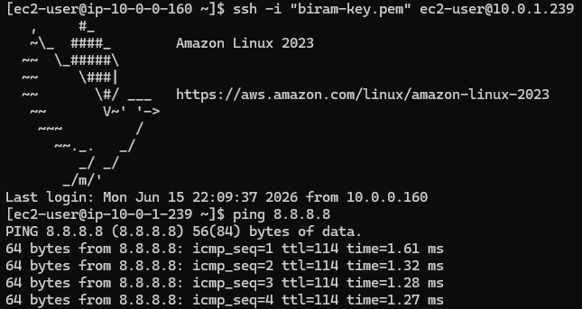

### 13. Bonus - CloudWatch monitoring

Detailed monitoring is already enabled on both instances, but the default EC2 metrics **don't include memory or disk-space usage** - the hypervisor can't see inside the guest OS, so those need the CloudWatch agent.

First, an IAM role (`Assignment-EC2-Cloudwatch`) with `CloudWatchAgentServerPolicy` (lets the agent push metrics) and `AmazonSSMManagedInstanceCore` (enables Session Manager), attached to both instances:

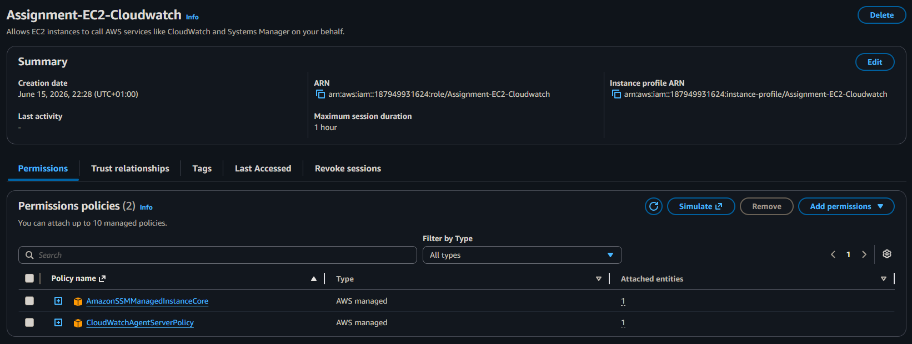

Then the agent is installed and started on each instance:

```bash
sudo dnf install -y amazon-cloudwatch-agent
sudo /opt/aws/amazon-cloudwatch-agent/bin/amazon-cloudwatch-agent-config-wizard   # select memory + disk
sudo /opt/aws/amazon-cloudwatch-agent/bin/amazon-cloudwatch-agent-ctl \
  -a fetch-config -m ec2 -s -c file:/opt/aws/amazon-cloudwatch-agent/bin/config.json
```

Both instances then report into the **`CWAgent`** namespace:

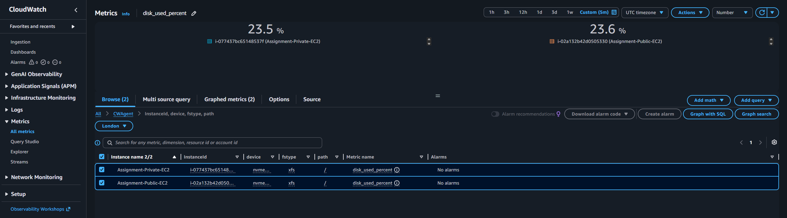

The neat detail: the **private** instance's metrics still land in CloudWatch despite it having no public IP - that traffic egresses through the NAT Gateway, the exact same path proven in step 12.

## Commands Used

All commands used during the build, in one place.

```bash
# ─── Connect to the bastion (public EC2) from my machine ─────
ssh -i "D:\~Biramserver\AWS Key Pairs\biram-key.pem" \
  ec2-user@ec2-13-40-45-94.eu-west-2.compute.amazonaws.com


# ─── Web server on the bastion ───────────────────────────────
sudo dnf install -y httpd
sudo systemctl enable --now httpd
echo "My Assignment 1 works" | sudo tee /var/www/html/index.html

curl http://localhost                 # answers locally
sudo systemctl status httpd           # active + listening on :80
sudo ss -tlnp | grep :80              # confirm something is bound to port 80


# ─── Hop from the bastion to the private instance ────────────
ssh -i "biram-key.pem" ec2-user@10.0.1.239


# ─── Prove the private subnet's outbound path via NAT ────────
ping 8.8.8.8                          # replies → NAT egress works
curl -I https://aws.amazon.com        # alternative TCP/443 check


# ─── CloudWatch agent (run on EACH instance) ─────────────────
sudo dnf install -y amazon-cloudwatch-agent

# run the wizard WITH sudo (it writes to a root-owned path), pick memory + disk:
sudo /opt/aws/amazon-cloudwatch-agent/bin/amazon-cloudwatch-agent-config-wizard

# start the agent with the generated config:
sudo /opt/aws/amazon-cloudwatch-agent/bin/amazon-cloudwatch-agent-ctl \
  -a fetch-config -m ec2 -s -c file:/opt/aws/amazon-cloudwatch-agent/bin/config.json

# confirm it's running:
sudo /opt/aws/amazon-cloudwatch-agent/bin/amazon-cloudwatch-agent-ctl -a status
```

## What I Learnt

### VPC and subnetting
- A VPC is an isolated private network; the CIDR block (`10.0.0.0/16` here) sets its address space.
- AWS **reserves 5 IPs in every subnet**, so a `/24` gives 251 usable addresses, not 256.
- A subnet has **no inherent "public" or "private" nature** - that's decided entirely by its route table.

### Internet Gateway vs NAT Gateway
- The **IGW** is bidirectional: it lets the internet reach instances that have a public IP, and lets them reach out.
- The **NAT Gateway** is one-way: private instances can initiate outbound connections, but nothing outside can initiate inbound. This is the whole point of a private subnet - it can still pull updates without being exposed.
- The NAT lives in the **public** subnet because its own return traffic needs the public route to the IGW.

### Route tables define the topology
- The `local` route (auto-created) is what lets subnets in the VPC talk to each other.
- The `0.0.0.0/0` default route is the switch: → IGW makes a subnet public, → NAT makes it private.
- Subnet **associations** matter - a route table only governs the subnets explicitly attached to it.

### Security groups
- They're **stateful**: allow the inbound side and the return traffic is automatic.
- **Referencing another SG as the source** ("allow SSH from the bastion's SG") is cleaner and more durable than hardcoding an IP - it survives IP changes and scales to more instances.
- For east-west traffic *inside* the VPC, the source an SG sees is the other instance's **private** IP - there's no NAT between them. (This is why reusing the public SG on the private box would have *blocked* the bastion: that SG's rule is scoped to my home IP, not the bastion.)

### The bastion host pattern
- A single hardened, internet-facing instance is the only SSH entry point; everything private sits behind it.
- Keeping the private key *off* the bastion (ProxyJump or SSM Session Manager) is the safer way to do the hop.

### CloudWatch monitoring
- **Basic** monitoring (5-min) is on by default and free; **detailed** (1-min) is a toggle.
- The default EC2 metrics **don't include memory or disk usage** - the hypervisor can't see inside the guest OS, so those require the **CloudWatch agent**.
- The agent needs an **IAM role** (`CloudWatchAgentServerPolicy`) or it has no permission to push anything; it reports into the `CWAgent` namespace.

## Challenges & How I Solved Them

### 1. HTTP didn't work even though SSH did
The bastion was SSH-able but `http://13.40.45.94` returned nothing. SSH working actually narrowed it down - the network path (IGW, route, public IP, SG) was clearly fine, so the problem had to be at the HTTP layer.

**Solution:** `curl http://localhost` *on the instance* was the deciding test. It failed → nothing was listening on port 80, because a fresh instance doesn't run a web server. Installing and starting Apache fixed it, and the browser served the page straight after.

### 2. Couldn't just reuse the public SG on the private instance
The instinct was to attach the existing public SG to the private box. But that SG only allows SSH **from my home IP** - and when the bastion connects, the private instance sees the bastion's *private* IP as the source, not my home IP. Reusing the SG would have **locked the bastion out**.

**Solution:** created a dedicated `Assignment-Private-SG` whose inbound SSH rule references the **bastion's security group** as the source. That's what "allow only internal access from the bastion" actually means in practice.

### 3. The CloudWatch config wizard exited with a non-zero status
Running `amazon-cloudwatch-agent-config-wizard` failed with `exited with non-zero status: 1`, and the follow-up start command then complained the config file didn't exist.

**Solution:** the wizard was run **without `sudo`**, so it couldn't write `config.json` to the root-owned `/opt/aws/amazon-cloudwatch-agent/bin/` directory and never created the file. Re-running the wizard with `sudo` let it write the config, and the agent started cleanly.

## Cleanup

A NAT Gateway and its Elastic IP **bill by the hour whether you use them or not**, so teardown matters. In order:

- **Delete the NAT Gateway** (`Assignment-NAT`) - the main meter running.
- **Release the Elastic IP** - an unattached EIP is also chargeable.
- **Terminate both EC2 instances** - this also stops the detailed-monitoring and public-IPv4 charges.
- **Delete the VPC** - this cleans up the subnets and route tables; detach and delete the Internet Gateway as part of it.

Leaving the VPC, subnets, route tables, IGW, and security groups in place is free while idle - only the NAT Gateway, the EIP, the running instances, and detailed monitoring actually cost anything.

## Files

- [`README.md`](README.md) - this file
- [`screenshots/`](screenshots/) - all screenshots referenced above, including [`architecture-diagram.png`](screenshots/architecture-diagram.png)