# AWS Application Load Balancer: A Highly Available, Auto-Scaling Web Tier


A common production pattern, built from scratch: multiple EC2 instances behind an Application Load Balancer, with the instances locked away so the ALB is the only thing the internet can reach. This teaches load balancing, health checks, and security-group isolation - then extends into the real-world finish: a custom domain via Route 53, HTTPS with a managed certificate, and an Auto Scaling Group so the fleet heals and scales itself.

## What I Built

A highly available web tier in the **eu-west-2 (London)** region. Two web servers sit behind an **Application Load Balancer** spread across two Availability Zones. The ALB is the single public entry point; the instances accept traffic **only** from the ALB's security group, never directly from the internet. On top of the core build:

- A **Route 53** record maps `aws.biram.uk` to the ALB via an **ALIAS** record.
- An **HTTPS:443 listener** serves a free **ACM** certificate, with HTTP:80 redirecting to it.
- An **Auto Scaling Group** replaces the two hand-launched instances with a self-healing, multi-AZ fleet.

**Stack:**
- **Application Load Balancer** - layer-7 load balancer; the only internet-facing component
- **Target Group** - the pool of instances the ALB forwards to, health-checked on `/`
- **Amazon EC2** - two `t3.micro` web servers (Amazon Linux 2023, Apache via user-data)
- **Auto Scaling Group + Launch Template** - a self-healing fleet across two AZs
- **Security Groups** - ALB SG open to the world on 80/443; EC2 SG open **only to the ALB SG**
- **Amazon Route 53** - public hosted zone, ALIAS record `aws.biram.uk` → ALB
- **AWS Certificate Manager (ACM)** - DNS-validated TLS certificate on the HTTPS listener

**Architecture:**

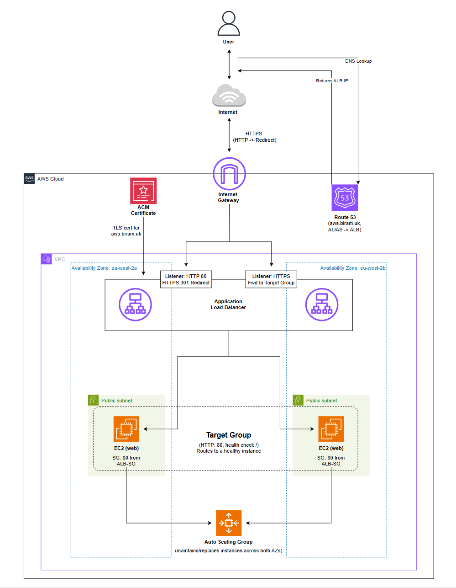

How traffic actually flows:
- **DNS first.** The browser asks Route 53 for `aws.biram.uk`; the ALIAS record returns the ALB's IPs. This is a lookup, not a hop - the request itself then goes to the ALB.
- **User → Internet → IGW → ALB.** Over HTTPS. The ALB presents the ACM cert on its 443 listener and terminates TLS; the 80 listener just 301-redirects to 443.
- **ALB → Target Group → a healthy EC2.** The ALB forwards plain HTTP to whichever instance is healthy, round-robin across the two AZs.
- **No direct path to the instances.** The EC2 SG only allows port 80 from the ALB's SG, so hitting an instance's IP directly just times out.
- **The ASG keeps it alive.** It maintains two instances across both AZs and replaces any that die or fail the ALB's health check.

### Resources created

| Resource | Name | ID / Value |
|----------|------|-----------|
| VPC | `A2-VPC` | `vpc-0c570d1409efdda94` - `10.0.0.0/16` |
| Public subnet (AZ-a) | `A2-Public-Subnet-1` | `subnet-0feb7e331dac7dc52` - `10.0.0.0/20` - eu-west-2a |
| Public subnet (AZ-b) | `A2-Public-Subnet-2` | `subnet-0d733ac0c558f99c8` - `10.0.16.0/20` - eu-west-2b |
| Internet Gateway | `A2-IGW` | `igw-0be70f053a99ca3a2` |
| Route table | `A2-RT` | `rtb-00aa9866dcea56a87` (`0.0.0.0/0` → IGW) |
| Application Load Balancer | `A2-ALB` | `a2-alb-2003740875.eu-west-2.elb.amazonaws.com` (internet-facing) |
| Target Group | `A2-TargetGroup` | HTTP:80, health check `/` |
| ALB security group | `A2-ALB-SG` | `sg-0d740ef6115f0d07e` (HTTP+HTTPS from anywhere) |
| EC2 security group | `A2-EC2-SG` | `sg-0f36be41b8b35c005` (HTTP from `A2-ALB-SG` only) |
| Launch Template | `A2-LaunchTemplate` | `t3.micro`, Amazon Linux 2023, Apache via user-data |
| Auto Scaling Group | `A2-ASG` | desired 2 / min 2 / max 4, across both AZs |
| ACM certificate | `aws.biram.uk` | DNS-validated, on the HTTPS:443 listener |
| Route 53 hosted zone | `aws.biram.uk` | Public zone, ALIAS A → `A2-ALB` |

## Screenshots - quick reference

Jump straight to any step. The full walk-through with images is in the next section.

| # | Step | Screenshot |
|---|------|-----------|
| 1 | Two EC2 instances (different AZs) | [View](screenshots/ec2-instances.png) · [user-data](screenshots/ec2-user-data.png) |
| 2 | The ALB | [View](screenshots/alb.png) |
| 3 | ALB listener (HTTP:80) | [View](screenshots/alb-listeners.png) |
| 4 | Target group + health checks | [View](screenshots/target-group-targets+health-checks.png) |
| 5 | ALB security group | [View](screenshots/alb-sg.png) |
| 6 | EC2 security group (HTTP from ALB SG) | [View](screenshots/ec2-sg.png) |
| 7 | Traffic alternating via the ALB | [View](screenshots/alb-dns.png) · [GIF](screenshots/dns-asg-load-balancing.gif) |
| 8 | Targets healthy | [View](screenshots/asg-healthy.png) |
| 9 | Direct access to an instance is blocked | [View](screenshots/curl-alb-ec2.png) |
| 10 | Route 53 hosted zone | [View](screenshots/aws-hosted-zone.png) |
| 11 | NS delegation in Cloudflare | [View](screenshots/ns-records-cloudflare.png) |
| 12 | ALIAS record → ALB | [View](screenshots/alias-record.png) · [dig](screenshots/dig-dns.png) |
| 13 | ACM cert (pending → issued) | [Pending](screenshots/acm-pending.png) · [Issued](screenshots/acm-issued.png) |
| 14 | HTTPS rule on the ALB SG | [View](screenshots/alb-sg-https.png) |
| 15 | HTTP → HTTPS redirect | [View](screenshots/alb-http-redirect.png) · [GIF](screenshots/dns-http-redirect.gif) |
| 16 | Launch template + ASG | [Summary](screenshots/asg-summary.png) |
| 17 | ASG self-healing | [View](screenshots/asg-self-healing.png) |

## Build Walkthrough

The project end-to-end, in the order it actually happened: the core ALB build first, then the three bonuses.

### 1. Launch two EC2 instances with user-data

Two `t3.micro` instances on Amazon Linux 2023, **one in each AZ** (eu-west-2a and eu-west-2b) for availability. Each boots a web server via **user-data** so there's nothing to configure by hand:

```bash
#!/bin/bash
yum update -y
yum install -y httpd
systemctl start httpd
systemctl enable httpd
echo "<h1>Assignment 2 - EC2 instance 1 online</h1>" > /var/www/html/index.html
```

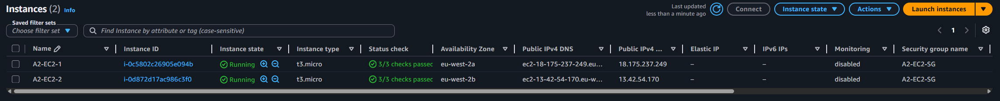
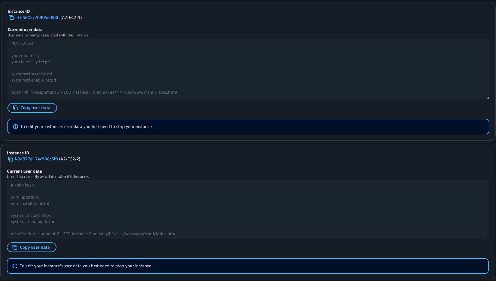

The second instance got `instance 2` in its page so the two return **different content** - that's what makes load balancing visible later. (When I move to the Auto Scaling Group in step 9, this hardcoding has to change - more on that there.)

### 2. Create the Application Load Balancer

An **internet-facing** Application Load Balancer, `A2-ALB`, spanning both public subnets so it has a node in each AZ.

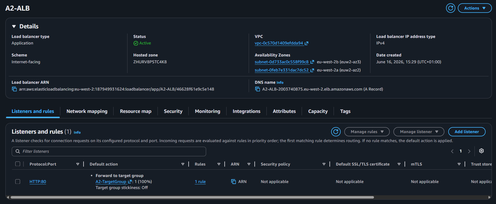

An ALB has to live in **at least two subnets in different AZs** - that's what makes it highly available. It gets its own DNS name (`a2-alb-...elb.amazonaws.com`) that always resolves to its current node IPs.

### 3. Add the HTTP listener

A **listener** on **HTTP:80** with the default action **forward to the target group**. A listener is just a port the ALB watches, with an action attached.

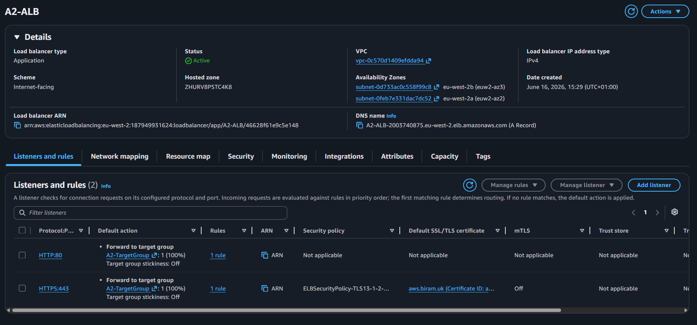

### 4. Create the target group + register the instances

`A2-TargetGroup` (Instance type, HTTP:80) with both instances registered and a **health check on `/`**.

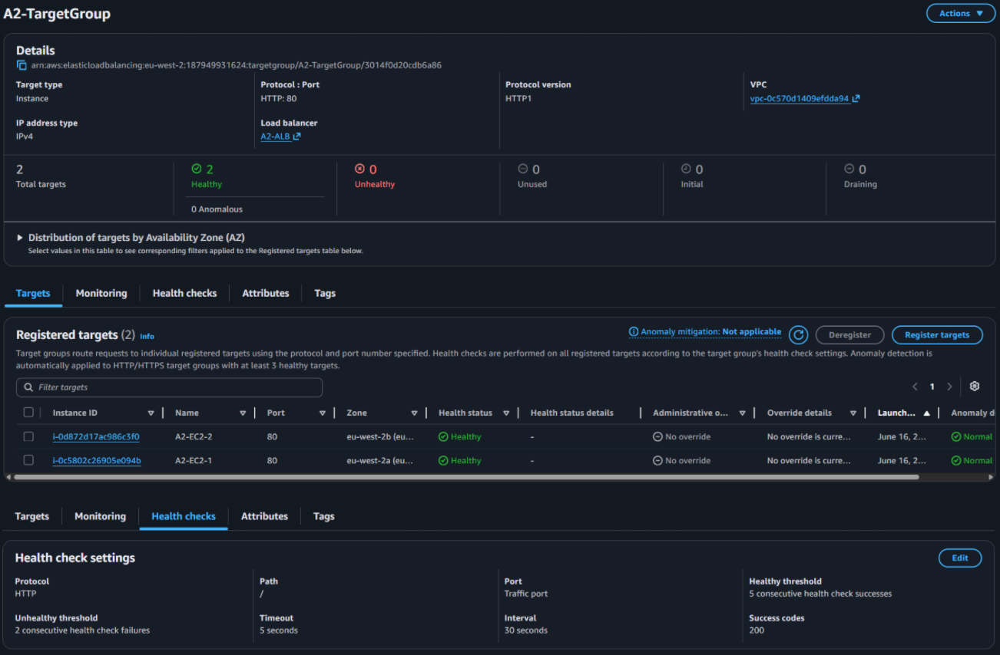

The target group is the pool the ALB forwards to. The health check is the contract: the ALB only sends traffic to targets that return `200` on `/`. Anything else (a `403`, a timeout, a refused connection) marks the target **unhealthy** and pulls it out of rotation.

### 5. Security groups - the isolation

Two security groups, chained so the ALB is the only way in:

- **`A2-ALB-SG`** - inbound **HTTP:80 from `0.0.0.0/0`** (anyone can hit the load balancer).
- **`A2-EC2-SG`** - inbound **HTTP:80 from `A2-ALB-SG`** (the ALB's SG), nothing else.

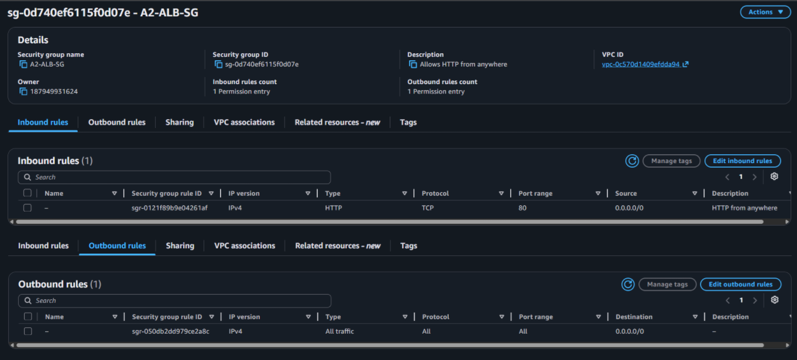
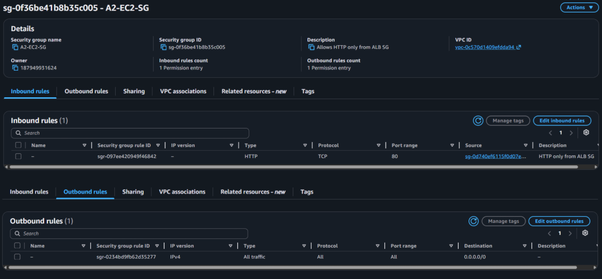

The instance SG's source is the **ALB's security group**, not a CIDR. That's the whole isolation: traffic is only accepted if it comes from something wearing the ALB SG. The health check itself originates from the ALB, so this rule is also what lets health checks through.

### 6. Test it

Browsing the ALB's DNS name and refreshing shows the response **alternate between the two instances** - proof the ALB is round-robining across the target group:

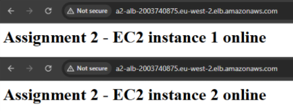

And a `curl` straight to an instance's own IP, bypassing the ALB, **times out** - proof the instances aren't reachable directly, exactly as the brief requires:

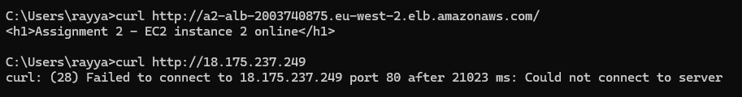

### 7. Bonus - Route 53 ALIAS to the ALB

The ALB's `amazonaws.com` name works but isn't memorable, and you can't put a trusted TLS cert on it - so I pointed `aws.biram.uk` at it. My domain's DNS lives on Cloudflare, so I **delegated a subdomain** into a Route 53 hosted zone rather than moving the whole domain.

First a **public hosted zone** for `aws.biram.uk`:

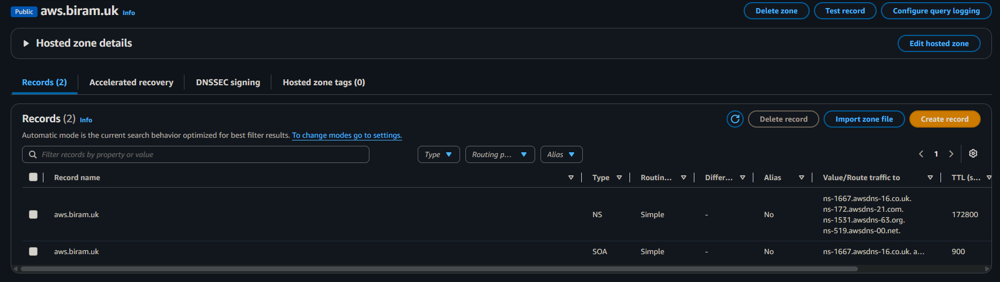

Then four **NS records** in Cloudflare pointing the subdomain at Route 53's nameservers (this hands off resolution of `aws.biram.uk` to AWS):

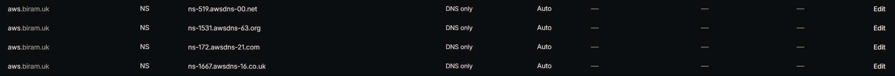

Finally an **ALIAS A record** in Route 53 pointing the name at the ALB. ALIAS is a Route 53-only type that points at an AWS resource directly - unlike a CNAME it works at the zone apex, resolves natively to the ALB's IPs (which can change), and is free for queries to AWS resources:


A `dig` confirms `aws.biram.uk` now resolves to the ALB's two node IPs:

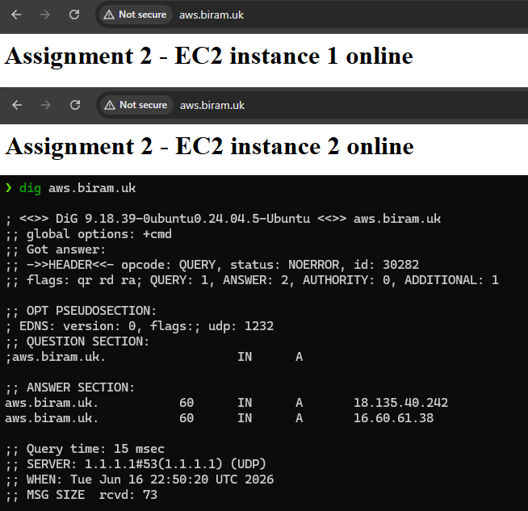

### 8. Bonus - HTTPS listener with ACM

HTTP is unencrypted, so I added TLS. **ACM** issues free public certificates and auto-renews them; the **ALB** terminates TLS at the edge, so the instances stay on plain HTTP internally.

A public certificate for `aws.biram.uk`, **DNS-validated** (one click adds the validation record straight into the Route 53 zone), going from *Pending* to *Issued*:

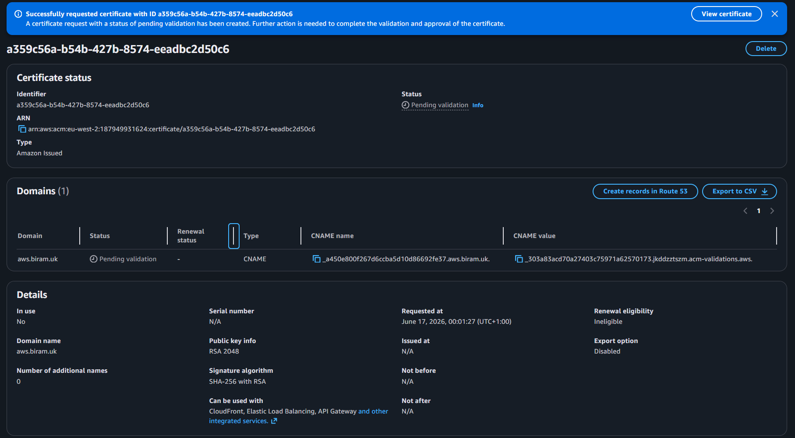
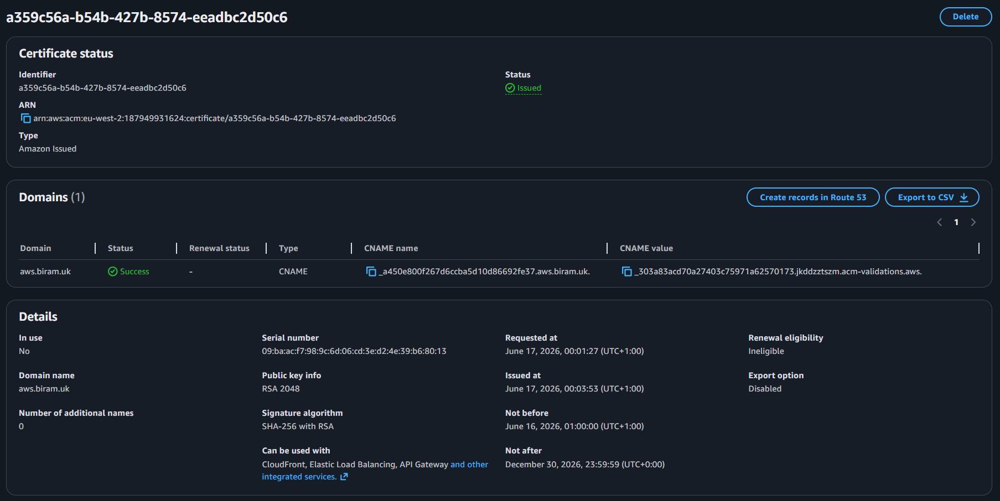

Then an **HTTPS:443 listener** presenting that cert and forwarding to the target group, plus an inbound **443** rule on the ALB SG:

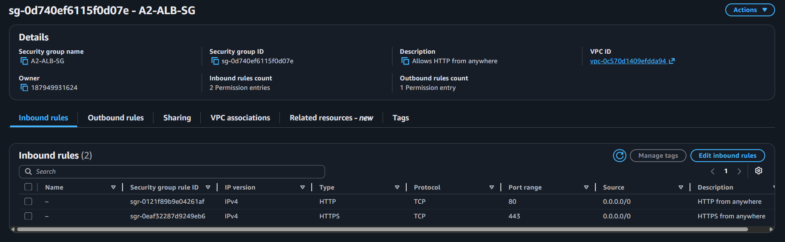

And the HTTP:80 listener changed from *forward* to a **301 redirect to HTTPS**, so everyone lands on the secure URL:

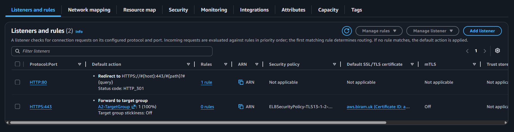

### 9. Bonus - Auto Scaling Group

The two hand-launched instances are pets; an **ASG** turns them into cattle - a self-healing fleet from a single blueprint.

A **launch template** (`A2-LaunchTemplate`) holds the AMI, instance type, the `A2-EC2-SG`, and the user-data. Because one template runs **identical** user-data on every instance, the hardcoded "instance 1 / 2" approach no longer works - so the page switched to `$(hostname)`, letting each instance self-identify:

```bash
#!/bin/bash
yum update -y
yum install -y httpd
systemctl start httpd
systemctl enable httpd
echo "<h1>Assignment 2 - $(hostname)</h1>" > /var/www/html/index.html
```

The ASG runs across **both AZs**, attached to `A2-TargetGroup` with **ELB health checks** turned on (so it replaces instances that fail the ALB's `/` check, not just ones that fail EC2 status checks), at desired/min/max of 2/2/4:

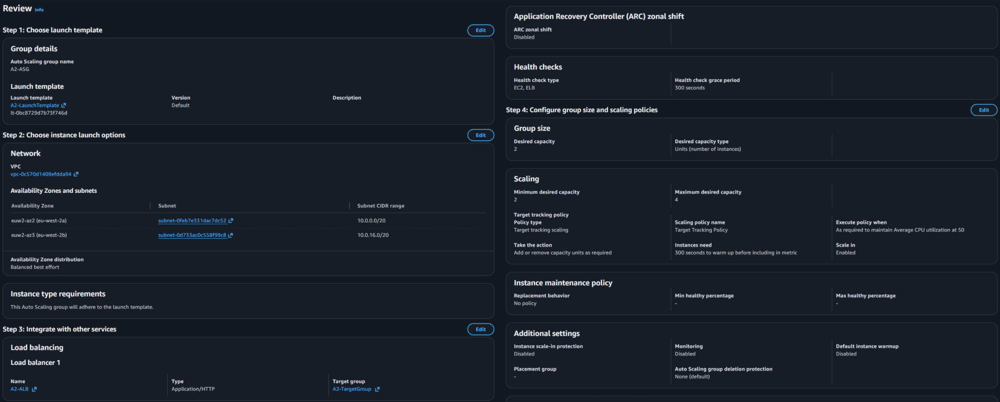
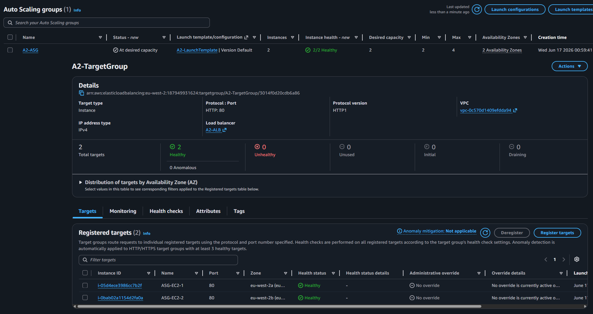

The payoff - **self-healing**: terminating an instance by hand, the ASG detects the capacity shortfall and launches a replacement automatically:

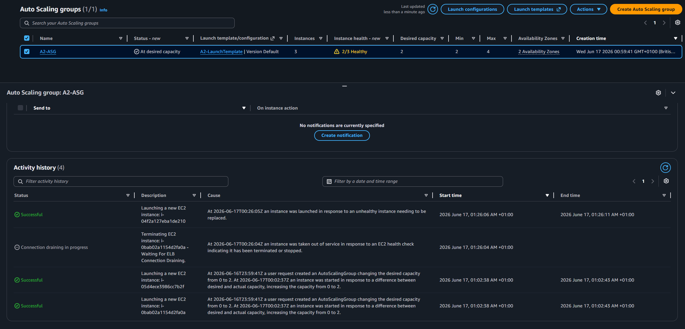

And the whole thing alternates across the live fleet over the custom HTTPS domain:

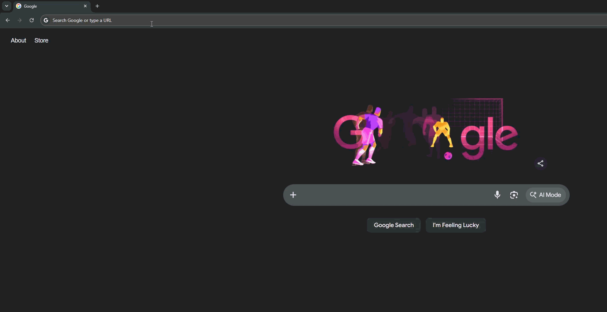

## Commands Used

```bash
# ─── User-data baked into the launch template ────────────────
#!/bin/bash
yum update -y
yum install -y httpd
systemctl start httpd
systemctl enable httpd
echo "<h1>Assignment 2 - $(hostname)</h1>" > /var/www/html/index.html


# ─── Confirm DNS resolves the domain to the ALB ──────────────
dig aws.biram.uk            # answer section returns the ALB's node IPs


# ─── Confirm direct access to an instance is blocked ─────────
curl http://<instance-public-ip>     # times out - SG allows only the ALB SG
```

## What I Learnt

### Application Load Balancers and listeners
- An ALB must span **at least two AZs**; that's the source of its availability.
- A **listener** is a port + an action. One ALB runs many - here HTTP:80 (redirect) and HTTPS:443 (forward). You never need a second ALB for HTTPS.
- **TLS termination** happens at the ALB: it holds the cert and decrypts, so backends can stay on plain HTTP.

### Target groups and health checks
- The target group is the instance pool; the **health check on `/`** is the gate - only `200`-returning targets receive traffic.
- A target failing health checks (wrong path, `403` from a missing index page, refused connection) is silently pulled from rotation - which is usually *why* an ALB returns errors.

### Security group chaining
- Referencing the **ALB's SG** as the source on the instance SG ("HTTP from `A2-ALB-SG`") is what enforces "no direct public access" - and it's also what lets the ALB's health checks reach the instances.
- It's more durable than a CIDR: it keeps working no matter how the ALB's IPs change.

### A public subnet is not the same as internet access
- The big one. An instance in a **public subnet** (route to IGW) still has **no internet** unless it has a **public IP** - the IGW maps a private IP to a public one, so with no public IP there's nothing to map.
- This is exactly why user-data that runs `yum install` fails silently on a no-public-IP instance: it can't reach the package repos. (Full story in Challenges.)

### Route 53 ALIAS vs CNAME
- **ALIAS** is Route 53-only, works at the zone apex, points natively at AWS resources, and is free for AWS-resource queries - the right way to point a name at an ALB.
- Delegating a **subdomain** via NS records lets you use Route 53 for one name without moving a whole domain off another DNS provider.

### Auto Scaling Groups
- A **launch template** is the instance blueprint; the **ASG** owns placement (you give it the subnets, not the template).
- One template means identical instances - so per-instance differences have to be **generated at boot** (e.g. `$(hostname)`), not hardcoded.
- Turning on **ELB health checks** makes the ASG replace instances that fail the *ALB's* check, giving true self-healing.

## Challenges & How I Solved Them

### 1. 502 Bad Gateway and both targets permanently unhealthy
The ALB returned `502` and both targets sat at *Unhealthy: health checks failed*. The security groups were correct (EC2 SG allowed HTTP from the ALB SG), the routes pointed at the IGW, the ALB was active - everything *looked* right.

**Root cause:** the instances were in **public subnets but had no public IP**, and there was **no NAT**. A public subnet's route to the IGW is useless without a public IP to map, so the instances had **zero outbound internet** - which meant the user-data's `yum install httpd` had failed at boot and nothing was ever listening on port 80. No port 80 → failed health checks → `502`.

**Solution:** relaunched the instances with **auto-assign public IP enabled**, so they could reach the package repos through the existing IGW and actually install Apache. The instances are still not reachable from the internet - the security group blocks every inbound port except from the ALB - so the isolation requirement holds. The lesson stuck: *public subnet ≠ internet access; an instance needs a public IP (or a NAT) to use the IGW.*

### 2. Working out where the failure was
With the SGs confirmed correct, the failure had to be either the SG blocking the ALB or the web server never starting. The deciding move was reading the **target health reason** ("connection refused" vs "timed out") and getting onto a box to check `sudo cat /var/log/cloud-init-output.log` and `curl http://localhost` - which showed `yum` had errored with no route to the repos, pinning it on the missing outbound path rather than the SG.

### 3. Per-instance content doesn't survive a launch template
Moving to the ASG, the hardcoded "instance 1 / 2" pages broke the "different content" test - a single launch template runs the same script on every instance, so they'd all say the same thing.

**Solution:** switched the page to `$(hostname)`, so each instance stamps its own unique hostname at boot. It needs no per-instance config, and it scales to any fleet size - a better demonstration of load balancing than a static label.

## Cleanup

The ALB and the Route 53 hosted zone are the things that bill while idle, so tear down in this order:

- **Delete the Auto Scaling Group** (set desired/min to 0 first, or just delete it) - this terminates its instances.
- **Delete the Application Load Balancer** - it bills hourly plus per LCU.
- **Delete the Target Group** and the **Launch Template**.
- **Delete the ACM certificate** (free, but tidy).
- **Delete the Route 53 hosted zone** (~$0.50/month) and remove the four **NS delegation records** from Cloudflare.
- **Delete the VPC** if not reusing it - this cleans up the subnets and route table; detach and delete the IGW as part of it.

The VPC, subnets, IGW, and security groups are free while idle - only the ALB, the hosted zone, the running instances, and data transfer actually cost anything.

## Files

- [`README.md`](README.md) - this file
- [`screenshots/`](screenshots/) - all screenshots referenced above, including [`architecture-diagram.png`](screenshots/architecture-diagram.png) and the load-balancing / redirect GIFs