# AWS Static Website: A Global, HTTPS-Secured Site on S3, CloudFront & Route 53


A static website served the production way, built from scratch: files in an S3 bucket, delivered globally through the CloudFront CDN, on a custom HTTPS domain via Route 53. The core build teaches object storage, edge caching, and DNS, then, it extends into the real-world finish: a CI/CD pipeline that deploys on every push, security headers stamped at the edge, and URL rewriting with Lambda@Edge.

## What I Built

A globally distributed static website. The site's files live in an **S3 bucket** in **eu-west-2 (London)**, and **Amazon CloudFront** caches and serves them from edge locations around the world over HTTPS. **Route 53** points `aws.biram.uk` at the distribution, and **ACM** provides the TLS certificate. On top of the core build, three production extensions:

- A **CI/CD pipeline** with **GitHub Actions** that deploys to S3 and invalidates CloudFront on every push to `main` - authenticating to AWS with **OIDC**, so there are no long-lived credentials stored anywhere.
- **Security headers** (HSTS, CSP and more) injected at the edge by a **CloudFront Function** on the viewer response.
- A **Lambda@Edge** function that rewrites directory-style URLs to their `index.html` at the origin request.

**Stack:**
- **Amazon S3** - object storage hosting the static site, with static website hosting enabled
- **Amazon CloudFront** - global CDN; caches the site at edge locations and serves it over HTTPS
- **Amazon Route 53** - public hosted zone, ALIAS record `aws.biram.uk` → CloudFront
- **AWS Certificate Manager (ACM)** - TLS certificate for `aws.biram.uk`, issued in **us-east-1** as CloudFront requires
- **GitHub Actions + OIDC** - CI/CD pipeline that deploys to S3, with no stored access keys
- **CloudFront Functions** - lightweight edge function adding security headers
- **Lambda@Edge** - edge function rewriting directory URLs to `index.html`

**Architecture:**

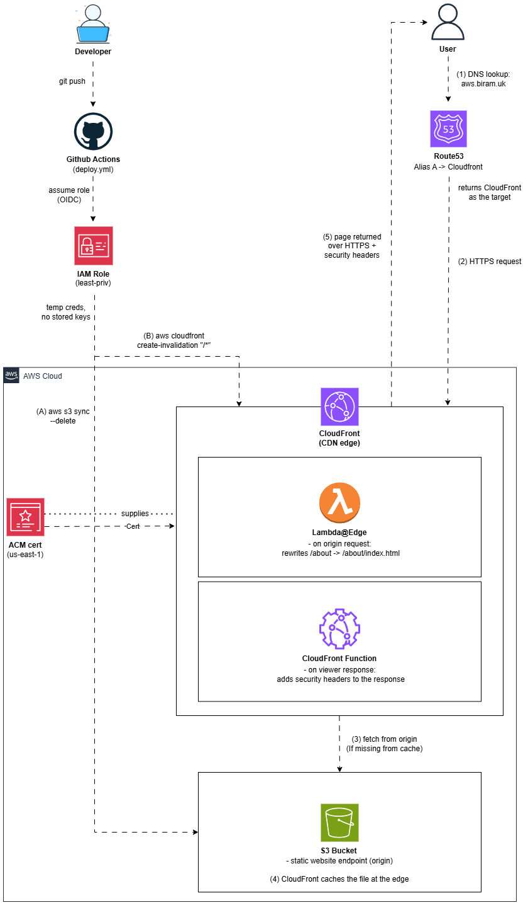

How it actually works:
- **DNS first.** The browser asks Route 53 for `aws.biram.uk`; the ALIAS record returns the CloudFront distribution. This is a lookup, not a hop - the request itself then goes to CloudFront's nearest edge.
- **Edge cache check.** CloudFront checks whether the nearest edge location already holds the page. On a **hit** it serves it straight back - fast, with no trip to S3. On a **miss** it goes to the origin.
- **Origin fetch from S3.** On a miss, CloudFront pulls the file from the S3 **website endpoint**, caches it at the edge, and returns it. The website endpoint is also what resolves `/` and folder paths to their `index.html`.
- **HTTPS throughout.** CloudFront presents the ACM certificate for `aws.biram.uk` and serves over HTTPS; the default root object is `index.html`.
- **Edge functions shape the request and response.** A CloudFront Function stamps security headers onto every response, and a Lambda@Edge function rewrites directory URLs before the origin fetch.

### Resources created

| Resource | Name | ID / Value |
|----------|------|-----------|
| S3 bucket | `a3-biram-s3` | eu-west-2 - static website hosting enabled - public-read |
| S3 website endpoint (origin) | - | `a3-biram-s3.s3-website.eu-west-2.amazonaws.com` |
| CloudFront distribution | `a3-cloudfront-distribution` | `d1klseoynyw9po.cloudfront.net` |
| Alternate domain (CNAME) | `aws.biram.uk` | configured on the distribution |
| Default root object | `index.html` | served at `/` |
| ACM certificate | `aws.biram.uk` | **us-east-1** (required by CloudFront), DNS-validated |
| Route 53 hosted zone | `aws.biram.uk` | public zone, ALIAS A → CloudFront |

## Screenshots - quick reference

Jump straight to any step. The full walk-through with images is in the next sections.

| # | Step | Screenshot |
|---|------|-----------|
| 1 | S3 bucket created | [View](screenshots/s3-bucket-creation.png) |
| 2 | Block Public Access disabled | [View](screenshots/s3-publicaccess-off.png) |
| 3 | Static website hosting enabled | [View](screenshots/s3-static-web-enabled.png) |
| 4 | Public-read bucket policy | [View](screenshots/s3-bucket-policy.png) |
| 5 | Site files uploaded | [View](screenshots/s3-html-uploaded.png) |
| 6 | Live via the S3 website endpoint | [View](screenshots/s3-website.png) |
| 7 | CloudFront alternate domain + SSL cert | [View](screenshots/alternate-domain-ssl.png) |
| 8 | ACM certificate issued (us-east-1) | [View](screenshots/acm-issued.png) |
| 9 | CloudFront behaviours | [View](screenshots/cloudfront-behaviours.png) |
| 10 | Live via the CloudFront domain | [View](screenshots/cloudfront-domain-website.png) |
| 11 | Route 53 ALIAS A record → CloudFront | [View](screenshots/domain-a-record.png) |
| 12 | DNS resolves the domain | [dig](screenshots/dig-dns.png) |
| 13 | Live over the custom HTTPS domain | [GIF](screenshots/dns-website-secure.gif) |
| 14 | Served from the edge (`x-cache` header) | [View](screenshots/curl-via-cloudfront.png) |
| 15 | Caching proof: stale → invalidate → fresh | [Stale](screenshots/old-index-cached.png) · [Invalidation](screenshots/cloudfront-invalidation.png) · [Fresh](screenshots/new-index-invalidation.png) |
| **Bonus** | | |
| 16 | GitHub OIDC identity provider | [View](screenshots/oidc-provider.png) |
| 17 | IAM deploy role + permissions | [View](screenshots/github-iam-roles-permissions.png) |
| 18 | Repo structure + workflow | [View](screenshots/site-github-repo.png) |
| 19 | Pipeline deploy succeeds | [View](screenshots/actions-success-website-test.png) |
| 20 | Security-headers function test | [View](screenshots/cf-sec-headers-test.png) |
| 21 | Function associated to the behaviour | [View](screenshots/function-association-behaviours.png) |
| 22 | A-grade security headers | [View](screenshots/curl+secheaders.png) |
| 23 | Lambda@Edge function | [View](screenshots/a3-url-rewrite.png) |
| 24 | URL rewrite in action | [GIF](screenshots/lambda@edge-about.gif) |

## Build Walkthrough

The core site end-to-end, in the order it actually happened. The three bonuses follow in their own section.

### 1. Create the S3 bucket

A bucket, `a3-biram-s3`, in **eu-west-2 (London)**.

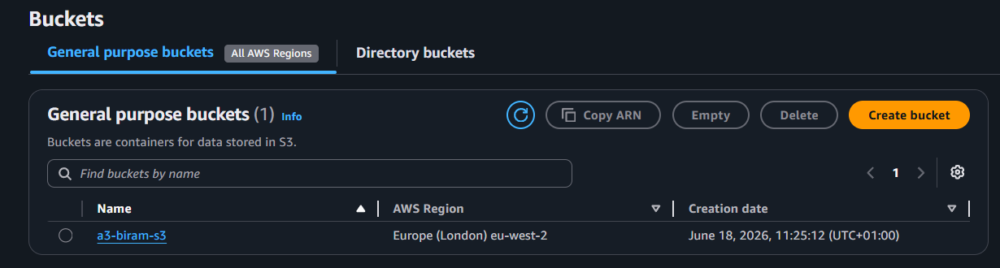

S3 is object storage - cheap, durable, and able to serve static files directly, which makes it the natural home for a website that has no server-side code.

### 2. Disable Block Public Access

By default S3 blocks all public access. For a public website served from the S3 website endpoint, the objects have to be publicly readable, so this block is turned off at the bucket level.

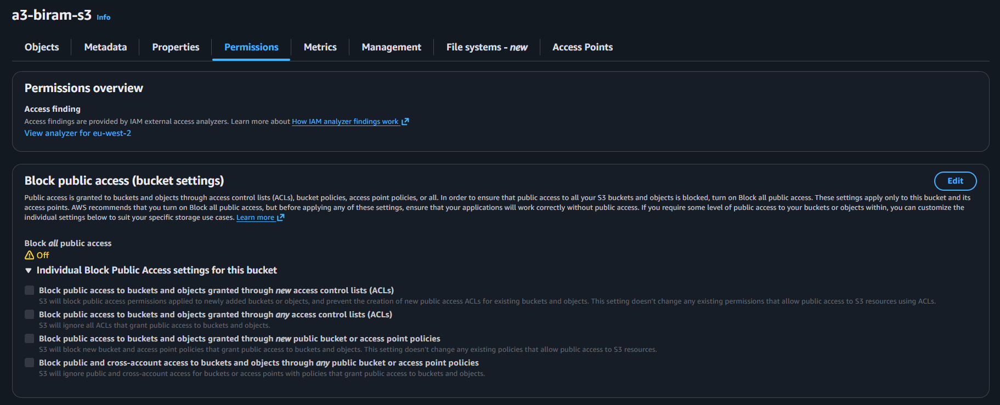

This follows the assignment's approach (public bucket + website endpoint). The modern, hardened alternative is to keep the bucket **private** and let only CloudFront read it through **Origin Access Control (OAC)** - the bucket is never public, and the site is only reachable through CloudFront. Worth knowing as the production-grade version of this step.

### 3. Enable static website hosting

Static website hosting turned on, with the index document set to `index.html` and the error document to `error.html`.

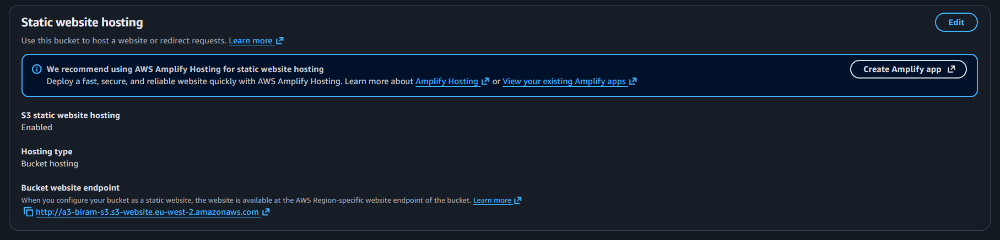

This gives the bucket a **website endpoint**. The website endpoint is what resolves a folder path like `/` to its `index.html` and serves a custom error page.

### 4. Add a public-read bucket policy

A bucket policy allowing anyone to read objects:

```json
{
  "Version": "2012-10-17",
  "Statement": [
    {
      "Sid": "PublicReadGetObject",
      "Effect": "Allow",
      "Principal": "*",
      "Action": "s3:GetObject",
      "Resource": "arn:aws:s3:::a3-biram-s3/*"
    }
  ]
}
```

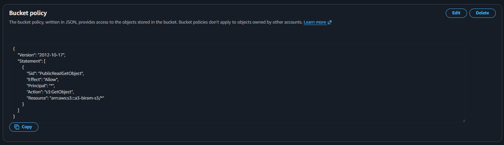

Every statement answers four questions: **Effect** (Allow), **Principal** (`*` = everyone), **Action** (`s3:GetObject` = read an object), and **Resource** (`arn:aws:s3:::a3-biram-s3/*` = every object in this bucket). Only the bucket name in the Resource ARN changes between projects.

### 5. Upload the site and test the endpoint

`index.html` and `error.html` uploaded to the bucket.

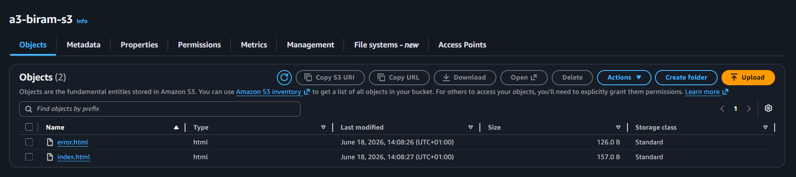

The site loads on the S3 website endpoint - the bucket is now serving over plain HTTP:

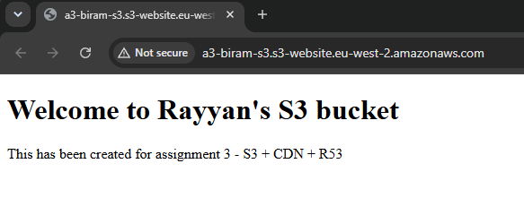

### 6. Put CloudFront in front

A CloudFront distribution with the **S3 website endpoint** as its origin, `aws.biram.uk` as an alternate domain, the **us-east-1** ACM certificate for custom SSL, and `index.html` as the default root object.

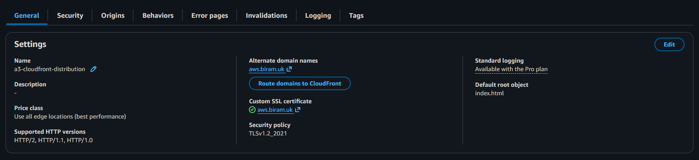

CloudFront buys three things at once: **speed** (the site is cached at edge locations close to the visitor), **HTTPS with a trusted custom cert**, and a single managed front door. The one hard rule here: CloudFront certificates **must** live in us-east-1, so this cert is separate from anything in London.

The certificate, DNS-validated and issued:

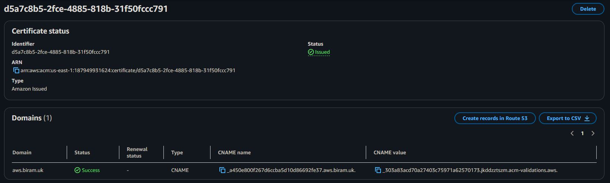

The distribution's behaviours:

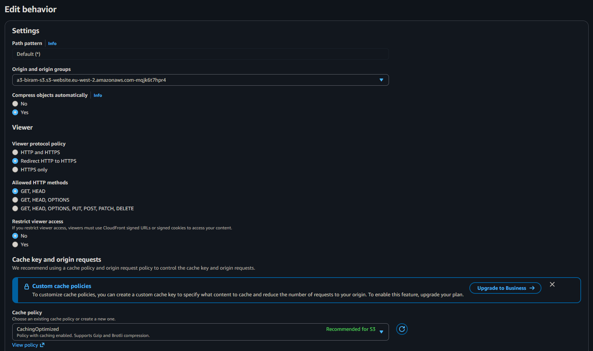

The site now also loads on the CloudFront domain (`d1klseoynyw9po.cloudfront.net`):

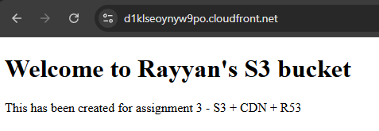

### 7. Point the domain at CloudFront with Route 53

The `aws.biram.uk` hosted zone already existed - it was created and delegated from Cloudflare in Assignment 2 - so this step **reused** it and pointed an **ALIAS A record** at the CloudFront distribution.

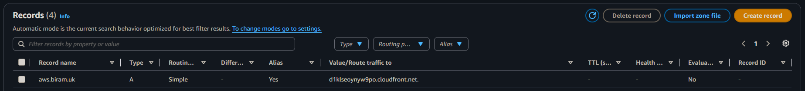

ALIAS is a Route 53-only record type: it works at the zone apex, points natively at an AWS resource like a CloudFront distribution (whose IPs change), and is free for queries to AWS resources. A `dig` confirms the name resolves:

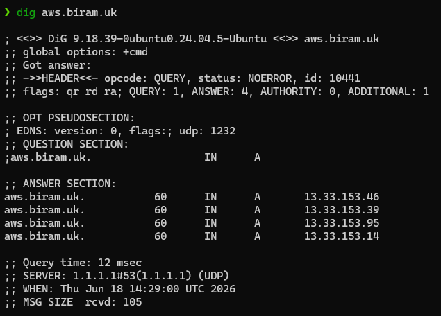

And the site is live over the custom HTTPS domain:


### 8. Confirm edge delivery and prove the cache

A `curl -I` shows the response coming from CloudFront - `x-cache: Hit from cloudfront` and a `via ... cloudfront` header:

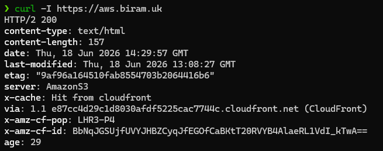

Then the central CloudFront lesson, demonstrated. After editing the homepage and re-uploading it to S3, CloudFront still served the **old** copy - because the edge had it cached:

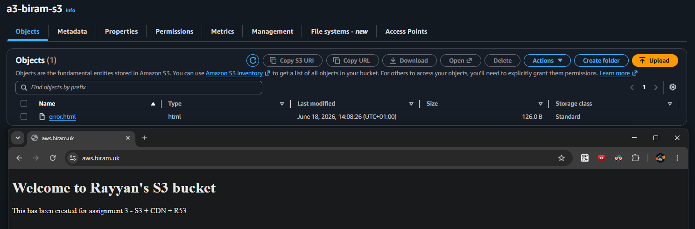

Creating an **invalidation** for `/*` tells the edges to drop their cached copies and re-fetch:

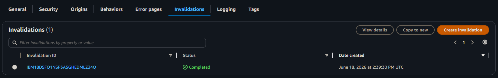

After the invalidation, a refresh shows the **new** content:

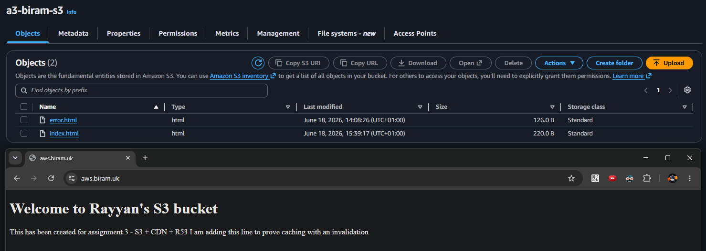

This is the thing to understand about a CDN: CloudFront serves from the edge for the cache's lifetime, so a change at the origin isn't visible until the cache expires **or** you invalidate it. It's exactly why the CI/CD pipeline in the next section runs an invalidation after every deploy.

## Bonus Extensions

Three production extensions on top of the core site. These were built and documented separately from the main brief.

| Resource | Name | Detail |
|----------|------|--------|
| GitHub OIDC provider | `token.actions.githubusercontent.com` | audience `sts.amazonaws.com` |
| IAM deploy role | web-identity role | locked to `RayyanBiram/devops-learning` on `main` |
| IAM policy | `GitHubActions-S3-Deploy` | S3 put/delete/list on the bucket + `cloudfront:CreateInvalidation` |
| CloudFront Function | `add-security-headers` | runs on viewer response |
| Lambda@Edge function | `a3-url-rewrite` | us-east-1, runs on origin request |

### Bonus 1 - CI/CD with GitHub Actions (OIDC)

Manual uploads replaced with an automatic deploy: a push to `main` syncs the site to S3 and invalidates CloudFront. Authentication uses **OIDC** rather than stored keys - GitHub proves its identity to AWS each run and borrows temporary credentials, so there is nothing permanent to leak.

A one-time **OIDC identity provider** tells AWS to trust GitHub's token issuer:

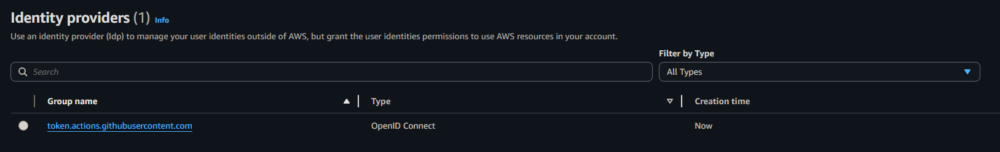

A **web-identity IAM role** that GitHub can assume, locked by a trust condition to only this repo on `main`, with a **least-privilege** policy - it can put/remove objects in this one bucket and create CloudFront invalidations, nothing else:

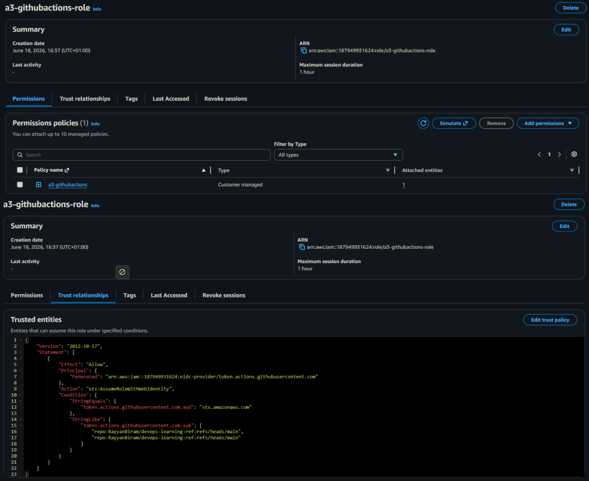

The website files live in a dedicated `sites/` folder inside the project, with the workflow at the **repository root** (the only place GitHub Actions scans):

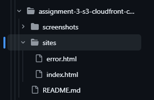

The workflow itself - `.github/workflows/deploy.yml`:

```yaml
name: Deploy to S3

on:
  push:
    branches: [ main ]
    paths:
      - '06-aws/projects/assignment-3-s3-cloudfront-cdn-route53/**'

permissions:
  id-token: write     # lets the job prove its identity to AWS (OIDC)
  contents: read      # lets the job read the repo

jobs:
  deploy:
    runs-on: ubuntu-latest
    steps:
      - uses: actions/checkout@v4

      - name: Connect to AWS (OIDC)
        uses: aws-actions/configure-aws-credentials@v4
        with:
          role-to-assume: ${{ secrets.AWS_ROLE_ARN }}
          aws-region: eu-west-2

      - name: Sync site to S3
        run: aws s3 sync ./06-aws/projects/assignment-3-s3-cloudfront-cdn-route53/sites s3://a3-biram-s3 --delete

      - name: Invalidate CloudFront
        run: aws cloudfront create-invalidation --distribution-id ${{ secrets.CF_DISTRIBUTION_ID }} --paths "/*"
```

The role ARN and distribution ID are stored as repo secrets (`AWS_ROLE_ARN`, `CF_DISTRIBUTION_ID`). With OIDC there are no access keys to store - just those two reference values. The `paths` filter keeps the deploy from firing on unrelated pushes elsewhere in the monorepo. A push to `main` now runs the pipeline green and the change is live:

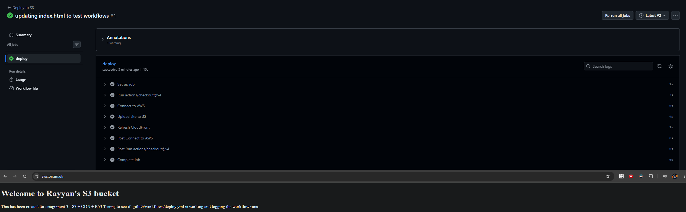

### Bonus 2 - Security headers (CloudFront Functions)

A plain CloudFront site doesn't send security headers by default. A **CloudFront Function** - a tiny JavaScript snippet that runs at the edge - stamps them onto every response. It's attached to the **viewer response**, the moment just before the page reaches the browser.

```javascript
function handler(event) {
    var response = event.response;
    var headers = response.headers;

    headers['strict-transport-security'] = { value: 'max-age=63072000; includeSubdomains; preload' };
    headers['x-content-type-options']    = { value: 'nosniff' };
    headers['x-frame-options']           = { value: 'DENY' };
    headers['referrer-policy']           = { value: 'strict-origin-when-cross-origin' };
    headers['content-security-policy']   = { value: "default-src 'self'" };

    return response;
}
```

Each line is one instruction to the browser: force HTTPS (HSTS), don't guess file types (`nosniff`), never allow the page inside a frame (clickjacking protection), limit referrer leakage, and only load resources from this domain (CSP). Tested in the console:

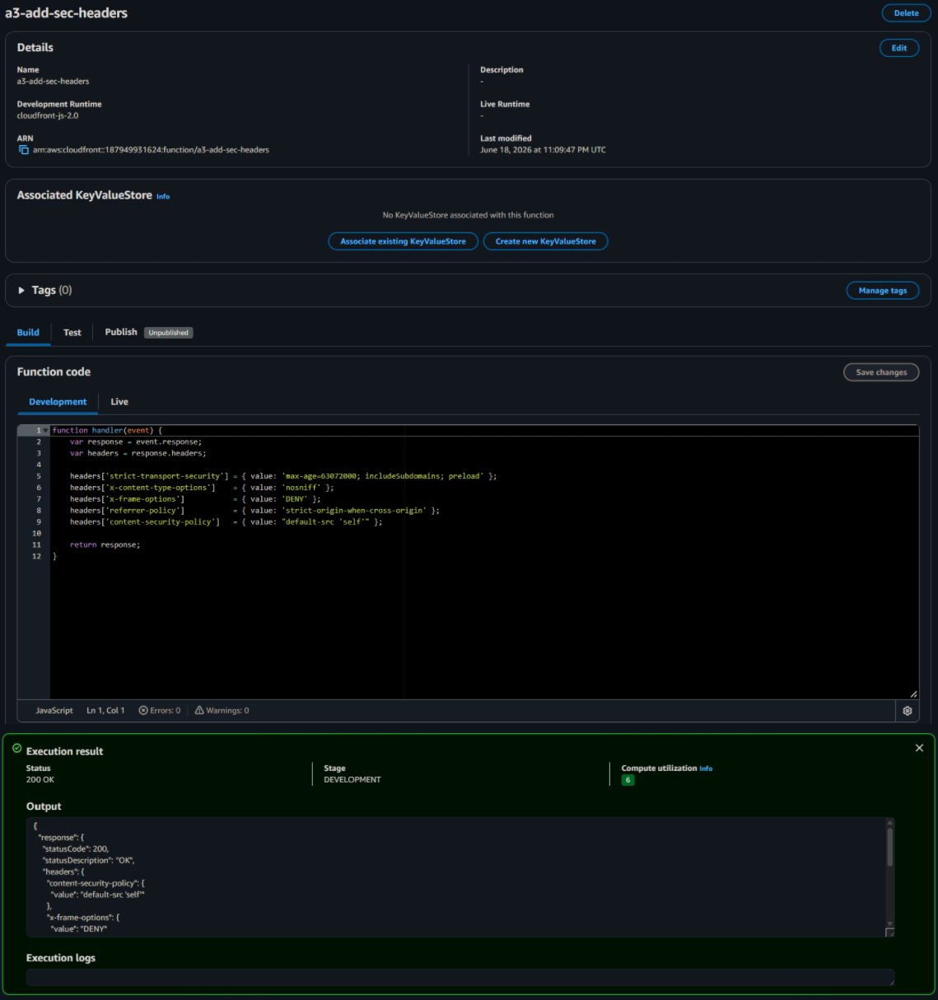

Published, then associated with the distribution's default behaviour on the viewer-response event:

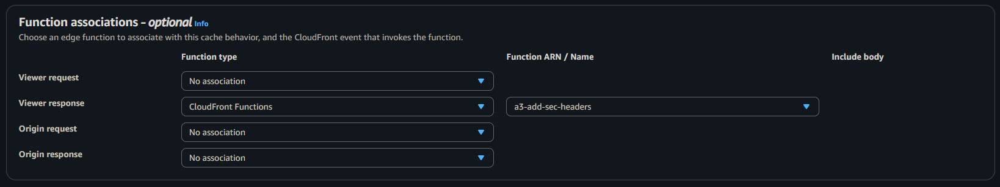

Verified end to end - `curl -I` shows the headers, and securityheaders.com grades the site **A**:

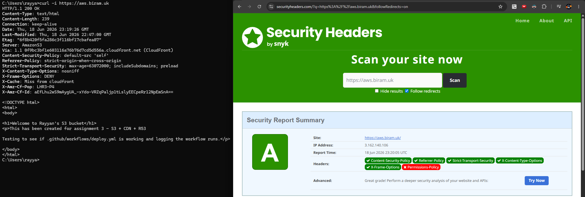

### Bonus 3 - URL rewrites (Lambda@Edge)

A **Lambda@Edge** function rewrites directory-style URLs to their `index.html` - so `/about/` and `/about` both resolve to `/about/index.html`. It runs on the **origin request**, the moment just before CloudFront fetches from S3, which is where changing the path changes which file is served.

```javascript
export const handler = async (event) => {
    const request = event.Records[0].cf.request;
    let uri = request.uri;

    if (uri.endsWith('/')) {
        uri += 'index.html';          // /about/ -> /about/index.html
    } else if (!uri.includes('.')) {
        uri += '/index.html';         // /about  -> /about/index.html
    }

    request.uri = uri;
    return request;
};
```

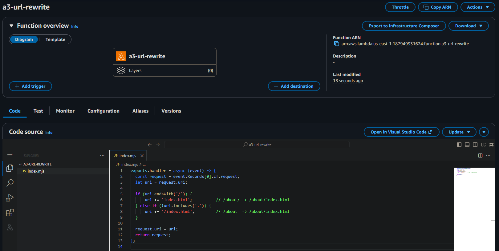

Two Lambda@Edge specifics matter here: the function **must** be created in **us-east-1** (it's replicated to the edges from there), and its execution role must be trusted by **both** `lambda.amazonaws.com` and `edgelambda.amazonaws.com` or the edge can't run it. Only a published, numbered **version** can be attached - never `$LATEST`. With a test `/about/` page in place, both URL forms resolve correctly:

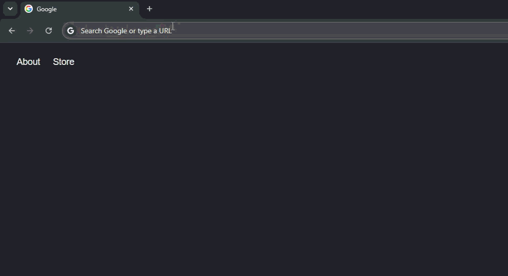

## Commands Used

```bash
# ─── Deploy: sync the site folder to the bucket (run by the pipeline) ───
aws s3 sync ./sites s3://a3-biram-s3 --delete      # --delete mirrors the bucket to the folder

# ─── Deploy: clear the CloudFront cache so changes show immediately ────
aws cloudfront create-invalidation --distribution-id <DIST_ID> --paths "/*"

# ─── Confirm the response is coming from CloudFront's edge ─────────────
curl -I https://aws.biram.uk        # look for x-cache: Hit from cloudfront + a via ... cloudfront header

# ─── Confirm the domain resolves to the distribution ──────────────────
dig aws.biram.uk
```

## What I Learnt

### CloudFront and edge caching
- CloudFront serves from the **nearest edge**; a request is a cache **hit** (served from the edge) or a **miss** (fetched from the origin, then cached).
- A change at the origin is invisible until the cache's TTL expires **or** you run an **invalidation** - which is exactly why the pipeline invalidates `/*` after each deploy.
- The `x-cache` and `via` response headers are how you confirm a request was actually served by CloudFront.

### The us-east-1 certificate rule
- CloudFront only accepts ACM certificates from **us-east-1**, regardless of where the bucket or anything else lives. The eu-west-2 certificate from Assignment 2 could not be reused.

### Route 53 ALIAS to CloudFront
- **ALIAS** points natively at the distribution, works at the zone apex, and is free for AWS-resource queries - the right record type for fronting CloudFront.
- A delegated subdomain (the `aws.biram.uk` zone from Assignment 2) can be **reused** across projects by just repointing its records.

### CI/CD with GitHub Actions and OIDC
- A workflow is just *when* (a trigger) plus *what* (ordered steps). GitHub only runs workflows in `.github/workflows/` at the **repo root**.
- **OIDC** removes stored credentials: the deploy role is locked to one repo and branch by a trust condition, and carries a **least-privilege** policy scoped to the one bucket plus invalidations.

### CloudFront Functions vs Lambda@Edge
- **CloudFront Functions** are tiny and fast, for viewer request/response - ideal for header tweaks.
- **Lambda@Edge** is more capable and runs at more event types including **origin request** - the right place to rewrite a path. It must be created in **us-east-1**, its role needs the **`edgelambda.amazonaws.com`** trust, and only an immutable **version** can be deployed.

## Challenges & How I Solved Them

### 1. Lambda@Edge returned 503 across the whole site
Adding the URL-rewrite function took the entire site down with `503 - The Lambda function ... is invalid or doesn't have the required permissions`. Because the function runs on every request, one broken function broke everything.

**Two separate causes.** First, the function's execution role only trusted `lambda.amazonaws.com`; Lambda@Edge also needs the **edge** service to be able to assume it. Second, the code used CommonJS `exports.handler` inside a `.mjs` file, which is an ES module where `exports` doesn't exist - so the function couldn't even load.

**Solution:** added `edgelambda.amazonaws.com` to the role's trust policy, switched the handler to ES-module syntax (`export const handler`), published a new version, and re-deployed it to the origin-request event.

```json
{
  "Version": "2012-10-17",
  "Statement": [
    {
      "Effect": "Allow",
      "Principal": { "Service": ["lambda.amazonaws.com", "edgelambda.amazonaws.com"] },
      "Action": "sts:AssumeRole"
    }
  ]
}
```

### 2. The GitHub Actions workflow did nothing
The first workflow never triggered. It had been created at `06-aws/projects/.github/workflows/`, but GitHub Actions only scans `.github/workflows/` at the **repository root** - nested ones are ignored entirely.

**Solution:** moved the `.github` folder to the repo root. Then scoped the `s3 sync` path to the real `sites/` folder (so notes and screenshots don't get pushed into the live bucket) and added a `paths` filter so only changes under the assignment folder trigger a deploy.

### 3. "Could not assume role with OIDC: Request ARN is invalid"
Once the workflow ran, the AWS step failed with an invalid-ARN error. The `AWS_ROLE_ARN` secret held the role **name** rather than the full ARN, and the secret name has to match the workflow reference exactly or it resolves to empty.

**Solution:** re-entered the secret as the full `arn:aws:iam::...:role/...` value under the exact name `AWS_ROLE_ARN`, then re-ran the job - which went green and deployed.

### 4. CloudFront kept serving stale content
After editing and re-uploading `index.html`, the site still showed the old page. Nothing was wrong - CloudFront was serving the cached copy from the edge.

**Solution:** a `/*` invalidation forced the edges to re-fetch from the origin, and the new content appeared. This is the reason the CI/CD pipeline runs an invalidation as its final step.

### 5. The certificate couldn't be reused
The plan was to reuse Assignment 2's ACM certificate, but CloudFront rejects any certificate not issued in **us-east-1**.

**Solution:** requested a fresh DNS-validated certificate for `aws.biram.uk` in us-east-1. Everything else - bucket, distribution config, hosted zone - stayed as it was.

## Cleanup

Lambda@Edge is the awkward one to remove - its edge replicas take a few hours to delete after the association is gone - so start there:

- **Remove the Lambda@Edge association** from the distribution's origin-request behaviour, then delete the function once its replicas have cleared (this can take a few hours).
- **Remove the CloudFront Function association** and delete the function.
- **Disable, then delete the CloudFront distribution.**
- **Empty and delete the S3 bucket.**
- **Delete the ACM certificate** in us-east-1.
- **Delete the IAM role, the `GitHubActions-S3-Deploy` policy, and the OIDC provider**, and remove the `AWS_ROLE_ARN` / `CF_DISTRIBUTION_ID` repo secrets.
- **Keep or delete the Route 53 hosted zone** (it bills ~$0.50/month); if deleting, also remove the four NS delegation records from Cloudflare.

What actually costs money while idle is the hosted zone and any CloudFront usage; S3 storage and requests for a tiny static site are negligible.

## Files

- [`README.md`](README.md) - this file
- [`sites/index.html`](sites/index.html) and [`sites/error.html`](sites/error.html) - the website
- [`.github/workflows/deploy.yml`](.github/workflows/deploy.yml) - the CI/CD pipeline
- [`screenshots/`](screenshots/) - all screenshots and GIFs referenced above, including [`architecture-diagram.gif`](screenshots/architecture-diagram.gif)

The bucket policy, the CloudFront Function, and the Lambda@Edge function are all reproduced inline in the sections above.