# AWS Serverless REST API: API Gateway, Lambda & DynamoDB with IAM Least-Privilege


A serverless REST API built from scratch: API Gateway takes a request, a Lambda function processes it, and DynamoDB stores it - with each function's IAM role scoped to exactly one action. The core build teaches serverless compute, NoSQL storage, REST API design, and IAM least-privilege, then it extends into the production finish: a second read endpoint, API keys and usage plans, a WAF rate-limit, and a custom HTTPS domain.

## What I Built

A serverless REST API in the **us-east-1 (N. Virginia)** region. **API Gateway** exposes the public endpoints; **Lambda** functions run the logic on demand; **DynamoDB** stores each submission; and each Lambda wears an **IAM execution role** granting only the single action it needs. On top of the core build, four production extensions:

- A **`GET /students` endpoint** backed by a second Lambda that scans the table and returns every stored record.
- **API keys + a usage plan** so the API requires a key (`x-api-key`) and enforces a request rate and monthly quota.
- A **WAF** (Web Application Firewall) with a rate-based rule that blocks any IP flooding the API.
- A **custom HTTPS domain** (`api.aws.biram.uk`) via ACM and Route 53, replacing the raw `execute-api` URL.

**Stack:**
- **Amazon API Gateway** - REST API exposing `POST /submit` and `GET /students`, with Lambda proxy integration and CORS
- **AWS Lambda** - two Python 3.13 functions: `submit-student` (writes) and `get-students` (reads); serverless, runs only when called
- **Amazon DynamoDB** - the `students` table (partition key `id`, on-demand capacity); a managed NoSQL database
- **AWS IAM** - least-privilege execution roles (PutItem-only for the writer, Scan-only for the reader) plus basic logging
- **Amazon CloudWatch** - automatic per-function logs, the main debugging tool throughout
- **AWS WAF** - a Regional Web ACL with a rate-based rule attached to the API
- **AWS Certificate Manager (ACM) + Route 53** - TLS certificate and DNS for the custom domain `api.aws.biram.uk`

**Architecture:**

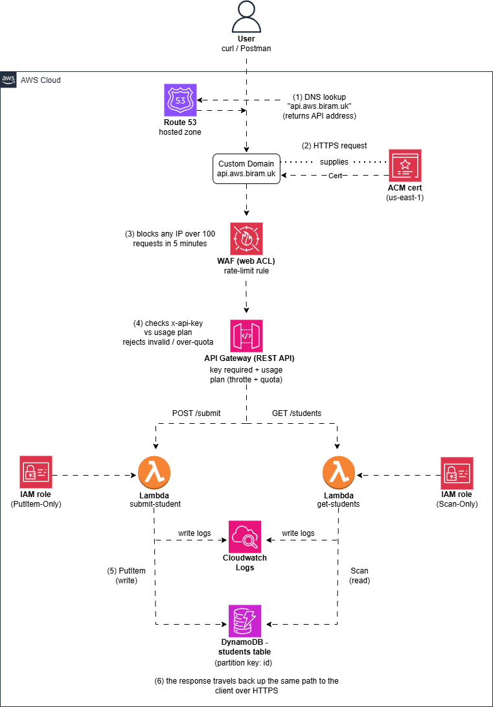

How it actually works:
- **DNS first.** The client asks Route 53 for `api.aws.biram.uk`; it returns the API's address. This is a lookup, not a hop - the request itself then goes straight to the custom domain.
- **HTTPS to the custom domain.** The request hits `api.aws.biram.uk`, secured by the ACM certificate.
- **WAF inspects first.** The Regional Web ACL checks the request against its rate-limit rule; an IP over the threshold is blocked before it ever reaches the API.
- **API Gateway checks the key.** It validates the `x-api-key` header against the usage plan (rate + quota); a missing, invalid, or over-quota key is rejected with `403`.
- **Routing to a Lambda.** `POST /submit` is sent to `submit-student`; `GET /students` is sent to `get-students`.
- **Least-privilege execution.** Each Lambda assumes its own role - `submit-student` may only `PutItem`, `get-students` may only `Scan` - and both write logs to CloudWatch.
- **DynamoDB.** The `students` table stores each submission (keyed by `id`) and returns the full list on a scan. The response then travels back out the same path over HTTPS.

### Resources created

| Resource | Name | ID / Value |
|----------|------|-----------|
| DynamoDB table | `students` | partition key `id` (String) - on-demand - us-east-1 |
| Lambda (write) | `submit-student` | Python 3.13 - role `submit-student-role-yoo8ey7q` |
| Lambda (read) | `get-students` | Python 3.13 - Scan-only role |
| API Gateway REST API | `students-api` | `https://7j9h8p707k.execute-api.us-east-1.amazonaws.com/prod` |
| Method (write) | `POST /submit` | Lambda proxy integration - API key required |
| Method (read) | `GET /students` | Lambda proxy integration |
| Stage | `prod` | deployed |

## Screenshots - quick reference

Jump straight to any step. The full walk-through with images is in the next sections.

| # | Step | Screenshot |
|---|------|-----------|
| 1 | DynamoDB `students` table created | [View](screenshots/ddb-table-creation.png) |
| 2 | `submit-student` Lambda code | [View](screenshots/submit-lambda-function-code.png) |
| 3 | PutItem least-privilege policy | [View](screenshots/putitem-policy.png) |
| 4 | Execution role policies | [View](screenshots/students-iam-policies.png) |
| 5 | `POST /submit` method + CORS | [View](screenshots/submit-options-post-cors.png) |
| 6 | curl → DynamoDB item → CloudWatch logs | [View](screenshots/curl-dbtable-cwlogs.png) |
| **Bonus** | | |
| 7 | `get-students` Lambda code | [View](screenshots/get-students-lambda-function.png) |
| 8 | `GET /students` returns stored items | [View](screenshots/curl-stored-students.png) |
| 9 | API key created | [View](screenshots/api-key-students.png) |
| 10 | Usage plan (rate + quota + stage) | [View](screenshots/usage-plan-students.png) |
| 11 | Key enforced: no key vs valid key | [View](screenshots/curl-api-key-submit.png) |
| 12 | WAF Web ACL + rate-limit rule | [View](screenshots/wacl-rules.png) |
| 13 | ACM certificate issued (us-east-1) | [View](screenshots/acm-cert-issued.png) |
| 14 | API Gateway custom domain | [View](screenshots/custom-domains-api-gateway.png) |
| 15 | Route 53 records for the subdomain | [View](screenshots/cname-a-records-route53.png) |
| 16 | Live on the custom HTTPS domain | [View](screenshots/curl-custom-dns-api.png) |

## Build Walkthrough

The core API end-to-end, in the order it was built: storage first, then the function, its permissions, the public endpoint, and finally a test. The four bonuses follow in their own section.

### 1. Create the DynamoDB table

A table named `students`, with a partition key `id` of type **String** and **on-demand** capacity mode.

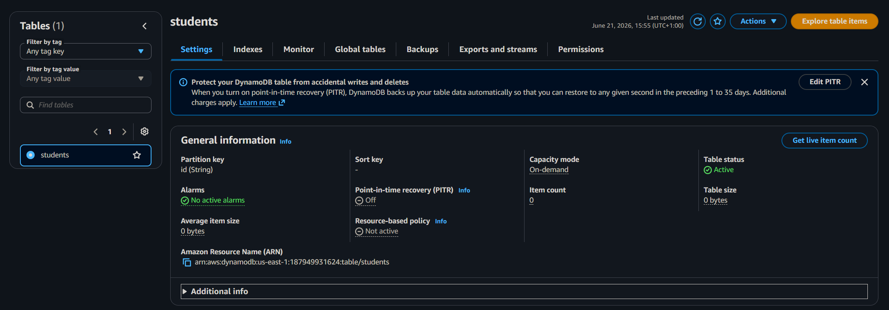

DynamoDB is a managed **NoSQL** database - it stores flexible records by a key rather than in rigid rows and columns. The **partition key** (`id`) is the unique label DynamoDB uses to identify and locate each item. **On-demand** capacity auto-scales to whatever traffic arrives and bills per request, so there's nothing to provision up front.

### 2. Create the Lambda function

`submit-student`, on the **Python 3.13** runtime. It generates a UUID, stores `{ id, timestamp, payload }`, and returns a structured JSON response, with error handling that logs to CloudWatch.

```python
import json
import uuid
from datetime import datetime, timezone
import boto3

# boto3 is the AWS SDK for Python - it lets the code talk to AWS.
# It's pre-installed in Lambda, so there's nothing to package.
dynamodb = boto3.resource('dynamodb')
table = dynamodb.Table('students')

def lambda_handler(event, context):
    try:
        # API Gateway passes the request body as a text string in event['body'].
        # json.loads() turns that text into a Python dictionary.
        body = json.loads(event.get('body') or '{}')

        item = {
            'id': str(uuid.uuid4()),                              # unique record ID
            'timestamp': datetime.now(timezone.utc).isoformat(),  # when it arrived
            'payload': body                                       # whatever the user sent
        }

        table.put_item(Item=item)   # the single DynamoDB write - the PutItem action

        return {
            'statusCode': 200,
            'headers': {
                'Content-Type': 'application/json',
                'Access-Control-Allow-Origin': '*'   # CORS header for browsers
            },
            'body': json.dumps({
                'message': 'Student stored successfully',
                'id': item['id']
            })
        }

    except Exception as e:
        print(f"Error: {e}")   # print() goes straight to CloudWatch logs
        return {
            'statusCode': 500,
            'headers': {
                'Content-Type': 'application/json',
                'Access-Control-Allow-Origin': '*'
            },
            'body': json.dumps({'message': 'Something went wrong'})
        }
```

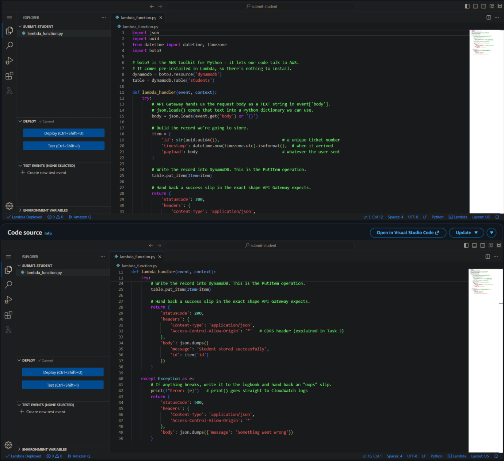

Lambda is **serverless** compute - code that runs only when something calls it, with no servers to manage and billing by the millisecond. The `lambda_handler` is the entry point AWS calls; the `event` is the incoming request from API Gateway. The response has a specific `statusCode` / `headers` / `body` shape because of **proxy integration** (set up in step 4) - the function writes its reply in the exact format API Gateway passes straight back to the caller. The `try / except` is the error handling: any failure is printed to CloudWatch and returned as a clean `500`.

### 3. IAM - the least-privilege execution role

The auto-created role already lets the function write logs. The only thing to add is permission to write to the `students` table - and nothing else:

```json
{
  "Version": "2012-10-17",
  "Statement": [
    {
      "Effect": "Allow",
      "Action": "dynamodb:PutItem",
      "Resource": "arn:aws:dynamodb:us-east-1:187949931624:table/students"
    }
  ]
}
```

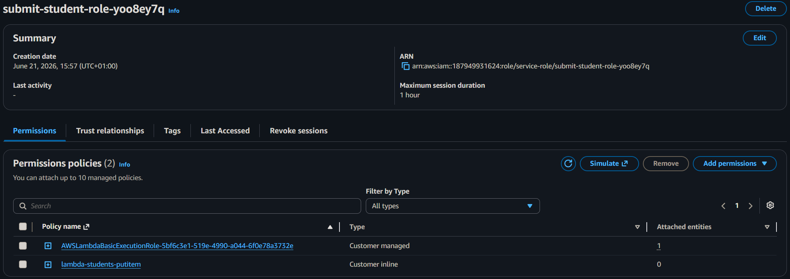
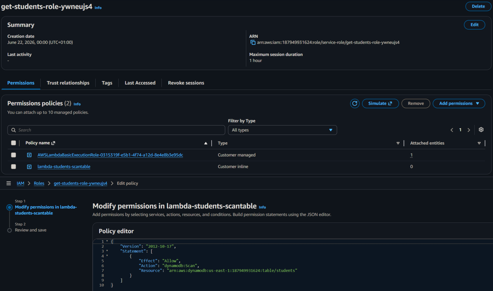

An **execution role** is the set of permissions Lambda assumes at runtime. This is **least-privilege** in practice: the role grants exactly one action (`dynamodb:PutItem`) on exactly one table - no wildcards, no `*:*`. Alongside it sits the basic logging policy, which is what lets the function stream to CloudWatch.

### 4. Build the API Gateway REST API

A REST API named `students-api`, with a `/submit` resource, a **POST** method using **Lambda proxy integration** to `submit-student`, **CORS** enabled, and a deployment to a `prod` stage.

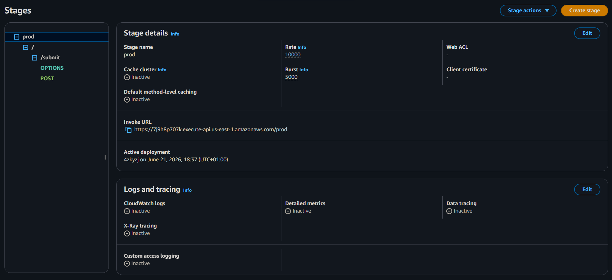

A few terms that matter here:
- **Proxy integration** hands the Lambda the entire request (method, headers, body) and returns its response untouched - the simplest, most common wiring.
- **CORS** (Cross-Origin Resource Sharing) is what lets a browser on one domain call an API on another. Enabling it adds the permission headers and an automatic **OPTIONS** method for the browser's preflight check - that's the OPTIONS sitting next to POST in the screenshot.
- A **stage** (`prod`) is a named, published snapshot of the API with its own public URL. Changes aren't live until they're deployed to it.

The deployed endpoint is `https://7j9h8p707k.execute-api.us-east-1.amazonaws.com/prod`, and the full path is that **+ `/submit`**.

### 5. Test the core

A `POST` with curl stores a record and returns the success JSON:

```bash
curl -X POST https://7j9h8p707k.execute-api.us-east-1.amazonaws.com/prod/submit \
  -H "Content-Type: application/json" \
  -d '{"name": "Mo", "module": "AWS"}'
# {"message": "Student stored successfully", "id": "..."}
```

The same screenshot shows the inserted item in **DynamoDB** and the run's logs in **CloudWatch** - the two places you confirm a serverless write actually happened. CloudWatch is AWS's logging service; every Lambda automatically streams to a log group named `/aws/lambda/submit-student`.

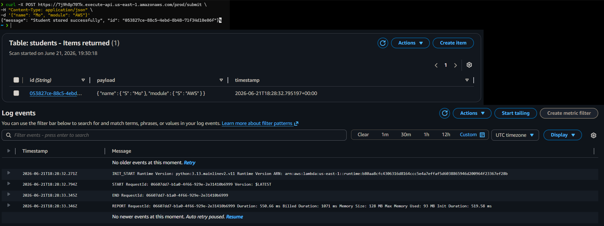

## Bonus Extensions

Four production extensions on top of the core API, built and documented separately from the main brief.

| Resource | Name | Detail |
|----------|------|--------|
| Lambda (read) | `get-students` | Python 3.13, Scan-only role, behind `GET /students` |
| API key | sent as `x-api-key` | required on `POST /submit` |
| Usage plan | rate + burst + quota | e.g. 10 req/s, burst 20, 1,000/month; tied to `prod` |
| WAF Web ACL | `students-waf` | **Regional** (us-east-1), rate-based: block over 100 req / 5 min per IP |
| ACM certificate | `api.aws.biram.uk` | us-east-1, DNS-validated |
| Custom domain | `api.aws.biram.uk` | API Gateway Regional domain, mapped to `prod` |

### Bonus 1 - GET /students (a Scan endpoint)

A second, separate Lambda (`get-students`) reads the whole table and returns it, so the working `POST` function stays untouched and each function keeps a single, tightly-scoped permission.

```python
import json
import boto3
from decimal import Decimal

dynamodb = boto3.resource('dynamodb')
table = dynamodb.Table('students')

# DynamoDB returns numbers as a special Decimal type that Python's JSON
# encoder doesn't understand - this converts them so the response is clean JSON.
def decimal_default(obj):
    if isinstance(obj, Decimal):
        return float(obj)
    raise TypeError

def lambda_handler(event, context):
    try:
        result = table.scan()                 # read every item in the table
        items = result.get('Items', [])
        return {
            'statusCode': 200,
            'headers': {
                'Content-Type': 'application/json',
                'Access-Control-Allow-Origin': '*'
            },
            'body': json.dumps(items, default=decimal_default)
        }
    except Exception as e:
        print(f"Error: {e}")
        return {
            'statusCode': 500,
            'headers': {'Content-Type': 'application/json',
                        'Access-Control-Allow-Origin': '*'},
            'body': json.dumps({'message': 'Something went wrong'})
        }
```

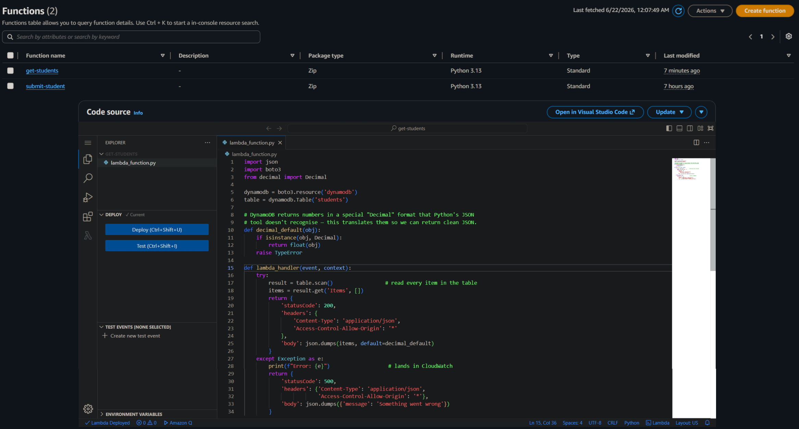

Its role grants only `dynamodb:Scan` on the `students` table (the read mirror of the writer's PutItem policy). A **Scan** reads *every* item in the table - fine for a small table, though its targeted cousin **Query** is what you'd reach for at scale, since Scan reads everything. The route is a new `/students` resource with a **GET** method, Lambda proxy integration, and CORS. A plain `curl` (GET needs no `-X` flag) returns the stored records:

```bash
curl https://7j9h8p707k.execute-api.us-east-1.amazonaws.com/prod/students
```

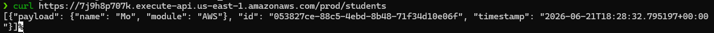

### Bonus 2 - API keys + usage plans

Out of the box, anyone with the URL can call the API. An **API key** is a secret token the caller must send in an `x-api-key` header; a **usage plan** is the rulebook attached to that key - a **rate** (requests per second + burst) and a **quota** (total per month) - tied to a stage.

The key, and the usage plan with its throttle, quota, and associated `prod` stage:

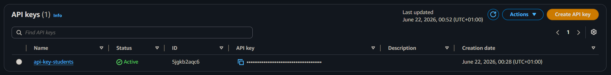
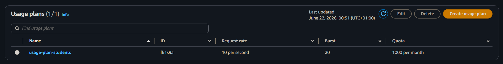

With **API key required** set to `true` on `POST /submit` and the API redeployed, the no-key call is rejected and only the valid key gets through:

```bash
# No key  → 403 Forbidden
curl -X POST https://7j9h8p707k.execute-api.us-east-1.amazonaws.com/prod/submit \
  -H "Content-Type: application/json" -d '{"name":"Mo","module":"AWS"}'

# Valid key → success
curl -X POST https://7j9h8p707k.execute-api.us-east-1.amazonaws.com/prod/submit \
  -H "Content-Type: application/json" \
  -H "x-api-key: <API_KEY>" \
  -d '{"name":"Mo","module":"AWS"}'
```

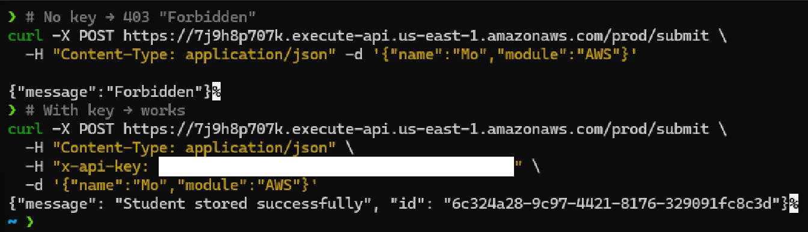

The thing to internalise: a key does nothing on its own. It only works once it is **in a usage plan that's associated with the stage**, *and* the API has been redeployed after turning the requirement on (both of these tripped me up - see Challenges).

### Bonus 3 - WAF with a rate-based rule

A **WAF** (Web Application Firewall) sits in front of the API and inspects every request against a set of rules held in a **Web ACL** (Access Control List). The rule here is **rate-based**: any single IP that crosses a request threshold inside a 5-minute window is blocked.

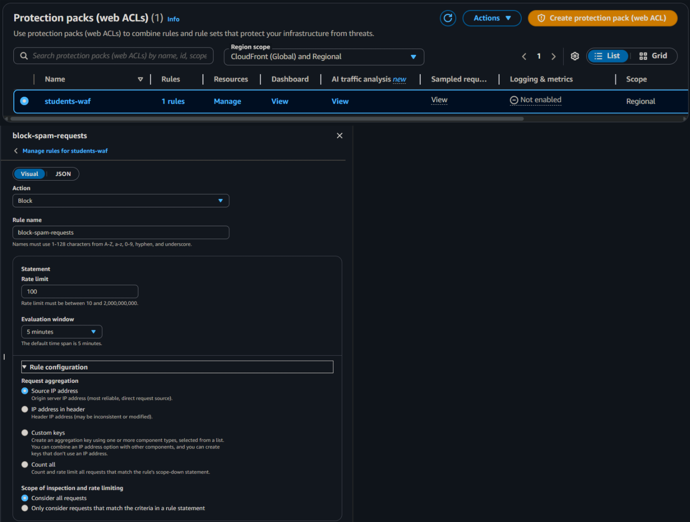

The critical detail is **scope**. WAF comes in two flavours that can't be mixed: **CloudFront (Global)** guards CloudFront only, while **Regional** guards regional resources like API Gateway. Because this API is a regional resource, the Web ACL is created in **Regional** scope, in **us-east-1**, then associated with `students-api : prod`. The rule blocks an IP that exceeds **100 requests per 5 minutes** (100 is WAF's minimum), with a default action of **Allow** so normal traffic passes.

### Bonus 4 - Custom domain via ACM

The raw `7j9h8p707k.execute-api...` URL is replaced with a clean, branded name: `api.aws.biram.uk`. A **subdomain** is used deliberately - the apex `aws.biram.uk` already serves the Assignment 3 website, and a DNS name can only point at one target, so `api.` keeps both live without collision.

The pieces:
- An **ACM certificate** for `api.aws.biram.uk` in **us-east-1**, DNS-validated (the validation record drops straight into the existing `aws.biram.uk` Route 53 zone).
- An API Gateway **custom domain name** (`api.aws.biram.uk`, Regional) pointed at that certificate, which produces a target domain like `d-xxxx.execute-api.us-east-1.amazonaws.com`.
- An **API mapping** wiring that custom domain to `students-api : prod`.
- A Route 53 **ALIAS A record** for `api.aws.biram.uk` → the API Gateway target domain - added as a new record *inside* the existing zone, leaving the website's apex record untouched.

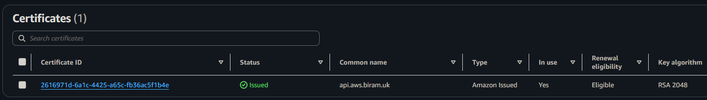
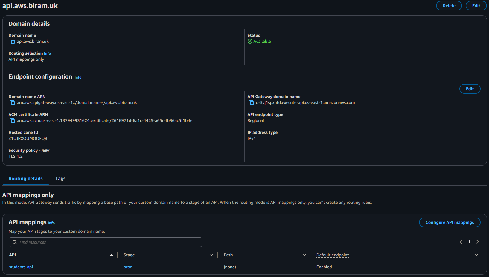
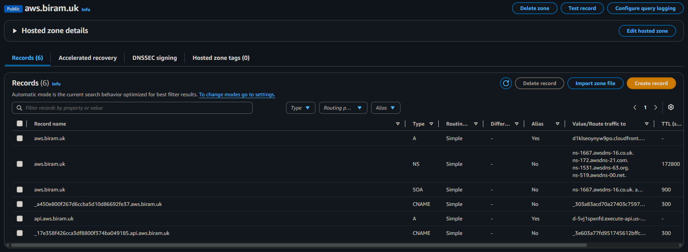

Because the mapping points the root of the domain at the `prod` stage, the stage name drops out of the path - the endpoint is simply `api.aws.biram.uk/submit`:

```bash
curl -X POST https://api.aws.biram.uk/submit \
  -H "Content-Type: application/json" \
  -H "x-api-key: <API_KEY>" \
  -d '{"name":"Mo","module":"AWS"}'
# {"message": "Student stored successfully", "id": "..."}
```

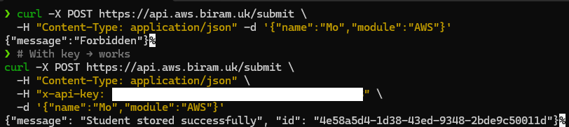

## Commands Used

```bash
# ─── Store a record (core POST) ───────────────────────────────────────
curl -X POST https://7j9h8p707k.execute-api.us-east-1.amazonaws.com/prod/submit \
  -H "Content-Type: application/json" \
  -d '{"name": "Mo", "module": "AWS"}'

# ─── Read every record (bonus GET) ────────────────────────────────────
curl https://7j9h8p707k.execute-api.us-east-1.amazonaws.com/prod/students

# ─── POST with an API key (after key enforcement) ─────────────────────
curl -X POST https://7j9h8p707k.execute-api.us-east-1.amazonaws.com/prod/submit \
  -H "Content-Type: application/json" \
  -H "x-api-key: <API_KEY>" \
  -d '{"name":"Mo","module":"AWS"}'

# ─── POST against the custom HTTPS domain (stage drops out of the path) ─
curl -X POST https://api.aws.biram.uk/submit \
  -H "Content-Type: application/json" \
  -H "x-api-key: <API_KEY>" \
  -d '{"name":"Mo","module":"AWS"}'
```

## What I Learnt

### DynamoDB and NoSQL
- A **partition key** (`id`) uniquely identifies each item; **on-demand** capacity auto-scales and bills per request, so there's nothing to provision.
- **Scan** reads the whole table (fine when small); **Query** targets specific keys and is what scales. DynamoDB also returns numbers as a **Decimal** type, which has to be converted before Python can serialise it to JSON.

### Lambda and serverless
- A function runs only when invoked, billed by the millisecond - no servers to manage. The **handler** receives the API Gateway **event**; with **proxy integration** the function must return the exact `statusCode` / `headers` / `body` shape API Gateway passes back.
- `boto3` (the AWS SDK) is pre-installed, and `print()` output lands automatically in CloudWatch.

### API Gateway (REST)
- **Proxy integration** forwards the whole request and returns the Lambda's response untouched.
- **CORS** is browser-only; enabling it adds the permission headers and an automatic **OPTIONS** preflight method.
- Nothing is live until it's **deployed to a stage** - the single most common "why isn't my change working" cause (it bit me twice, once for the endpoint and once for API keys).

### IAM least-privilege
- An **execution role** is what the function assumes at runtime; scoping it to one action on one resource (`PutItem` / `Scan` on the `students` table) is least-privilege in practice - no wildcards.
- An `AccessDeniedException` always names the exact **role**, **action**, and **resource ARN** that was blocked, so you can copy that ARN straight into a policy.

### API keys, usage plans, and WAF
- A key only works once it's **in a usage plan associated with the stage**, *and* the API has been redeployed after enabling the requirement.
- A usage plan enforces a **rate** (throttle + burst) and a **quota**; a WAF **rate-based rule** is a separate, IP-level flood protection that runs *before* the API.
- WAF **scope** is fixed at creation: **Regional** for API Gateway, **CloudFront** for distributions - and they can't be swapped.

### Custom domains
- API Gateway certificates for a Regional custom domain go in **us-east-1**; an **API mapping** ties the domain to a stage and drops the stage name from the path.
- A subdomain (`api.aws.biram.uk`) is added as a new record *inside* the existing hosted zone - no new zone needed, and the apex record is left alone.

## Challenges & How I Solved Them

### 1. AccessDeniedException on PutItem (an IAM region mismatch)
The first real `POST` returned the function's own `{"message": "Something went wrong"}`, and CloudWatch held the real cause:

```
AccessDeniedException ... not authorized to perform: dynamodb:PutItem on
resource: arn:aws:dynamodb:us-east-1:...:table/students because no
identity-based policy allows the dynamodb:PutItem action
```

The table and API were in **us-east-1**, but the PutItem policy's `Resource` ARN had been written with the region as `eu-west-2` - so it granted access to a table that doesn't exist, and the real write was denied.

**Solution:** corrected the ARN region to `us-east-1` (copying the exact ARN straight from the error message), saved the inline policy, and re-ran the same curl - which succeeded. IAM updates near-instantly, so no redeploy was needed. The lesson: in AWS, **IAM, Lambda, and DynamoDB all have to reference the same region.**

### 2. "Missing Authentication Token" when opening the URL in a browser
Pasting the endpoint into a browser returned `{"message":"Missing Authentication Token"}`. This is one of API Gateway's most misleadingly-named errors - it almost never means an auth problem.

**Cause:** a browser sends a **GET**, but only a **POST** method existed on `/submit`. With no matching method, API Gateway returns that generic message.

**Solution:** test with the correct method - `curl -X POST` (or Postman set to POST). Filed away for next time: "Missing Authentication Token" usually just means **wrong method or wrong path**.

### 3. API key enforcement: two separate gotchas
Enabling API keys took two attempts. First, *both* a no-key request and a placeholder-key request succeeded - because setting **API key required** is only a config change and doesn't take effect until the stage is **redeployed**. After redeploying, the no-key call correctly returned `Forbidden` - but a *valid* key was *also* rejected.

**Cause and solution:** the key existed, but it wasn't linked through the full chain. A key only works when it is **added into a usage plan** *and* that **usage plan is associated with the `prod` stage**. Completing both links (no redeploy needed for the linking itself) made the valid key succeed while keying-less requests stayed blocked.

### 4. WAF "resource not supported in current region"
Trying to attach the Web ACL to the API failed with `ListResourcesForWebACL ... The resource is not supported in current region`, even though both were in us-east-1.

**Cause:** the Web ACL had been created in **CloudFront (Global)** scope, which physically cannot see or attach API Gateway. Scope is fixed at creation and can't be edited.

**Solution:** created a fresh Web ACL in **Regional** scope (us-east-1), then associated it with `students-api : prod` - confirming the attach from the API Gateway stage side, which sidesteps the WAF console's resource picker entirely.

## Cleanup

A few of these bill while idle, so tear down roughly in reverse build order:

- **Disassociate and delete the WAF Web ACL** (a Web ACL + rule carries a small monthly cost).
- **Delete the API Gateway custom domain** and remove the Route 53 records for `api.aws.biram.uk` (the ALIAS A record and the ACM validation CNAME). **Keep the `aws.biram.uk` hosted zone** - the Assignment 3 website still uses it.
- **Delete the ACM certificate** in us-east-1.
- **Delete the REST API** (`students-api`), along with the **usage plan** and **API key**.
- **Delete both Lambda functions** (`submit-student`, `get-students`).
- **Delete the DynamoDB table** (`students`).
- **Delete the two IAM execution roles** and their inline policies.

What actually costs money: the WAF Web ACL (small monthly), API Gateway (per request), DynamoDB on-demand (negligible while idle), and the shared Route 53 hosted zone (~$0.50/month, kept for the website).

## Files

- [`README.md`](README.md) - this file
- [`screenshots/`](screenshots/) - all screenshots referenced above, including [`architecture-diagram.gif`](screenshots/architecture-diagram.gif)

The two Lambda functions (`submit-student`, `get-students`) and the IAM policies (PutItem and Scan) are reproduced inline in the sections above.