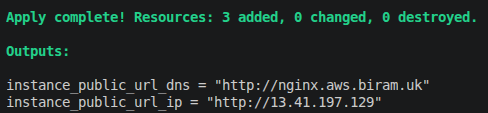

# NGINX deployed using Terraform & cloud-init: EC2 Configured on First Boot via user_data_base64


An EC2 instance running NGINX, provisioned end-to-end with Terraform and configured entirely by cloud-init with no manual steps and no SSH. Terraform renders a cloud-config file into a gzipped, base64 payload, hands it to the instance through `user_data_base64`, and the instance installs and starts NGINX on first boot. A Route 53 record puts it on a clean subdomain, and `apply` prints the live URLs.

## What I Built

A single NGINX instance in the **eu-west-2** region, defined entirely as code and configured with **cloud-init**. **Terraform** provisions every resource; a `cloudinit_config` **data source** renders a declarative **cloud-config** YAML into the instance's user data; **NGINX** serves a custom page on first boot; a **security group** opens port 80; and **Route 53** maps `nginx.aws.biram.uk` to the instance. The focus of this build is the wiring, how Terraform passes cloud-init to EC2 through `user_data_base64`, and how cloud-init takes the box from bare AMI to fully configured with zero manual steps.

**Stack:**
- **Terraform** - provisions and manages every resource. One `apply` builds the whole stack, one `destroy` removes it
- **Amazon EC2** - a `t2.micro` Amazon Linux 2023 instance running NGINX
- **cloud-init (cloud-config)** - declarative YAML that installs NGINX and serves a custom page on first boot
- **Terraform `cloudinit_config` data source** - renders the YAML into a gzipped, base64 payload for `user_data_base64`
- **NGINX** - the web server, serving a custom `index.html`
- **Security Group** - a virtual firewall, inbound HTTP (port 80) from anywhere, all outbound allowed
- **Amazon Route 53** - DNS - an A record points `nginx.aws.biram.uk` at the instance's public IP, referencing the existing hosted zone via a `data` source

**How it actually works:**
- **Terraform applies the config.** It creates the security group, renders the cloud-config through the `cloudinit_config` data source, launches the EC2 instance with that payload as `user_data_base64`, and creates the DNS record, all in one pass.
- **The instance boots and self-configures.** On first boot cloud-init reads the cloud-config: it writes the custom `index.html`, installs NGINX with `dnf`, moves the page into NGINX's web root, and enables + starts the service
- **NGINX serves the page.** NGINX listens on port 80 and returns the custom HTML.
- **The security group lets traffic through.** Inbound port 80 is open so a browser anywhere can reach NGINX. All outbound is allowed so the instance can `dnf install` NGINX during boot.
- **DNS resolves the domain.** Route 53 answers `nginx.aws.biram.uk` with the instance's public IP, so the site is reachable by name as well as by IP.

### Resources created

| Resource | Name | Detail |
|----------|------|--------|
| EC2 instance | `aws_instance.nginx` | Amazon Linux 2023 - `t2.micro` - eu-west-2 - runs NGINX |
| cloud-init config *(data)* | `data.cloudinit_config.ec2_userdata` | gzip + base64 payload - wired to `user_data_base64` |
| Security group | `aws_security_group.sg_nginx` | Inbound `80/tcp` from `0.0.0.0/0` - all outbound allowed |
| Route 53 record | `aws_route53_record.nginx_dns` | `A` record - `nginx.aws.biram.uk` → instance public IP - TTL 300 |
| Route 53 zone *(data)* | `data.aws_route53_zone.primary` | Existing `aws.biram.uk` zone - referenced, **not** created |

## Screenshots - quick reference

| # | Step | Screenshot |
|---|------|-----------|
| 1 | `terraform apply` complete, both output URLs printed | [View](screenshots/terraform-apply-outputs.png) |
| 2 | NGINX live via the public IP | [GIF](screenshots/nginx-ip.gif) |
| 3 | NGINX live via the custom domain | [GIF](screenshots/nginx-dns.gif) |

## Build Walkthrough

The stack file by file: the provider, the inputs, the cloud-init file, how it's passed to EC2, the firewall, DNS, the outputs, and the deploy.

### 1. Provider and remote state - `provider.tf`

```hcl
terraform {
  required_providers {
    aws = {
      source  = "hashicorp/aws"
      version = "6.52.0"
    }
  }
  backend "s3" {
    bucket = "terraform-state-rayyan"
    key    = "terraform.tfstate"
    region = "eu-west-2"
  }
}

provider "aws" {
    region = "eu-west-2"
}
```

**AWS** provider declared. The **S3 backend** keeps state remote, durable, shareable, and out of Git.

### 2. Input variables - `variables.tf`

```hcl
variable "instance_type" {
  description = "AMI of the EC2 instance"
}

variable "ami_id" {
  description = "AMI ID of the EC2 instance"
}
```

Instance type and AMI are left as inputs (supplied via `terraform.tfvars`), so the config stays reusable without editing `main.tf`. The AMI matters here - the cloud-config's install command is specific to Amazon Linux 2023 (see Challenges).

### 3. The cloud-init file - `cloud-config.yaml`

This is the declarative config cloud-init runs on first boot. `write_files` drops the custom homepage onto disk; `runcmd` installs NGINX, moves the page into its web root, and starts the service:

```yaml
#cloud-config
write_files:
  - path: /run/myserver/index.html
    owner: root:root
    permissions: "0644"
    content: |
      <html>
        <body>
          <h1>NGINX deployed onto an EC2 instance via Terraform + cloud-init</h1>
        </body>
      </html>

runcmd:
  - dnf install -y nginx
  - mv /run/myserver/index.html /usr/share/nginx/html/index.html
  - systemctl enable --now nginx
```

cloud-init is the standard way to configure a cloud instance on first boot, and cloud-config is its declarative YAML format. `systemctl enable --now` enables, starts, **and waits** for NGINX in one step.

### 4. Passing cloud-init to EC2 - `main.tf`

This is the core of the assignment: how the YAML reaches the instance. A `cloudinit_config` data source renders the cloud-config into a **gzipped, base64-encoded** payload, which is wired to `user_data_base64`:

```hcl
# NOTE ON user_data vs user_data_base64:
# A single plain-text script could be passed with:
#   user_data = file("userdata.sh")
# Terraform base64-encodes plain user_data automatically before sending it to AWS.
#
# This build instead uses the cloudinit_config data source, which supports
# multi-part MIME configs and renders its output as base64 directly - so it's wired to
# user_data_base64, not user_data, to avoid double-encoding an already-encoded string.


resource "aws_instance" "nginx" {
    ami                    = var.ami_id
    instance_type          = var.instance_type
    vpc_security_group_ids = [aws_security_group.sg_nginx.id]
    user_data_base64       = data.cloudinit_config.ec2_userdata.rendered

    tags = {
      Name = "nginx instance"
    }
}

data "cloudinit_config" "ec2_userdata" {
    gzip          = true
    base64_encode = true
    part {
      content_type = "text/cloud-config"
      content = templatefile("${path.module}/cloud-config.yaml", {
      header: aws_security_group.sg_nginx.id
    })
    }
}
```

The `user_data` vs `user_data_base64` distinction is the key detail. Terraform base64-encodes plain `user_data` for you, so handing an already-encoded payload to `user_data` would **double-encode** it and the instance would receive garbage because `cloudinit_config` already renders gzip + base64, it goes to `user_data_base64`, which takes the payload as-is.

### 5. Security group - `main.tf`

```hcl
# Create security group for nginx with all inbound traffic through
# port 80 (HTTP). All outbound traffic allowed through on all ports
resource "aws_security_group" "sg_nginx" {

    ingress {
        description = "HTTP for nginx"
        from_port   = 80
        to_port     = 80
        protocol    = "tcp"
        cidr_blocks = ["0.0.0.0/0"] 
    }

    egress {
        from_port   = 0
        to_port     = 0
        protocol    = "-1"
        cidr_blocks = ["0.0.0.0/0"]
    }

  tags = {
    Name = "sg_nginx"
  }
}
```

Inbound `80/tcp` from anywhere lets browsers reach NGINX; egress `-1` (all protocols) lets the instance reach the internet to `dnf install nginx`.

> **Note:** exposing port 80 straight to the world is fine for a demo. In production the instance would sit in a private subnet behind an ALB, with the load balancer taking public traffic and the instance reachable only from it.

### 6. DNS with Route 53 - `main.tf`

```hcl
# Read from existing hosted zone
data "aws_route53_zone" "primary" {
  name = "aws.biram.uk"
}

# Create new A record in Route 53
resource "aws_route53_record" "nginx_dns" {
  zone_id = data.aws_route53_zone.primary.zone_id
  name    = "nginx.aws.biram.uk"
  type    = "A"
  ttl     = 300
  records = [aws_instance.nginx.public_ip]
}
```

Same pattern as the previous build: a `data` source **references** the existing `aws.biram.uk` zone (delegated from Cloudflare) rather than creating a duplicate, and the A record maps `nginx.aws.biram.uk` to the instance IP with a short 300s TTL.

### 7. Outputs - `outputs.tf`

```hcl
output "instance_public_url_ip" {
    description = "Public IPv4 of the EC2 instance"
    value       = "http://${aws_instance.nginx.public_ip}"
}

output "instance_public_url_dns" {
    description = "Public URL of the EC2 instance"
    value       = "http://${aws_route53_record.nginx_dns.name}"
}
```

Both outputs render as full URLs, so the moment `apply` finishes the terminal prints two clickable links - domain and raw IP.

### 8. Deploy and verify

```bash
terraform init      # download the AWS provider and wire up the backend
terraform plan      # preview what will be created
terraform apply     # build it
```

After `apply`, both URLs print in the outputs:



And NGINX is live on **both** the public IP and the custom domain:


> **Note:** `user_data` / `user_data_base64` only runs on **first boot**. After changing `cloud-config.yaml`, a plain `terraform apply` won't re-run it - force a rebuild with `terraform apply -replace="aws_instance.nginx"`.

## Commands Used

```bash
# ─── Initialise: download providers, wire up the backend ──────────────
terraform init

# ─── Preview, then build the stack ────────────────────────────────────
terraform plan
terraform apply

# ─── Force a rebuild so changed cloud-init re-runs on a fresh instance ─
terraform apply -replace="aws_instance.nginx"

# ─── Confirm the domain resolves to the instance's public IP ──────────
nslookup nginx.aws.biram.uk

# ─── Tear everything down when finished ───────────────────────────────
terraform destroy
```

## What I Learnt

- **`user_data` vs `user_data_base64`** - Terraform auto-base64-encodes plain `user_data`, so a payload that's *already* base64 (like `cloudinit_config`'s output) must go to `user_data_base64` or it gets double-encoded.
- **cloud-init / cloud-config** - a declarative YAML (`write_files`, `runcmd`) that the OS runs on first boot - the clean alternative to an imperative Bash script.
- **Install commands are AMI-specific** - `amazon-linux-extras` is Amazon Linux 2 only; Amazon Linux 2023 uses `dnf`. The command has to match the AMI or the boot config silently fails.
- **user data runs once** - only on first boot, so a changed cloud-config needs `terraform apply -replace` to take effect.
- **`systemctl enable --now`** - enables, starts, and waits in one step; `--no-block` can report success before the service is actually up.
- **"Won't resolve" isn't always DNS** - `nslookup` was correct the whole time; the real gap was nothing listening on port 80. Check the layer, not just the name.

## Challenges & How I Solved Them

### 1. The site wouldn't load - NGINX never installed
After `apply`, neither the IP nor the domain served anything, even after waiting and trying incognito. DNS wasn't the problem, `nslookup` returned the instance IP, so the issue was on the box. Nothing was listening on port 80. Since the security group only opened port 80, I temporarily added an SSH rule scoped to my own IP, connected in, and `/var/log/cloud-init-output.log` showed the real cause.

The cloud-config used `amazon-linux-extras install -y nginx1`, which only exists on **Amazon Linux 2**. On **Amazon Linux 2023** that command isn't available, so the `runcmd` line failed and NGINX never installed, but cloud-init still finished, so the instance came up "healthy" with no web server.

**Solution:** switched the install to `dnf install -y nginx`, the Amazon Linux 2023 package manager. On a fresh rebuild, NGINX installed and served the page on both the IP and the domain, then I removed the temporary SSH rule.

### 2. Editing the cloud-config changed nothing
After fixing the install line, re-running `terraform apply` didn't update the instance. `user_data` / `user_data_base64` only runs on **first boot**, so the already-running instance never re-ran cloud-init.

**Solution:** forced a clean rebuild with `terraform apply -replace="aws_instance.nginx"`, which terminated the old instance and launched a new one that ran the corrected cloud-config from scratch.

### 3. systemd could report success before NGINX was up
The original `runcmd` used `systemctl start --no-block nginx`. `--no-block` tells systemd not to wait for the service to finish starting before moving on, so cloud-init can log success even if NGINX hasn't actually come up.

**Solution:** replaced the separate enable/start lines with a single `systemctl enable --now nginx`, which enables, starts, and waits for confirmation in one step.

## Cleanup

Everything here is Terraform-managed, so teardown is a single command:

```bash
terraform destroy
```

This removes the EC2 instance, the security group, and the Route 53 A record in one pass. Two things deliberately survive:
- The **`aws.biram.uk` hosted zone** stays - it's referenced via a `data` source, not created here, so `destroy` leaves it untouched.
- The **S3 state bucket** (`terraform-state-rayyan`) isn't part of this configuration either, so it persists for future runs.

What actually costs money: effectively nothing once destroyed. While running, the `t2.micro` (free-tier eligible) and the shared Route 53 hosted zone (~$0.50/month) are the only charges.

## Files

- [`README.md`](README.md) - this file
- [`provider.tf`](provider.tf) - AWS + cloudinit providers and S3 remote-state backend
- [`variables.tf`](variables.tf) - input variables (instance type, AMI)
- [`main.tf`](main.tf) - EC2 instance, `cloudinit_config` data source, security group, and Route 53 record
- [`cloud-config.yaml`](cloud-config.yaml) - the cloud-init config that installs and starts NGINX on first boot
- [`outputs.tf`](outputs.tf) - the IP and domain URLs printed after `apply`
- [`.gitignore`](.gitignore) - excludes state, `.tfvars`, and the `.terraform` directory
- [`screenshots/`](screenshots/) - screenshots and the demo GIFs referenced above