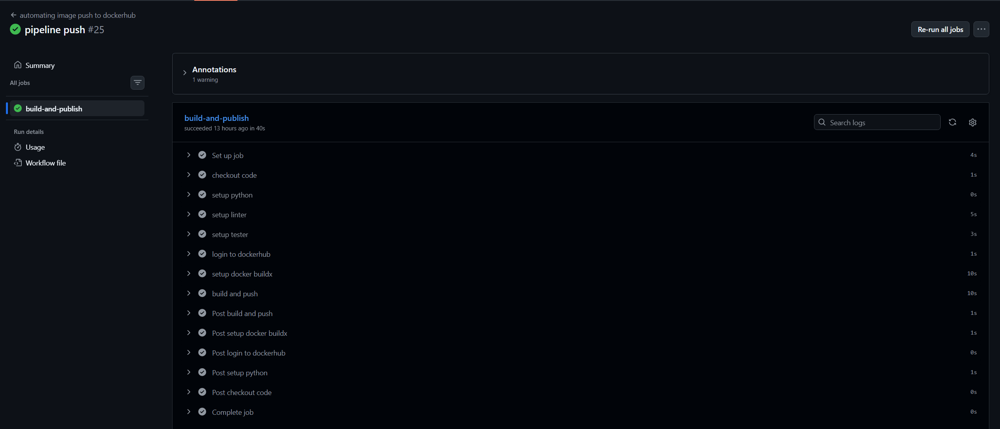
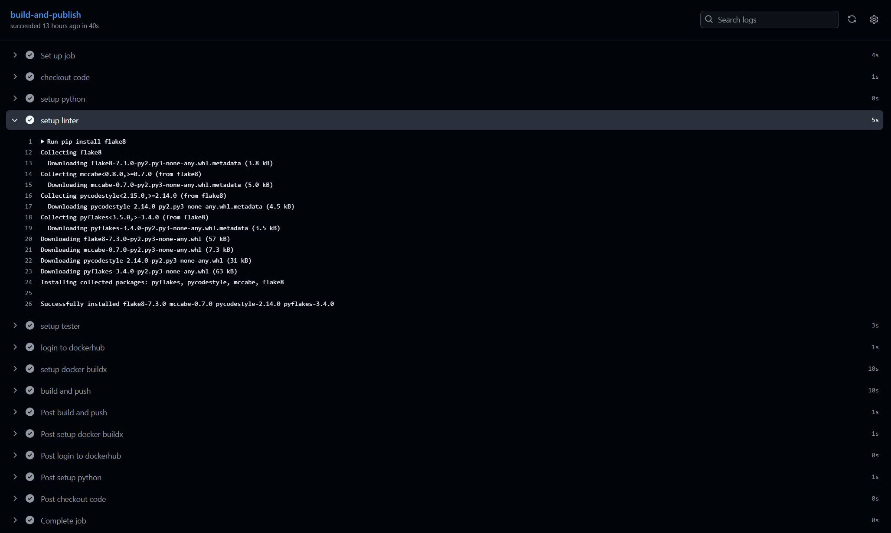
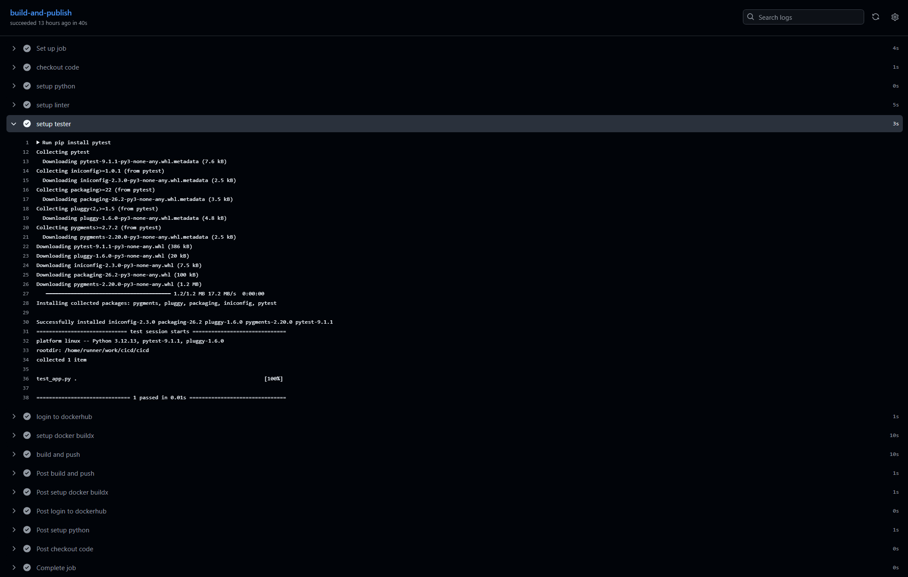
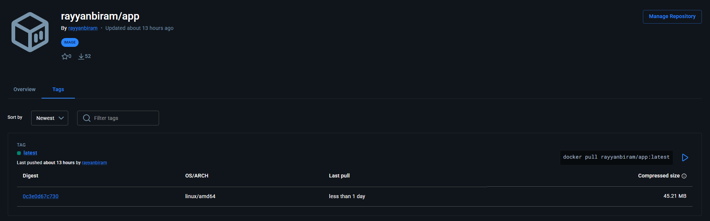
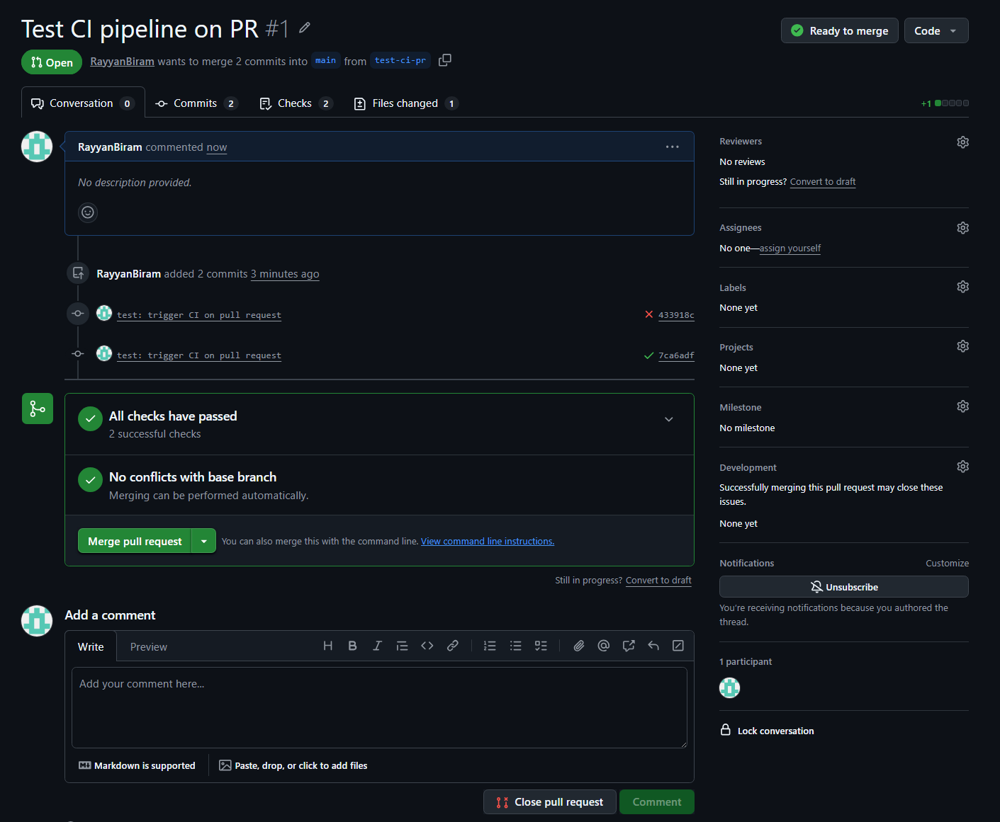
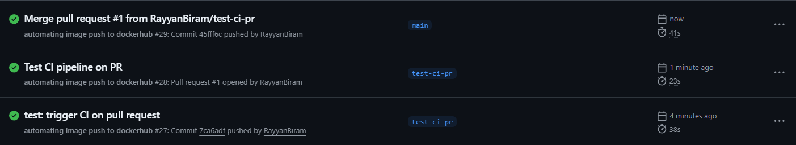
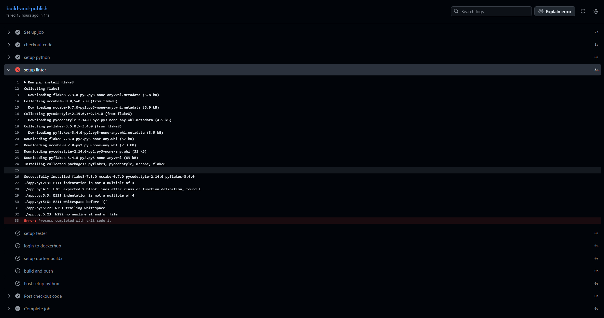
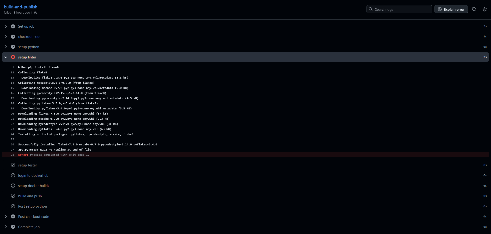

# CI Pipeline with GitHub Actions: Automated Linting, Testing & Docker Build on Every Push


A continuous integration pipeline built with GitHub Actions that runs automatically on every push and pull request. On each trigger it checks out the code, lints it with flake8, runs the unit tests with pytest, and builds the Docker image, publishing the image to Docker Hub only on pushes and never on pull requests. GitHub Actions is wired to gate code quality on every change and a a single conditional keeps publish separate from validation.

## What I Built

A CI pipeline defined entirely in a single workflow file, triggered on both `push` and `pull_request`. **GitHub Actions** runs the job on an `ubuntu-latest` runner; **flake8** enforces code style. **pytest** runs the unit tests. **Docker Buildx** builds the image.**`docker/build-push-action`** publishes it to **Docker Hub**. The publish step is guarded by a condition so validation runs on every event, while the push to Docker Hub happens only on real pushes to the repo, keeping pull-request runs read-only.

**Stack:**
- **GitHub Actions** - the CI runner and orchestrator. One workflow file drives the whole pipeline
- **Python 3.12** - the runtime, the linter, and tests execute against, set up via `actions/setup-python`
- **flake8** - the linter, checking `app.py`
- **pytest** - the test runner, auto-discovering and executing `test_app.py`
- **Docker + Buildx** - builds the container image from the `Dockerfile`
- **Docker Hub** - the image registry the built image is pushed to
- **GitHub Secrets** - stores the Docker Hub username and access token so credentials never live in the workflow

**How it actually works:**
- **A push or PR triggers the workflow.** The `on: [push, pull_request]` trigger fires the job on either event, so every change is validated before it can merge.
- **The runner checks out the code.** `actions/checkout` pulls the repository onto the fresh runner. Without this step nothing else can see `app.py` or `test_app.py`.
- **Python is set up, then the code is linted.** `actions/setup-python` installs Python 3.12, then flake8 is installed and run against `app.py`. A style failure fails the job.
- **The tests run.** pytest is installed and invoked with no arguments, so it auto-discovers `test_app.py` and runs the assertion against `say_hello()`.
- **The image builds, and publishes only on a push.** Buildx builds the image from the `Dockerfile`. `docker/build-push-action` pushes it to Docker Hub, but only when `github.event_name == 'push'`, so a pull request builds and validates without ever publishing.

### What this pipeline covers

| Stage | Tool | Detail |
|-------|------|--------|
| Checkout | `actions/checkout@v4` | Pulls repo code onto the runner - prerequisite for every later step |
| Python setup | `actions/setup-python@v5` | Installs Python 3.12 for the lint and test steps |
| Linting | `flake8` | Checks `app.py` for PEP8 style violations |
| Unit tests | `pytest` | Auto-discovers `test_app.py` and runs it |
| Docker login | `docker/login-action@v4` | Authenticates to Docker Hub using secrets |
| Image build | `docker/setup-buildx-action@v4` + `docker/build-push-action@v7` | Builds the image and pushes on `push` events only |

## Screenshots - quick reference
 
| # | Step | Screenshot |
|---|------|-----------|
| 1 | `build-and-publish` run - every step green, push #25 | [View](screenshots/successful-push-summary.png) |
| 2 | setup linter step - flake8 installed, clean lint | [View](screenshots/flake8-linter-logs.png) |
| 3 | setup tester step - `test_app.py` passing, `1 passed` | [View](screenshots/pytest-tester-logs.png) |
| 4 | Image published - `latest` tag on Docker Hub | [View](screenshots/dockerhub-latest.png) |
| 5 | Pull-request run - all checks passed, ready to merge | [View](screenshots/test-ci-pipeline-pr-merge.png) |
| 6 | Run history - PR run, push run, and merge run | [View](screenshots/testing-pull-request.png) |
| 7 | First failed run - flake8 flags PEP8 violations | [View](screenshots/failed-push-linter.png) |
| 8 | Second failed run - one `W292` left before green | [View](screenshots/failed-push-linter-2.png) |

## Repo Structure

```
flask-ci-pipeline/
├── .github/
│   └── workflows/
│       └── ci.yaml          # CI workflow: checkout, lint, test, build, conditional push
├── app.py                   # the application under test
├── test_app.py              # the unit test, run by pytest
├── Dockerfile               # packages the app into a slim Python image
└── screenshots/             # workflow-run and Docker Hub screenshots
 ```

## Build Walkthrough
 
The pipeline file by file: the app being tested, the test, the Dockerfile that packages it, and the workflow that ties them together.
 
### 1. The application - `app.py`
 
The minimal app under test - a single function returning a greeting, with a guard so it prints when run directly:
 
```python
def say_hello():
    return "Hello World!"
 
 
if __name__ == "__main__":
    print(say_hello())
```
 
Deliberately small: the point of Task 1 is the pipeline, not the app. Keeping the logic to one testable function makes the lint and test stages easy to reason about.
 
### 2. The unit test - `test_app.py`
 
A single `unittest` test case asserting the function returns the expected string:
 
```python
import unittest
from app import say_hello
 
 
class TestHello(unittest.TestCase):
    def test_say_hello(self):
        self.assertEqual(say_hello(), "Hello World!")
 
 
if __name__ == "__main__":
    unittest.main()
```
 
Written with `unittest`, but run by pytest in the pipeline. pytest auto-discovers `unittest.TestCase` classes as long as the filename starts with `test_`, so no rewrite was needed.
 
### 3. The Dockerfile
 
Packages the app into a slim Python image:
 
```dockerfile
FROM python:3.8-slim
WORKDIR /app
COPY . .
EXPOSE 80
CMD [ "python", "app.py" ]
```
 
A minimal image. A slim Python base, the app copied in, and a default command to run it. This is what the build stage produces and publishes.
 
### 4. The workflow - `ci.yaml`
 
The core of the assignment. One job runs checkout, Python setup, lint, test, Docker login, build, and a conditional push:
 
```yaml
name: automating image push to dockerhub
on: [ push, pull_request ]
jobs:
  build-and-publish:
    runs-on: ubuntu-latest
    permissions:
      id-token: write
      contents: write
 
    steps:
      - name: checkout code
        uses: actions/checkout@v4
      - name: setup python
        uses: actions/setup-python@v5
        with:
          python-version: 3.12
      - name: setup linter
        run: |
          pip install flake8
          flake8 app.py
      - name: setup tester
        run: |
          pip install pytest
          pytest
      - name: login to dockerhub
        uses: docker/login-action@v4
        with:
          username: ${{ secrets.DOCKER_USERNAME }}
          password: ${{ secrets.DOCKERHUB_TOKEN }}
      - name: setup docker buildx
        uses: docker/setup-buildx-action@v4
      - name: build and push
        uses: docker/build-push-action@v7
        if: github.event_name == 'push'
        with:
          push: true
          tags: ${{ secrets.DOCKER_USERNAME }}/app:latest
```
 
Two details carry this workflow. First, `checkout` comes **first**, every later step depends on the repo actually being on the runner. Second, the `if: github.event_name == 'push'` on the build-and-push step is what separates validation from publishing. Lint and test runs on every push and PR, but the image only reaches Docker Hub on a push, so pull requests are validated without publishing. Credentials come from `secrets.DOCKER_USERNAME` and `secrets.DOCKERHUB_TOKEN`, so nothing sensitive lives in the file.
 
### 5. Verify the run
 
On a push, every step goes green. Checkout, Python setup, lint, test, login, build, and the conditional push:
 

 
The linter step installs flake8 and passes cleanly once the code is PEP8-compliant:
 

 
The tester step installs pytest, which discovers `test_app.py` and runs it - `1 passed`:
 

 
The built image lands on Docker Hub under the `latest` tag:
 

 
### 6. The pull-request path
 
To confirm the conditional actually gates publishing, a test branch was pushed and opened as a PR. Lint and test run, the checks pass, and the branch is mergeable, but no image is published, because the build-and-push step is skipped on a `pull_request` event:
 

 
The run history shows the full flow: the push to the test branch, the pull-request run, and the merge run into `main` - each triggering the pipeline:
 

 
 
## What I Learnt
 
- **The runner starts empty** - `actions/checkout` has to run first. Without it, flake8 hits `FileNotFoundError` because the repo isn't on the runner yet.
- **flake8 vs pytest target files differently** - flake8 is pointed at a specific source file (`flake8 app.py`). pytest is run bare so it auto-discovers `test_*.py`. Pointing pytest at `app.py` finds no tests.
- **One condition splits CI from CD** - `if: github.event_name == 'push'` keeps the publish step off pull requests while still validating them, without needing two separate jobs.
- **Secrets keep credentials out of Git** - Docker Hub username and token are injected from repository secrets at runtime, never hard-coded in the workflow.
- **A default `push` behaviour is safe** - `docker/build-push-action` doesn't push unless told to, so `push: true` has to be explicit.

## Challenges & How I Solved Them
 
### 1. flake8 couldn't find the file - `FileNotFoundError`
The first run failed on the lint step with `E902 FileNotFoundError: 'app.py'`. The file existed in the repo, but the job had no checkout step, so the runner, a fresh VM, was empty.
 
**Solution:** added `actions/checkout@v4` as the first step. Once the repo was actually pulled onto the runner, flake8 could see `app.py` and moved on to checking it.
 
### 2. flake8 then reported real style errors
With checkout fixed, flake8 could finally read `app.py`, and flagged genuine PEP8 issues. Indentation that wasn't a multiple of four, a missing blank-line gap before the `if __name__` block, a space before a parenthesis in `print (…)`, trailing whitespace, and no newline at end of file.
 

 
**Solution:** worked through them, four-space indentation, two blank lines before the entry-point guard, and `print(...)` with no space. A second run then failed on just one remaining issue, `W292 no newline at end of file`, which made the fix obvious, add a trailing newline.
 

 
Adding the final newline cleared the last error and the linter passed.
 
### 3. pytest pointed at the wrong file found no tests
An early version ran `pytest app.py`. `app.py` is the application, not the test file, so pytest had nothing to collect there.
 
**Solution:** ran pytest with no argument. Bare `pytest` auto-discovers files matching `test_*.py`.
 
### 4. Publishing on pull requests
The initial workflow pushed the image on every trigger, including pull requests. Not desirable, since a PR is a proposed change that hasn't been merged.
 
**Solution:** added `if: github.event_name == 'push'` to the build-and-push step. Lint, test, and build still run on PRs, but the push to Docker Hub only fires on an actual push to the repo, keeping PR runs validation-only.
 
## Files
 
- [`README.md`](README.md) - this file
- [`app.py`](app.py) - the application under test
- [`test_app.py`](test_app.py) - the unit test, run by pytest in the pipeline
- [`Dockerfile`](Dockerfile) - packages the app into a slim Python image
- [`.github/workflows/ci.yaml`](.github/workflows/ci.yaml) - the CI workflow: checkout, lint, test, build, conditional push
- [`screenshots/`](screenshots/) - the workflow-run and Docker Hub screenshots referenced above