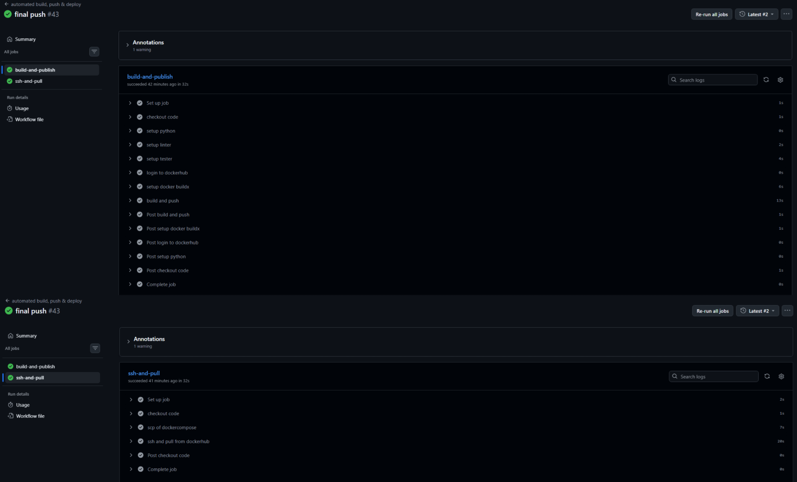
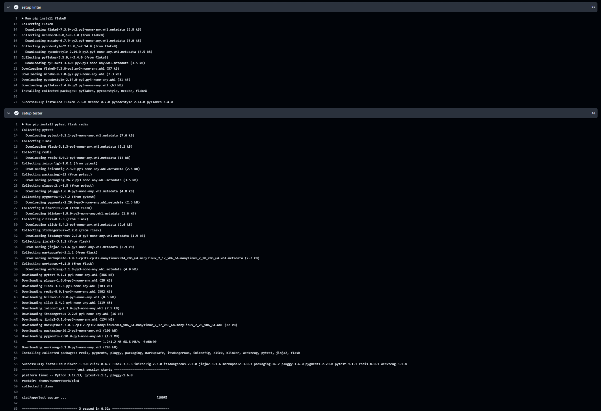
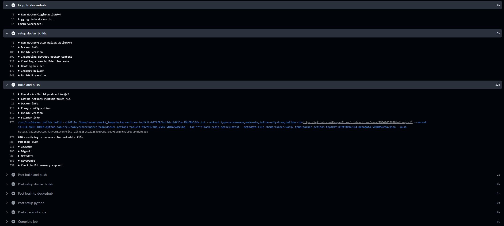
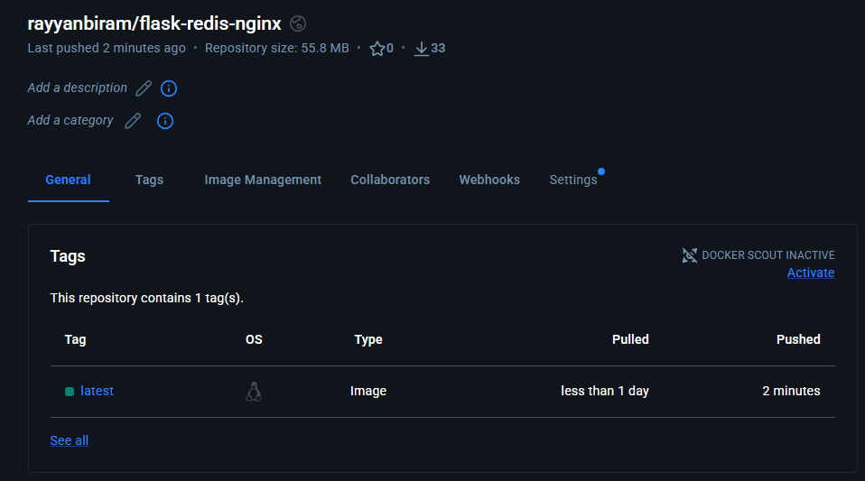
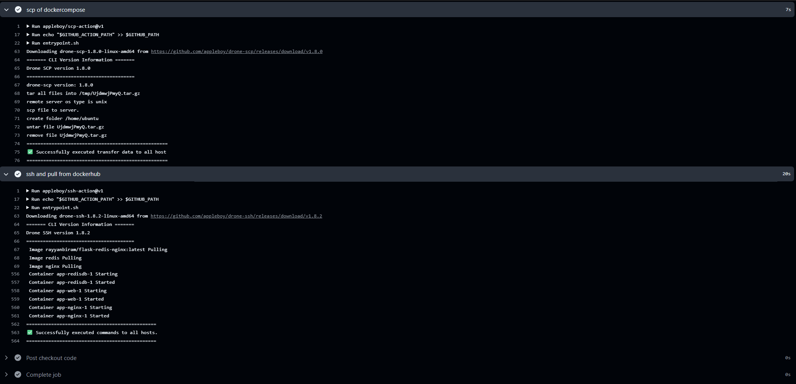
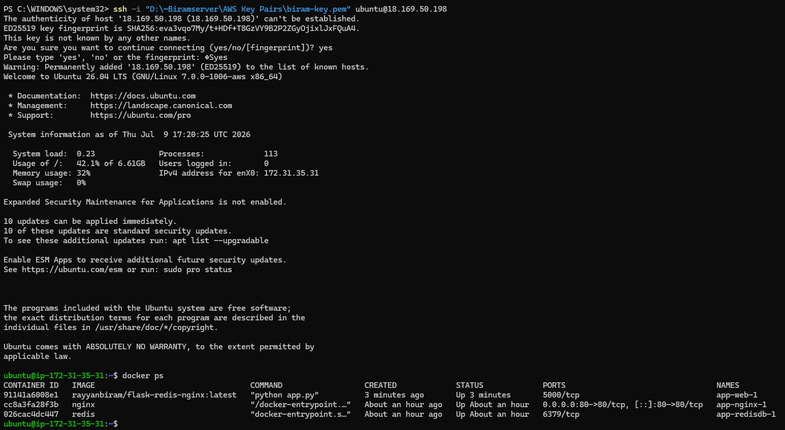
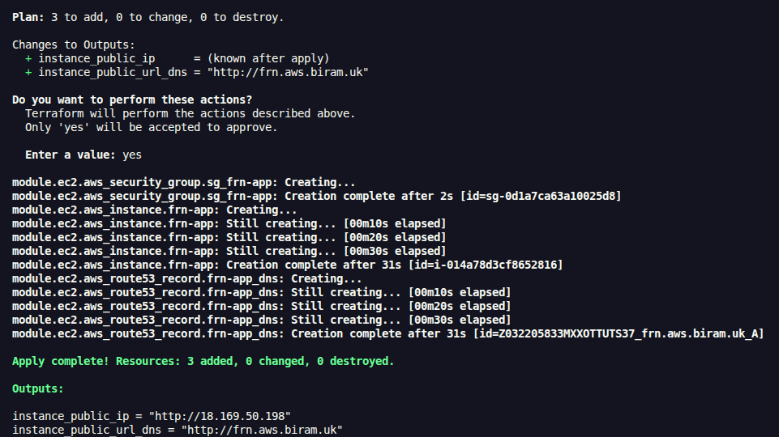
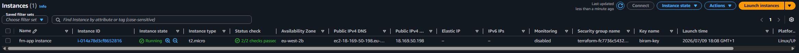
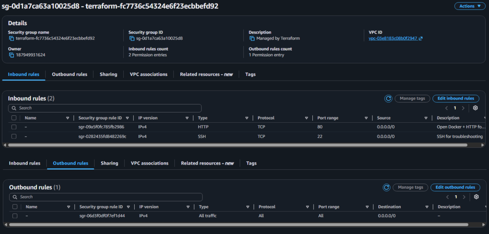
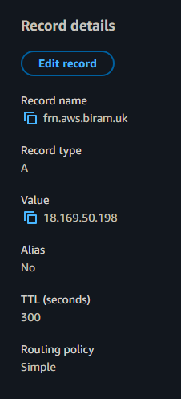

# CI/CD Pipeline: Automated Build, Push & Deploy of a Flask-Redis-NGINX Stack to EC2


A full CI/CD pipeline that takes a Flask-Redis-NGINX app from a `git push` all the way to a running deployment on AWS. On every push, GitHub Actions lints and tests the code, builds a Docker image and pushes it to Docker Hub, then SSHes into a Terraform-provisioned EC2 instance to pull the new image and restart the stack. The EC2 instance itself is defined entirely as code with a reusable Terraform module, and the site comes up on a custom subdomain over HTTP. One `push` updates the running site. One `terraform apply` builds the infrastructure it runs on.

## What I Built

An end-to-end pipeline in two halves. **CI** - one GitHub Actions job checks out the code, lints it with **flake8**, runs the **pytest** suite, then builds the multi-container image with **Docker Buildx** and pushes it to **Docker Hub**. **CD** - a second job, gated behind the first, copies the production compose file and NGINX config to the instance with **SCP**, then **SSHes in** to run `docker compose pull` and `up -d`. The target is an **EC2** instance in the **eu-west-2** region, provisioned by a self-contained **Terraform module** (instance, security group, Route 53 record), with **remote state** in **S3**. **NGINX** fronts the **Flask** app and a **Redis** container backs the visit counter.

**Stack:**
- **GitHub Actions** - the CI/CD orchestrator. A single workflow drives build, push, and deploy across two jobs
- **flake8 / pytest** - lint and test gates that run before anything is published or deployed
- **Docker + Buildx + Docker Compose** - builds the image and runs the three-container stack (web, redisdb, nginx)
- **Docker Hub** - the built `flask-redis-nginx` image is pushed to and pulled from the Dockerhub registry
- **appleboy/scp-action + ssh-action** - copy the compose files onto EC2 and run the deploy commands remotely
- **Terraform** - provisions the EC2 instance, security group, and DNS record as a reusable module
- **Amazon EC2** - a `t2.micro` Ubuntu instance running the Docker stack. Docker installed on first boot via user data
- **Amazon Route 53** - an A record maps `frn.aws.biram.uk` to the instance, referencing the existing hosted zone via a `data` source
- **Amazon S3** - remote backend storing `terraform.tfstate` off the local machine
- **Flask / Redis / NGINX** - the app - NGINX reverse-proxies to Flask, which increments a counter stored in Redis

**How it actually works:**
- **A push triggers CI.** GitHub Actions checks out the code, lints `app.py`, runs the pytest suite, then builds the image from the `app/` context and pushes it to Docker Hub as `flask-redis-nginx:latest`.
- **CI gates CD.** The deploy job declares `needs: build-and-publish`, so it only runs if lint, test, and build all pass. Both the build-push and deploy steps are also guarded by `if: github.event_name == 'push'`, so pull requests validate without publishing or deploying.
- **The deploy job ships the config, then deploys.** SCP copies `docker-compose-prod.yaml` and `nginx.conf` up to the instance. SSH then runs `docker compose pull && docker compose up -d`, which pulls the freshly-pushed image and recreates the containers.
- **The instance was built by Terraform.** A `terraform apply` created the EC2 instance, its security group (ports 80 and 22 open), and the Route 53 record. User data installed Docker on first boot and added the `ubuntu` user to the docker group, but ran no app logic, so the box only ever changes when the pipeline tells it to.
- **The site serves traffic.** NGINX listens on port 80 and proxies to the Flask container on 5000. Flask increments a counter in Redis on each `/count` visit. The security group's open port 80 lets browsers reach it, and Route 53 resolves the domain to the instance IP.

### Resources created (Terraform)

| Resource | Name | Detail |
|----------|------|--------|
| EC2 instance | `aws_instance.frn-app` | Ubuntu - `t2.micro` - eu-west-2 - runs the Docker Compose stack |
| Security group | `aws_security_group.sg_frn-app` | Inbound `80/tcp` + `22/tcp` from `0.0.0.0/0` - all outbound allowed |
| Route 53 record | `aws_route53_record.frn-app_dns` | `A` record - `frn.aws.biram.uk` → instance public IP - TTL 300 |
| Route 53 zone *(data)* | `data.aws_route53_zone.frn-app_dns` | Existing `aws.biram.uk` zone - referenced, **not** created |
| Default VPC *(data)* | `data.aws_vpc.default` | Account's default VPC - referenced for the security group |
| Remote state | S3 backend | bucket `terraform-state-rayyan` - key `terraform.tfstate` - eu-west-2 |

## Screenshots - quick reference

| # | Step | Screenshot |
|---|------|-----------|
| 1 | Full pipeline run - both jobs green, push #43 | [View](screenshots/full-pipeline-run-success.png) |
| 2 | Lint + test steps - flake8 clean, `3 passed` | [View](screenshots/setup-linter-tester-success.png) |
| 3 | Login, Buildx, build & push - image published | [View](screenshots/login-buildx-build-and-push.png) |
| 4 | Docker Hub - `flask-redis-nginx:latest` pushed | [View](screenshots/dockerhub-pushed-image.png) |
| 5 | SCP + SSH deploy - files copied, containers started | [View](screenshots/scp-ssh-and-pull-success.png) |
| 6 | `terraform apply` - 3 resources created, outputs printed | [View](screenshots/terraform-apply.png) |
| 7 | EC2 instance running in the console | [View](screenshots/aws-frn-app-instance.png) |
| 8 | Security group - ports 80 and 22 open | [View](screenshots/aws-sg_frn-app.png) |
| 9 | Route 53 A record for `frn.aws.biram.uk` | [View](screenshots/aws-route53-record.png) |
| 10 | SSH into EC2 - `docker ps` shows all three containers up | [View](screenshots/ssh-ec2-docker-ps.png) |
| 11 | Live site - visit counter incrementing on the domain | [GIF](screenshots/dns-live-count-page-working.gif) |

## Repo Structure

```
flask-stack-cicd-tf-aws/
├── .github/
│   └── workflows/
│       └── ci.yaml                    # CI/CD workflow: lint, test, build, push, deploy
├── app/
│   ├── app.py                         # Flask app: welcome page + Redis visit counter
│   ├── test_app.py                    # pytest suite (status, content, mocked Redis)
│   ├── Dockerfile                     # packages the Flask app
│   ├── docker-compose.yaml            # dev compose (build: from source)
│   ├── docker-compose-prod.yaml       # prod compose (image: from Docker Hub)
│   ├── nginx.conf                     # NGINX reverse-proxy config
│   └── .flake8                        # flake8 config for embedded HTML/CSS
├── infra/
│   ├── main.tf                        # root config, calls the EC2 module
│   ├── providers.tf                   # AWS provider + S3 remote-state backend
│   ├── variables.tf                   # root input variables
│   ├── outputs.tf                     # root outputs (instance IP, domain URL)
│   └── modules/
│       └── ec2/                       # reusable EC2 module
│           ├── ec2.tf                 # EC2 instance
│           ├── sg.tf                  # security group (ports 80, 22)
│           ├── route53.tf             # DNS A record
│           ├── userdata.sh            # first-boot Docker install
│           ├── variables.tf           # module inputs
│           └── outputs.tf             # module outputs
└── screenshots/                       # pipeline, deploy, infra, and live-site captures
```

## Build Walkthrough

The project in three layers: the app being deployed, the Terraform module that builds the target, and the workflow that ties CI to CD.

### 1. The application - `app/`

A small Flask app with two routes: a welcome page and a `/count` page that increments a visit counter held in Redis. NGINX sits in front as a reverse proxy. The three services are wired together with Docker Compose.

```python
@app.route('/')
def welcome():
    return WELCOME_HTML.replace("__STYLES__", BASE_STYLES)


@app.route('/count')
def increment():
    visits = cache.incr('visits')
    return COUNT_HTML.replace("__STYLES__", BASE_STYLES).replace("__VISITS__", str(visits))
```

Redis host and port are read from environment variables (`REDIS_HOST`, `REDIS_PORT`) with sensible defaults, so the same image runs locally and in production without code changes.

### 2. Two compose files - dev vs prod

The key design decision for deployment: **the dev and prod compose files differ in one line**. Locally, `web` is built from source. In production, it pulls the pre-built image from Docker Hub.

Dev (`docker-compose.yaml`) - builds from the local `Dockerfile`:

```yaml
web:
    build: .
```

Prod (`docker-compose-prod.yaml`) - pulls the published image:

```yaml
web:
    image: rayyanbiram/flask-redis-nginx:latest
```

This matters because the EC2 instance never gets the source code...Only the compose file and NGINX config are copied up. It pulls the image CI already built, rather than rebuilding on the box. NGINX publishes host port 80 and proxies to the Flask container on 5000:

```yaml
nginx:
    image: nginx
    ports:
      - "80:80"
    volumes:
      - ./nginx.conf:/etc/nginx/nginx.conf:ro
```

### 3. The Terraform module - `infra/modules/ec2/`

The infrastructure is a self-contained module. The root config (`infra/main.tf`) just calls it and passes inputs through:

```hcl
module "ec2" {
  source        = "./modules/ec2"
  ami_id        = var.ami_id
  instance_type = var.instance_type
  key_pair      = var.key_pair
}
```

Splitting the EC2 build into a reusable module (its own `ec2.tf`, `sg.tf`, `route53.tf`, `variables.tf`, `outputs.tf`) keeps the root clean and means the whole stack can be dropped into another project by calling the module.

**The instance - `ec2.tf`:**

```hcl
resource "aws_instance" "frn-app" {
  ami                    = var.ami_id
  instance_type          = var.instance_type
  key_name               = var.key_pair
  user_data              = file("${path.module}/userdata.sh")
  vpc_security_group_ids = [aws_security_group.sg_frn-app.id]
  tags = {
    Name = "frn-app instance"
  }
}
```

`user_data` is read with `file("${path.module}/userdata.sh")` - `path.module` is essential here, because filesystem functions resolve relative to where Terraform runs (`infra/`), not the module folder. Without it, Terraform looks for the script in the wrong directory and fails.

**The user data script - `userdata.sh`:** installs Docker on first boot via the official convenience script (which brings the Compose plugin too), enables and starts the Docker + containerd services, and adds the `ubuntu` user to the docker group so the CD pipeline can run `docker compose` over SSH without `sudo`:

```bash
#!/bin/bash
apt-get update -y
apt-get upgrade -y
curl -fsSL https://get.docker.com -o get-docker.sh
sh get-docker.sh
usermod -aG docker ubuntu
systemctl enable docker.service
systemctl start docker.service
systemctl enable containerd.service
systemctl start containerd.service
```

Deliberately minimal - it installs Docker and stops there. No app is pulled or started at boot, so the instance only changes when the pipeline deploys to it.

**The security group - `sg.tf`:** references the default VPC via a `data` source, then opens port 80 (HTTP) and port 22 (SSH):

```hcl
data "aws_vpc" "default" {
  default = true
}

resource "aws_security_group" "sg_frn-app" {
  vpc_id = data.aws_vpc.default.id
  ingress {
    description = "Open Docker + HTTP for frn-app"
    from_port   = 80
    to_port     = 80
    protocol    = "tcp"
    cidr_blocks = ["0.0.0.0/0"]
  }
  ingress {
    description = "SSH for troubleshooting"
    from_port   = 22
    to_port     = 22
    protocol    = "tcp"
    cidr_blocks = ["0.0.0.0/0"]
  }
  egress {
    from_port   = 0
    to_port     = 0
    protocol    = "-1"
    cidr_blocks = ["0.0.0.0/0"]
  }
}
```

Port 80 lets browsers reach NGINX. Port 22 lets the CD pipeline SSH in to deploy. `data "aws_vpc" "default"` is the correct read-only way to reference the existing default VPC. `aws_default_vpc` as a data source doesn't exist.

> **Note on SSH:** port 22 is open to `0.0.0.0/0` here so GitHub Actions runners (whose IPs change constantly) can connect to deploy. In production the deploy path would avoid opening SSH to the world - e.g. AWS SSM Session Manager, or GitHub's published runner IP ranges - and the instance would sit behind a load balancer in a private subnet.

**DNS - `route53.tf`:** a `data` source references the existing `aws.biram.uk` zone rather than creating a duplicate, and an A record maps `frn.aws.biram.uk` to the instance IP.

### 4. The workflow - `.github/workflows/ci.yaml`

Two jobs. `build-and-publish` runs CI and pushes the image. `ssh-and-pull` deploys, gated behind the first with `needs`.

**CI job** - checkout, Python, lint, test, then build and push:

```yaml
- name: setup linter
  run: |
    pip install flake8
    cd app/
    flake8 app.py
- name: setup tester
  run: |
    pip install pytest flask redis
    cd ..
    pytest
- name: build and push
  uses: docker/build-push-action@v7
  if: github.event_name == 'push'
  with:
    context: "{{defaultContext}}:app"
    push: true
    tags: ${{ secrets.DOCKER_USERNAME }}/flask-redis-nginx:latest
```

The tester step installs `flask` and `redis` alongside `pytest`, because the test file imports the app. Without the app's own dependencies, the import fails before any test runs. `context: "{{defaultContext}}:app"` points the build at the `app/` subfolder, so the Dockerfile and its `COPY . .` resolve correctly after the repo was reorganised into `app/` and `infra/`.

**CD job** - copy the config up, then deploy:

```yaml
ssh-and-pull:
  needs: build-and-publish
  runs-on: ubuntu-latest
  steps:
    - name: checkout code
      uses: actions/checkout@v4
    - name: scp of dockercompose
      uses: appleboy/scp-action@v1
      if: github.event_name == 'push'
      with:
        host: frn.aws.biram.uk
        username: ubuntu
        key: ${{ secrets.EC2_SSHKEY }}
        port: 22
        source: "./app/docker-compose-prod.yaml,./app/nginx.conf"
        target: /home/ubuntu
    - name: ssh and pull from dockerhub
      uses: appleboy/ssh-action@v1
      if: github.event_name == 'push'
      with:
        host: frn.aws.biram.uk
        username: ubuntu
        key: ${{ secrets.EC2_SSHKEY }}
        port: 22
        script: |
          cd app
          docker compose -f docker-compose-prod.yaml pull && docker compose -f docker-compose-prod.yaml up -d
```

`needs: build-and-publish` is what makes this CD. The deploy only runs if the image was built and pushed successfully. SCP lands the files under `/home/ubuntu/app/` (it preserves the `app/` source path), so the SSH script `cd app` first, which also makes NGINX's relative `./nginx.conf` mount resolve correctly. The SSH host targets `frn.aws.biram.uk` rather than the raw IP, so if the instance is ever replaced, Terraform updates the DNS record and the secret never needs touching.

### 5. Verify the pipeline

On a push, both jobs go green - CI (`build-and-publish`) and CD (`ssh-and-pull`):



Lint passes and all three tests pass - `3 passed`:



Docker Hub login, Buildx setup, and the build-and-push all succeed, publishing the image:



And the image lands on Docker Hub under `flask-redis-nginx:latest`:



### 6. Verify the deploy

The CD job copies the config up and SSHes in to pull the image and start the containers. `app-redisdb-1`, `app-web-1`, and `app-nginx-1` all start:



SSHing into the instance and running `docker ps` confirms all three containers are up. NGINX publishing port 80 to the world, Flask on 5000 internally, and Redis backing the counter:



The live site works on the custom domain, the visit counter incrementing on each request:


### 7. Verify the infrastructure

`terraform apply` builds the three resources and prints the instance IP and domain URL:



The instance is running in the EC2 console, tagged and on the right key pair:



The security group shows both inbound rules - HTTP on 80 and SSH on 22:



The Route 53 A record maps the subdomain to the instance IP:



## What I Learnt

- **`needs` is what turns CI into CD** - the deploy job only runs after build-and-publish succeeds, so a failed lint or test never reaches the server.
- **Dev and prod compose files serve different jobs** - `build:` for local development, `image:` for deployment, so the instance pulls the CI-built image instead of rebuilding from source it never has.
- **Test dependencies aren't just the test runner** - the test imports the app, so `flask` and `redis` have to be installed alongside `pytest` or the import fails before any test runs.
- **`context` follows the folder structure** - after splitting the repo into `app/` and `infra/`, the Docker build context had to point at `app/`, or it couldn't find the Dockerfile.
- **`path.module` matters in modules** - `file()` resolves relative to the run directory, not the module, so a module reading its own script needs `${path.module}`.
- **SCP preserves the source path** - `source: ./app/...` lands the file under `/home/ubuntu/app/`, so the SSH script has to `cd app` for both the compose file and NGINX's relative mount to resolve.
- **Deploy to the DNS name, not the IP** - SSHing to `frn.aws.biram.uk` means a replaced instance just needs Terraform to update the record; the GitHub secret never changes.
- **Open SSH is a deliberate trade-off** - GitHub runner IPs change, so port 22 is open to deploy; in production that path would be locked down (SSM or runner IP ranges).

## Challenges & How I Solved Them

### 1. Deploying on pull requests, and before CI passed
The first draft had the deploy steps running unconditionally and in the same job as the build, so a pull request would SSH into production, and a deploy could fire even if the image build had failed.

**Solution:** split the deploy into its own `ssh-and-pull` job with `needs: build-and-publish`, and guarded both the build-push and deploy steps with `if: github.event_name == 'push'`. Now CD only runs on a real push, and only after CI passes.

### 2. The Docker build couldn't find the Dockerfile
After reorganising the repo into `app/` and `infra/`, the build step failed with `failed to read dockerfile: no such file or directory`. `docker/build-push-action` defaults its context to the repo root, where there's no longer a Dockerfile.

**Solution:** set `context: "{{defaultContext}}:app"` so the build uses the `app/` subfolder as its context. The Dockerfile and its `COPY . .` then resolved correctly, and `flake8`/`pytest` paths were updated for the new layout too.

### 3. pytest failed with `ModuleNotFoundError: No module named 'flask'`
The test file imports the app, which imports `flask` and `redis`. The tester step only installed `pytest`, so the import blew up before any test ran. A second, unrelated test file left over from Task 1 was also being auto-discovered.

**Solution:** installed `flask` and `redis` alongside `pytest` in the tester step so the app imports cleanly, and scoped test discovery to the current project so the stale Task 1 file wasn't collected. The suite then ran green - `3 passed`.

### 4. `file("userdata.sh")` failed after modularising
Moving the EC2 config into `infra/modules/ec2/` broke the user data line with `no file exists at "userdata.sh"`. Filesystem functions resolve relative to where Terraform runs (`infra/`), not the module folder - so it was looking in the wrong place.

**Solution:** changed it to `file("${path.module}/userdata.sh")`. `path.module` always points at the module's own directory, so the script resolved regardless of where the command was run from.

### 5. The deploy SSH step couldn't find the compose file
The SSH script ran `docker compose -f docker-compose-prod.yaml` but failed with `no such file or directory`, then - once the file was found - NGINX failed to mount `nginx.conf`. SCP had landed the files under `/home/ubuntu/app/` (it preserves the source path), while the script was running from `/home/ubuntu`.

**Solution:** added `cd app` as the first line of the SSH script, and copied `nginx.conf` up alongside the compose file. Running from `/home/ubuntu/app` made both the `-f` path and NGINX's relative `./nginx.conf` mount resolve, and the stack came up.

### 6. The site needed a port number in the URL
With NGINX first mapped to host port 5000, the site only loaded at `frn.aws.biram.uk:5000`. To serve on a clean URL, NGINX's host port and the security group both had to move to 80.

**Solution:** changed the compose mapping to `"80:80"` and the security group ingress to port 80, then re-applied Terraform and re-deployed. The site then served on `frn.aws.biram.uk` with no port number. (Flask stays on 5000 internally - only NGINX's public host port changed.)

## Cleanup

The infrastructure is Terraform-managed, so teardown is a single command from `infra/`:

```bash
terraform destroy
```

This removes the EC2 instance, the security group, and the Route 53 A record in one pass. Two things deliberately survive:
- The **`aws.biram.uk` hosted zone** stays - it's referenced via a `data` source, not created here, so `destroy` leaves it untouched.
- The **S3 state bucket** (`terraform-state-rayyan`) isn't part of this configuration either, so it persists for future runs.

The published Docker Hub image also persists until manually deleted. While running, the `t2.micro` (free-tier eligible) and the shared Route 53 hosted zone (~$0.50/month) are the only charges.

## Files

- [`README.md`](README.md) - this file
- [`.github/workflows/ci.yaml`](.github/workflows/ci.yaml) - the CI/CD workflow: lint, test, build, push, and deploy
- [`app/app.py`](app/app.py) - the Flask app: welcome page and Redis-backed visit counter
- [`app/test_app.py`](app/test_app.py) - the pytest suite (status codes, page content, mocked Redis counter)
- [`app/Dockerfile`](app/Dockerfile) - packages the Flask app into a slim Python image
- [`app/docker-compose.yaml`](app/docker-compose.yaml) - dev compose (`build:` from source)
- [`app/docker-compose-prod.yaml`](app/docker-compose-prod.yaml) - prod compose (`image:` from Docker Hub)
- [`app/nginx.conf`](app/nginx.conf) - NGINX reverse-proxy config, fronting Flask on 5000
- [`app/.flake8`](app/.flake8) - flake8 config relaxing rules for the embedded HTML/CSS
- [`infra/main.tf`](infra/main.tf) - root config calling the EC2 module
- [`infra/providers.tf`](infra/providers.tf) - AWS provider and S3 remote-state backend
- [`infra/variables.tf`](infra/variables.tf) / [`infra/outputs.tf`](infra/outputs.tf) - root inputs and outputs
- [`infra/modules/ec2/`](infra/modules/ec2/) - the reusable EC2 module (instance, security group, DNS, user data)
- [`screenshots/`](screenshots/) - the run, deploy, infrastructure, and live-site screenshots referenced above